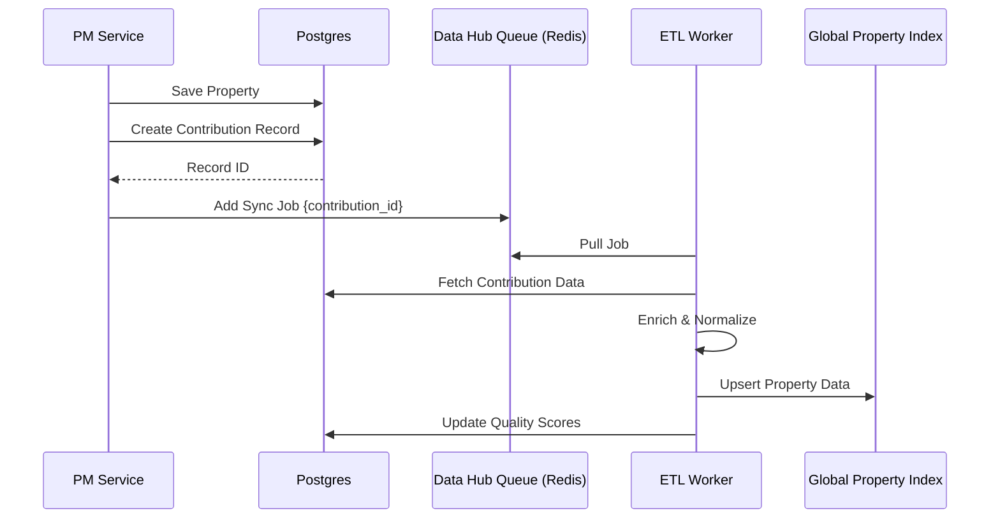

# Property Management - Data Hub Integration

This document outlines the strategy for integrating properties from the Property Management (PM) module into the global Data Hub architecture.

## Overview

Properties added to PROPMETRIK via the Property Management module represent high-fidelity, user-verified data. Integrating these into the Data Hub enhances the global property index, improves Automated Valuation Model (AVM) accuracy, and rewards users for maintaining quality data.

## 1. Data Classification & Trust

| Metric | Specification |
| :--- | :--- |
| **Data Tier** | `tier3b_user_generated` |
| **Source Type** | `internal_pm` |
| **Base Trust Score** | 0.85 (compared to 0.45 for web scrapers) |
| **Privacy Tier** | Public characteristic data, Private financial/tenant data |

> [!IMPORTANT]
> To maintain strict privacy, **no tenant information, lease amounts, or financial records** are synced to the Data Hub. Only physical property characteristics and location data are ingested.

## 2. Async Syncing Mechanism

The integration follows an asynchronous, event-driven architecture to ensure PM performance is unaffected by Data Hub processing.

### Sync Workflow
1. **Trigger**: A property is created or updated in the PM module (`portfolioService`).
2. **Event**: The system creates a `contribution` record (type: `new_property`, context: `property_management`).
3. **Queueing**: The `contributionJob` is added to the Data Hub `PROPERTY_PROCESS` queue.
4. **Enrichment**: The `propertyEnrichmentService` processes the data:
   - Validates the address against Ghana Post GPS standards.
   - Normalizes physical characteristics (beds, baths, area).
   - Updates the global property index (Postgres + OpenSearch).
5. **Quality Assessment**: The `qualityScoring` worker calculates the final Trust and Completeness scores.

### Architecture Diagram


## 3. Contribution Workflow & Credits

User contributions from PM are tracked through the existing Data Hub rewards system:

- **Automatic Rewards**: Users automatically earn `contribution_credits` upon successful sync and validation of their properties.
- **Verification Bonus**: If a user uploads verified documents (Site Plans, Indentures) in PM, the associated Data Hub entry receives a "Verified" badge and the user earns bonus credits.
- **Reputation**: High-quality PM data improves the user's `reputation_score` in the Contributor Leaderboard.

## 4. Implementation Details

### Data Source Configuration
A hidden "System" Data Source will be registered:
```json
{
  "name": "Internal Property Management",
  "slug": "internal-pm",
  "tier": "tier3b_user_generated",
  "sync_frequency": "realtime"
}
```

### Sync Triggers
Async syncing will be implemented using a shared Service Hook pattern:
- **`afterCreate`**: Ingests new property into Data Hub.
- **`afterUpdate`**: Triggers enrichment and index refresh.
- **`afterDelete`**: Marks property as delisted/inactive in Data Hub (soft delete).

## 5. Metadata Mapping

| PM Field | Data Hub Mapping | Note |
| :--- | :--- | :--- |
| `id` | `metadata.source_id` | Cross-reference link |
| `organization_id` | `metadata.org_id` | Tracks ownership |
| `physical_data` | `properties.*` | Beds, baths, SQM, etc. |
| `digital_address` | `properties.digital_address` | Verified location |
