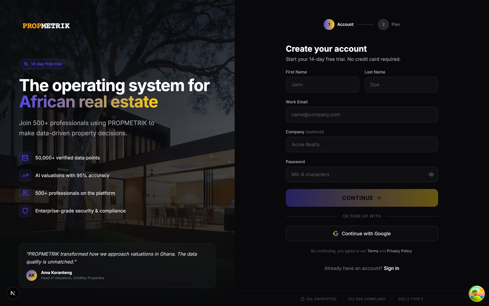
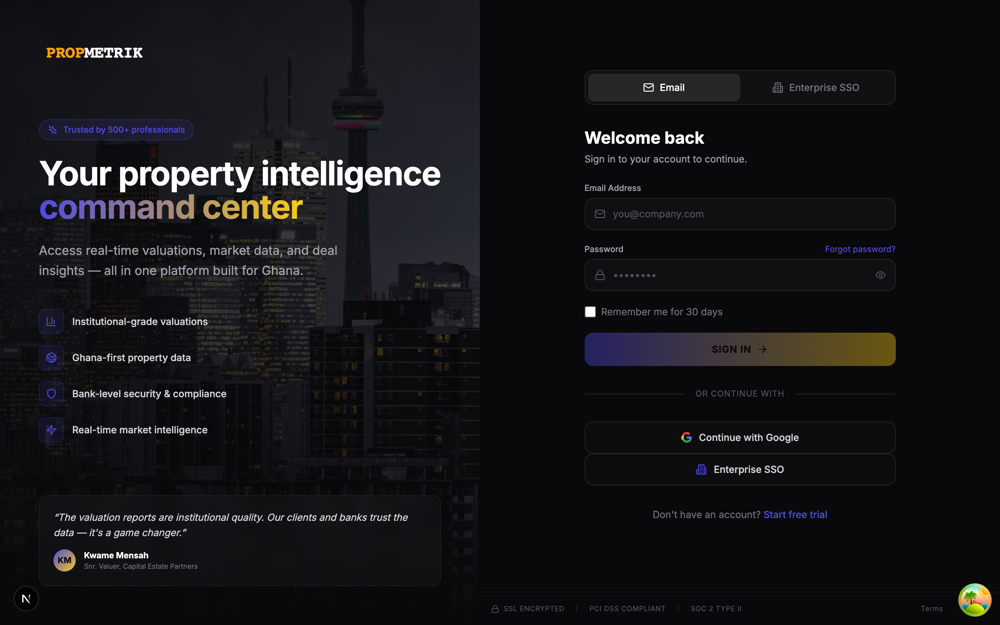
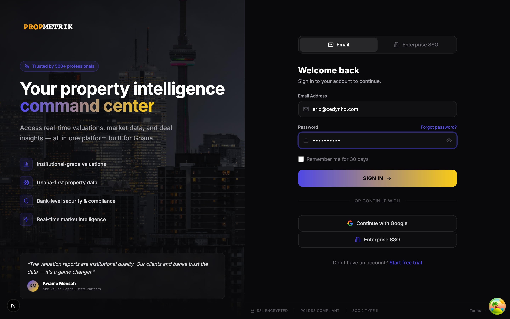
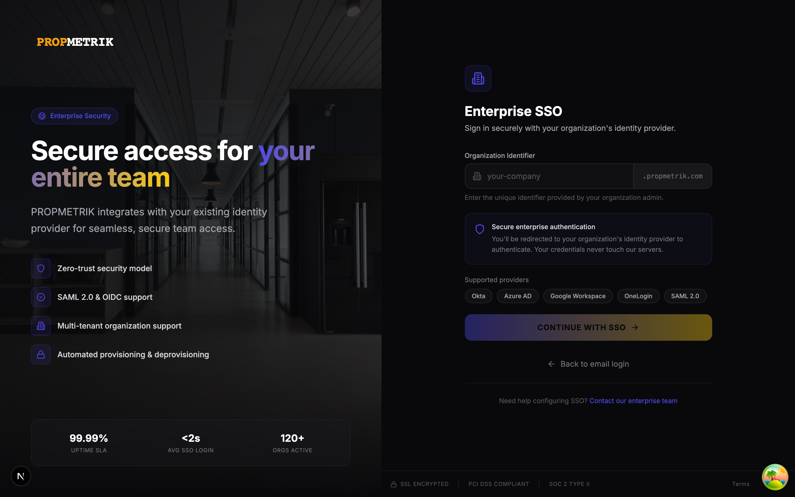

# Chapter 1: Authentication & Onboarding

PropMetrik uses secure, enterprise-grade authentication powered by Keycloak. This chapter covers everything from your first visit to completing onboarding and accessing the dashboard.

---

## 1.1 The PropMetrik Homepage

When you first visit PropMetrik, you land on the marketing homepage. This page highlights the platform's core capabilities: institutional-grade valuations, Ghana-first property data, bank-level security, and real-time market intelligence.

From the homepage you can:

- **Log In** -- Click the "Log In" button in the top navigation bar to access your existing account.
- **Sign Up** -- Click "Get Started" or "Sign Up" to create a new account.
- **Explore Features** -- Scroll down to learn about valuations, project management, property management, and data analytics before committing.

---

## 1.2 Creating an Account (Sign Up)

PropMetrik offers a multi-step signup flow that walks you through account creation, plan selection, and payment.

### Step 1: Account Details

1. Navigate to the **Sign Up** page by clicking "Get Started" on the homepage.
2. Enter your **full name**, **email address**, and choose a strong **password**.
3. Select your **organization type** (e.g., real estate firm, developer, valuation company).
4. Provide your **company name** if applicable.
5. Click **Continue** to proceed to plan selection.

### Step 2: Plan Selection

PropMetrik offers plans organized by module:

| Category | Plans | Starting Price |
|----------|-------|----------------|
| Full Platform | Core, Pro, Enterprise | GHS 390/mo |
| Property Management | Basic, Premium, Enterprise | GHS 390/mo |
| CRM & Deals | Starter, Professional, Enterprise | GHS 325/mo |
| Data Intelligence | Developer, Business, Enterprise | GHS 260/mo |
| Project Management | Starter, Professional, Enterprise | GHS 325/mo |

- Select the **plan category** that matches your primary use case.
- Choose a **tier** (plans marked "Popular" are recommended for most teams).
- Toggle between **monthly** and **annual** billing (annual billing offers a discount).

### Step 3: Payment

1. Enter your payment details to activate your subscription.
2. PropMetrik accepts major credit/debit cards and mobile money.
3. Review the order summary showing your selected plan and billing cycle.
4. Click **Complete Sign Up** to finalize your account.

> **Tip:** You can change your plan at any time from the dashboard settings. Start with a smaller plan and upgrade as your needs grow.

---

## 1.3 Logging In

Once your account is created, use the login page to access PropMetrik.

### Credentials Login

1. Navigate to the **Login** page.
2. Enter the **email address** you registered with.
3. Enter your **password**.
4. Optionally check **Remember me** to stay signed in on this device.
5. Click **Sign In**.

The login page features a split-screen layout: the left panel shows PropMetrik branding and feature highlights, while the right panel contains the login form. Two tabs at the top let you switch between **Credentials** and **Enterprise SSO** login methods.

### Common Login Errors

| Error Message | What It Means | What to Do |
|---------------|---------------|------------|
| Invalid email or password | Credentials do not match | Double-check your email and password; use "Forgot Password" if needed |
| Access denied | Your account may be deactivated | Contact your organization administrator |
| SSO configuration error | Enterprise SSO is misconfigured | Contact your IT department or PropMetrik support |
| Email linked to another provider | You previously signed up with a different method | Use the original sign-in method (e.g., SSO instead of credentials) |

---

## 1.4 Enterprise SSO Login

Organizations on Enterprise plans can configure Single Sign-On (SSO) via Keycloak, enabling employees to log in with their corporate identity provider.

### How to Use SSO

1. On the login page, click the **Enterprise SSO** tab.
2. Enter your **organization identifier** (slug). This is provided by your IT administrator (e.g., `acme-corp`).
3. Click **Continue with SSO**.
4. You will be redirected to your organization's identity provider (e.g., Microsoft Entra ID, Google Workspace, or Okta).
5. Complete authentication with your corporate credentials.
6. You will be redirected back to PropMetrik and logged in automatically.

> **Tip:** If you are unsure of your organization slug, ask your IT administrator or check any previous PropMetrik invitation emails.

### SSO Setup for Administrators

To configure SSO for your organization:

1. Contact PropMetrik support with your organization details.
2. Provide your identity provider metadata (SAML or OIDC configuration).
3. PropMetrik will configure your Keycloak realm and provide the necessary callback URLs.
4. Test the connection with a pilot group before rolling out to all users.

---

## 1.5 Forgot Password

If you forget your password, PropMetrik provides a self-service password reset flow.

### Steps to Reset Your Password

1. On the login page, click the **Forgot Password?** link below the password field.
2. Enter the **email address** associated with your account.
3. Click **Send Reset Link**.
4. Check your email inbox (and spam folder) for a password reset email from PropMetrik.
5. Click the reset link in the email. It will take you to a page where you can set a new password.
6. Enter your **new password** and confirm it.
7. Click **Reset Password** to save your new credentials.
8. You will be redirected to the login page. Sign in with your new password.

> **Tip:** Password reset links expire after a limited time for security. If the link has expired, simply request a new one.

---

## 1.6 Accepting a Team Invitation

If a colleague invites you to join their PropMetrik organization, you will receive an email with an invitation link.

### How to Accept an Invitation

1. Click the **Accept Invitation** link in the email.
2. If you already have a PropMetrik account, you will be prompted to log in and the invitation will be applied to your account.
3. If you are new to PropMetrik, you will be guided through a simplified signup process -- your plan and organization are already set by the inviter.
4. Once accepted, you will have access to the shared organization workspace, projects, and data.

---

## 1.7 Onboarding

After your first login, PropMetrik walks you through an onboarding flow to personalize your experience.

### Onboarding Steps

1. **Select Your Plan** -- If you signed up without a plan, or your plan needs confirmation, you will be prompted to choose one.
2. **Organization Setup** -- Confirm your company name, add a logo, and set your primary business focus (valuations, project management, property management, etc.).
3. **Invite Team Members** -- Optionally invite colleagues by entering their email addresses. They will receive invitation emails.
4. **Quick Tour** -- A brief guided tour highlights key dashboard areas: the market ticker, project list, and navigation sidebar.

> **Tip:** You can revisit onboarding settings at any time from Dashboard > Settings.

---

## 1.8 Security Best Practices

- **Use a strong password**: Combine uppercase letters, lowercase letters, numbers, and symbols. Minimum 8 characters.
- **Enable SSO when possible**: Enterprise SSO centralizes authentication and adds your organization's security policies (e.g., MFA).
- **Do not share credentials**: Each team member should have their own account. Use the invitation system to add collaborators.
- **Log out on shared devices**: Always log out when using a shared or public computer.
- **Keep your email secure**: Your email address is your primary account recovery method.

---

## Summary

| Task | Where to Go |
|------|-------------|
| Create a new account | Homepage > Get Started |
| Log in with credentials | Login page > Credentials tab |
| Log in with SSO | Login page > Enterprise SSO tab |
| Reset your password | Login page > Forgot Password |
| Accept a team invitation | Click link in invitation email |
| Complete onboarding | Automatic after first login |

---

[Next: Chapter 2 -- Dashboard & Navigation](../02-dashboard/guide.md)
