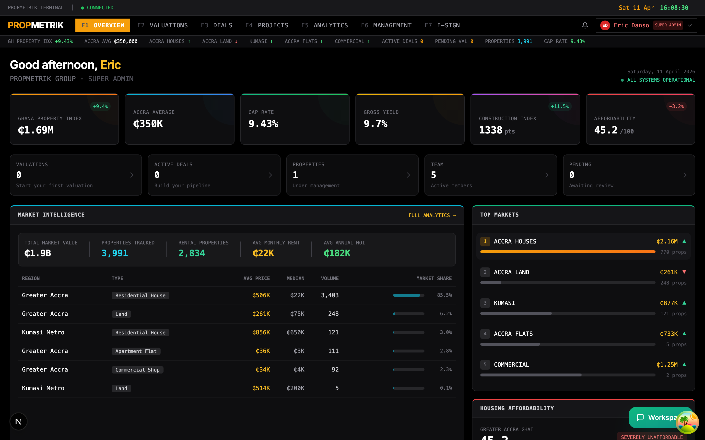
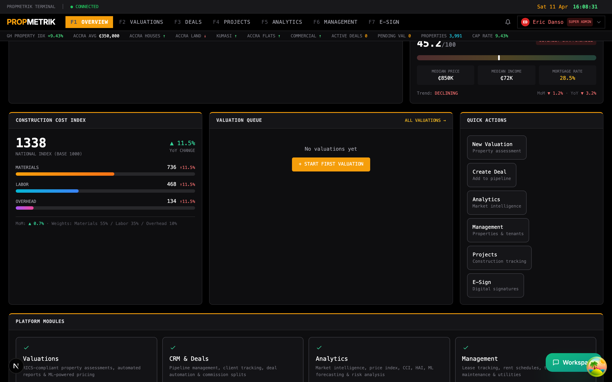
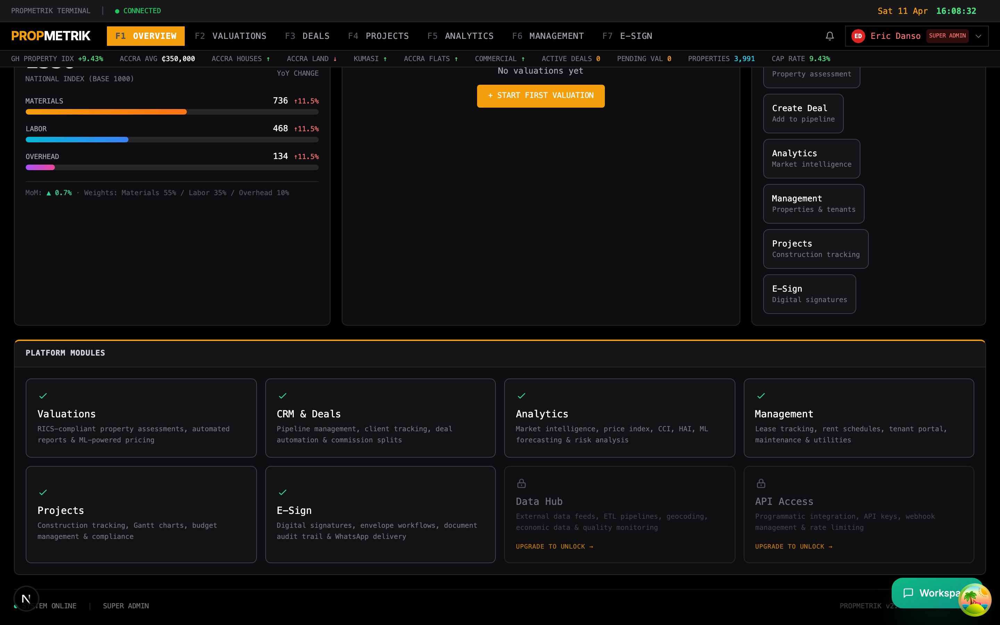
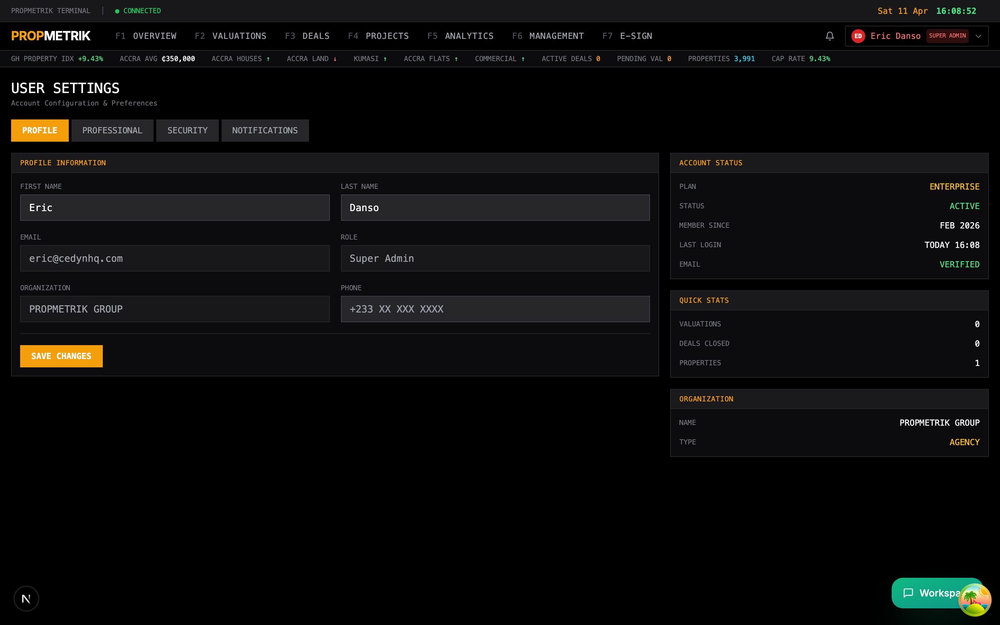
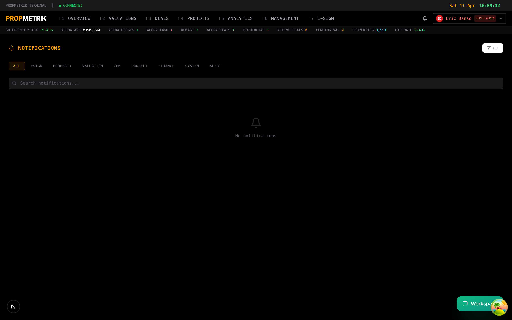
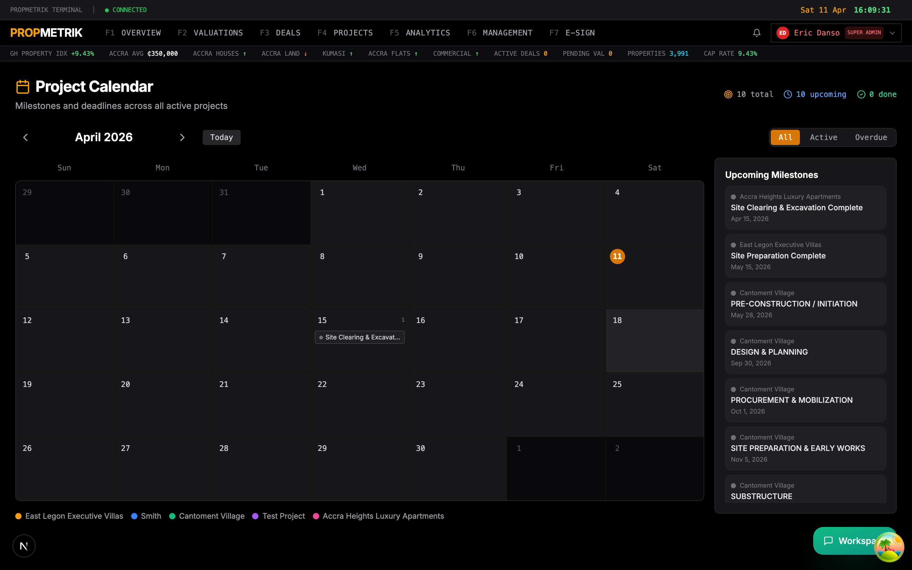
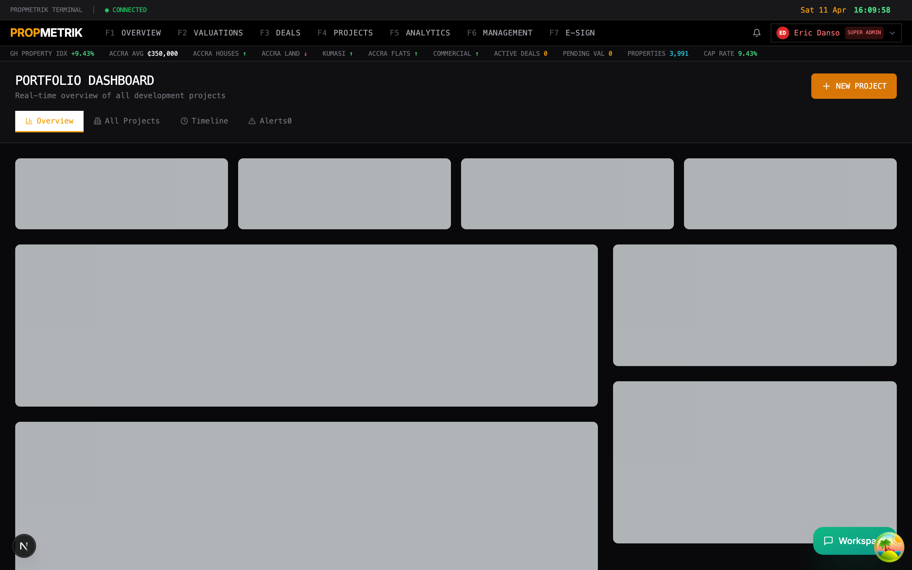

# Chapter 2: Dashboard & Navigation

The PropMetrik dashboard is your command center. It presents real-time market data, key performance indicators, and quick access to every module in the platform. The interface uses a distinctive terminal-style dark theme with amber accents, designed for professionals who spend extended time analyzing data.

---

## 2.1 Main Dashboard Overview

After logging in, you land on the main dashboard. This page provides a comprehensive snapshot of your organization's activity across all modules.

### Key Dashboard Sections

The main dashboard is divided into several panels:

**Top Ticker Bar**
A scrolling ticker at the top of the screen displays live market data, including:
- **Ghana Property Index** -- Average property prices and total listed properties with percentage change.
- **Accra Average Price** -- The current average property price in Accra.
- **Neighborhood Spotlights** -- Trending neighborhoods with average prices and directional indicators (up/down).
- **Active Deals** -- Number of deals currently in your pipeline.
- **Pending Valuations** -- Valuations awaiting completion.
- **Cap Rate** -- Current average capitalization rate.

**Overview Statistics**
Below the ticker, a row of summary cards shows:
- Total valuations completed
- Valuations this month
- Active deals in pipeline
- Pipeline value (in GHS)
- Total properties under management
- Team members in your organization

**Valuation Queue**
A panel listing recent valuation requests with their status, priority level, property type, and creation date. Click any item to open the full valuation.

**Deal Pipeline**
A visual representation of your deal pipeline showing the number of deals and total value at each stage (e.g., Lead, Qualified, Proposal, Negotiation, Closed).

**Recent Transactions**
A feed of the most recent property transactions including transaction type, property name, location, value, and date.

---

## 2.2 Market Intelligence Panels

Scrolling further down the dashboard reveals deeper market intelligence panels.

### Market Indicators

A table showing key metrics for different areas:
- **Area** -- Geographic region or neighborhood
- **Average Price** -- Current average property price in the area
- **Volume** -- Number of transactions recorded
- **Change** -- Percentage change over the reporting period (positive values in green, negative in red)

### Construction Cost Index (CCI)

Displays the national Construction Cost Index with its three components:
- **Materials** -- Cost index for building materials with month-over-month and year-over-year changes
- **Labor** -- Cost index for construction labor
- **Overhead** -- Cost index for project overhead

Each component shows its weight in the overall index, current value, and recent trends.

### Property Management KPIs

If you have properties under management, this panel shows:
- Average cap rate across your portfolio
- Average monthly rent
- Average annual net operating income (NOI)
- Average gross yield
- Total rental vs. sale properties

---

## 2.3 Dashboard Bottom Section

The lower portion of the dashboard contains additional intelligence and action items.

### Market Price Index

A breakdown of median and average property prices by region and property type. This data comes from PropMetrik's Data Hub and is updated regularly.

### Quick Actions

Shortcut buttons for common tasks:
- Create a new valuation
- Start a new deal
- Add a property
- Create a project
- View reports

---

## 2.4 Navigation Sidebar

The left sidebar provides access to all PropMetrik modules. It collapses to icons on smaller screens and expands on hover or click.

### Module Navigation

| Icon | Module | Description |
|------|--------|-------------|
| Dashboard | Home | Return to the main dashboard |
| Projects | Project Management | Construction project lifecycle management |
| Properties | Property Management | Portfolio, buildings, units, and leases |
| Valuations | Valuations | Property valuations and reports |
| Deals | CRM & Deals | Deal pipeline, contacts, and transactions |
| E-Sign | E-Signatures | Digital document signing |
| Calendar | Calendar | Unified calendar for milestones and deadlines |
| Analytics | Analytics | Market analytics and insights |
| Admin | Administration | Organization settings and compliance |

> **Tip:** Use keyboard shortcuts to navigate quickly between modules. Press `?` on any page to see available shortcuts.

---

## 2.5 Your Profile

Access your profile by clicking your avatar or name in the top-right corner of the dashboard.

### Profile Settings

From the profile page you can:

1. **Update Personal Information**
   - Edit your full name, phone number, and job title.
   - Upload or change your profile photo.

2. **Change Password**
   - Enter your current password and set a new one.
   - Password must meet minimum complexity requirements.

3. **Notification Preferences**
   - Choose which notifications you receive (email, in-app, WhatsApp).
   - Set notification frequency (immediate, daily digest, weekly summary).

4. **Connected Accounts**
   - View linked identity providers (e.g., Google, Microsoft).
   - Manage SSO connections.

5. **API Access**
   - View your API key for programmatic access (available on Developer and Enterprise plans).
   - Regenerate your API key if compromised.

### How to Update Your Profile

1. Click your **avatar** in the top-right corner.
2. Select **Profile** from the dropdown menu.
3. Edit the fields you want to update.
4. Click **Save Changes**.

---

## 2.6 Notifications

PropMetrik keeps you informed with a real-time notification system.

### Notification Types

- **Valuation Updates** -- When a valuation you requested is completed or requires action.
- **Deal Activity** -- When a deal moves to a new pipeline stage or a contact responds.
- **Project Alerts** -- Milestone deadlines, budget overruns, RFI responses, and inspection results.
- **Property Management** -- Lease expirations, maintenance requests, and payment receipts.
- **Team** -- Invitation acceptances, role changes, and mentions.
- **System** -- Platform updates, scheduled maintenance, and security alerts.

### Managing Notifications

1. Click the **bell icon** in the top navigation bar to open the notification panel.
2. Unread notifications appear with a badge count on the bell icon.
3. Click any notification to navigate directly to the relevant item.
4. Use the **Mark All Read** button to clear the unread badge.
5. Click **Settings** within the notification panel to customize which notifications you receive.

> **Tip:** For time-sensitive alerts (e.g., safety incidents on construction sites), enable WhatsApp notifications in your profile settings to receive instant messages.

---

## 2.7 Calendar

The unified calendar aggregates events from all modules into a single view.

### Calendar Features

**Views**
- **Month View** -- A traditional grid showing all events for the month. Days with events display colored dots.
- **Week View** -- A detailed view of the current week with time slots.
- **Day View** -- Hour-by-hour breakdown of a single day.

**Event Types**
The calendar pulls events from multiple sources, each color-coded:

| Color | Source | Examples |
|-------|--------|----------|
| Amber | Project Milestones | Foundation completion, roofing deadline |
| Blue | Deal Events | Viewing appointments, offer deadlines |
| Green | Property Management | Lease start/end dates, inspection schedules |
| Red | Overdue Items | Missed deadlines, overdue payments |
| Purple | Meetings | Team meetings, stakeholder reviews |

### Using the Calendar

1. Navigate to **Calendar** from the sidebar.
2. Use the **left/right arrows** to move between months.
3. Click any **date** to see all events for that day in a detail panel.
4. Click an **event** to navigate to the source item (e.g., clicking a milestone opens the project schedule).
5. Use the **filter** button to show/hide specific event types or projects.

### Filtering Events

- Click the **Filter** icon at the top of the calendar.
- Select which **projects** you want to see milestones for.
- Toggle event categories (milestones, deadlines, meetings) on or off.
- The filter persists across sessions until you change it.

---

## 2.8 Portfolio Overview

The portfolio view provides a high-level summary of all your real estate assets.

### Portfolio Metrics

- **Total Portfolio Value** -- Sum of all property valuations in your portfolio.
- **Properties by Type** -- Breakdown of residential, commercial, mixed-use, and industrial properties.
- **Geographic Distribution** -- Map or list showing where your properties are located across Ghana.
- **Performance Indicators** -- Aggregate yield, occupancy rate, and NOI across the portfolio.

### How to Use the Portfolio View

1. Navigate to the **Portfolio** section from the dashboard or sidebar.
2. Review the summary cards at the top for overall metrics.
3. Use the **property list** below to see individual assets with their current valuation, status, and key metrics.
4. Click any property to drill into its detail page.
5. Use **filters** to narrow by property type, location, or status.

> **Tip:** The portfolio view is ideal for investor reports. You can export portfolio summaries as PDF or Excel from the actions menu.

---

## 2.9 Dashboard Customization Tips

### Personalizing Your Experience

- **Role-based views**: The dashboard automatically adjusts its panels based on your role. Valuers see the valuation queue prominently; project managers see project milestones; property managers see occupancy metrics.
- **Plan-based access**: Some dashboard panels display a lock icon if they require a higher-tier plan. Click the lock to see upgrade options.
- **Refresh data**: The dashboard data refreshes automatically via real-time connections. You can also manually refresh by pressing `Ctrl+R` (or `Cmd+R` on Mac).

### Quick Navigation

| Action | How |
|--------|-----|
| Return to dashboard | Click the PropMetrik logo or "Dashboard" in the sidebar |
| Open notifications | Click the bell icon |
| Open profile | Click your avatar |
| Open calendar | Click "Calendar" in the sidebar |
| Search | Use the search bar in the top navigation |

---

## Summary

| Feature | Location |
|---------|----------|
| Market ticker | Top of main dashboard |
| Overview statistics | Dashboard summary cards |
| Deal pipeline | Dashboard middle section |
| Market intelligence | Dashboard scroll-down panels |
| Profile settings | Avatar > Profile |
| Notifications | Bell icon (top-right) |
| Calendar | Sidebar > Calendar |
| Portfolio | Sidebar > Portfolio |

---

[Previous: Chapter 1 -- Authentication & Onboarding](../01-authentication/guide.md) | [Next: Chapter 3 -- Project Management](../03-project-management/guide.md)
