# Chapter 3: Project Management

PropMetrik's Project Management module is a comprehensive construction management suite built for the Ghanaian real estate development industry. It covers the full project lifecycle from planning through closeout, with tools for scheduling, team coordination, bidding, quality control, safety, and financial tracking.

---

## 3.1 Projects List

The projects list is your central hub for all development projects in your organization.

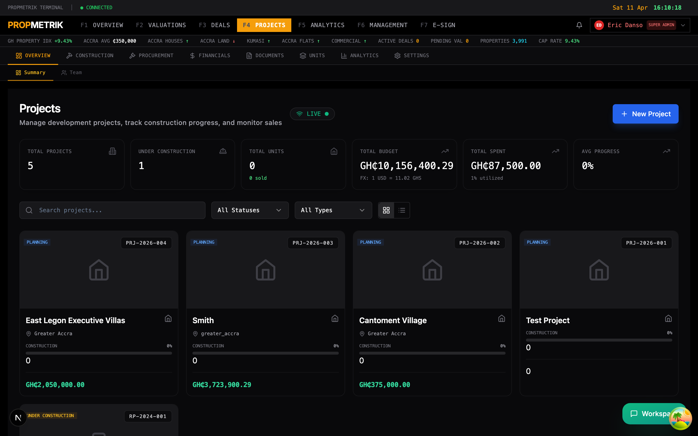

### Viewing Your Projects

1. Navigate to **Projects** from the sidebar.
2. The projects list displays all projects as cards (grid view) or rows (list view). Toggle between views using the **grid/list** icons in the top-right corner.
3. Each project card shows:
   - **Project name** and **project number**
   - **Project type** icon (Residential, Commercial, Mixed Use, Industrial, Land Development, Renovation)
   - **Status badge** -- color-coded to indicate the current phase
   - **Location** -- City or neighborhood
   - **Budget** -- Total project budget in GHS
   - **Progress** -- Percentage completion

### Project Statuses

| Status | Color | Meaning |
|--------|-------|---------|
| Planning | Blue | Project is in the planning/design phase |
| Pre-Sales | Purple | Units are being marketed before construction |
| Under Construction | Amber | Active construction is underway |
| Nearing Completion | Orange | Construction is 80%+ complete |
| Completed | Green | Construction is finished |
| Sold Out | Green | All units have been sold |
| On Hold | Gray | Project is temporarily paused |
| Cancelled | Red | Project has been cancelled |
| Archived | Dark Gray | Project is archived for record-keeping |

### Filtering and Searching

- Use the **search bar** to find projects by name or number.
- Use the **status filter** dropdown to show only projects in a specific phase.
- Use the **type filter** to narrow by project type (e.g., show only residential projects).
- Results update instantly as you type or change filters.

### Quick Stats Panel

At the top of the projects list, summary statistics show:
- Total number of projects
- Number currently under construction
- Total budget across all projects
- Average project completion percentage

---

## 3.2 Creating a New Project

PropMetrik uses a guided wizard to create new projects. The wizard ensures all required information is captured upfront.

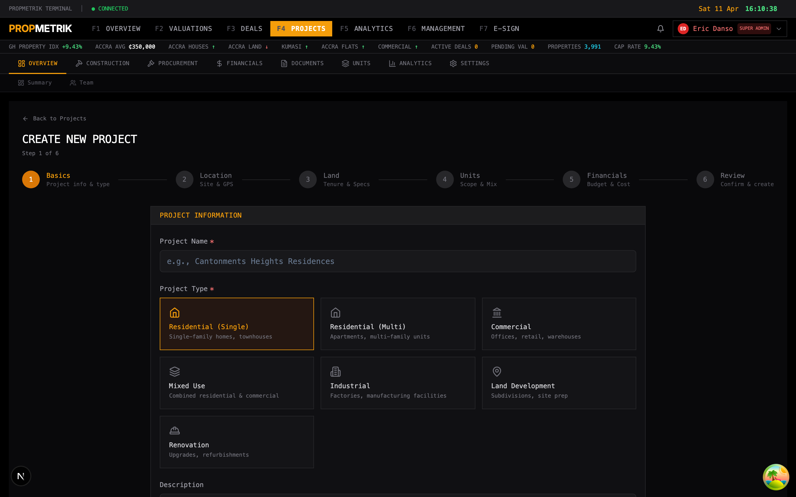

### Wizard Steps

The project creation wizard has six steps:

#### Step 1: Basics -- Project Info & Type

1. Click the **+ New Project** button on the projects list page.
2. Enter the **project name** (e.g., "Cantonments Residences Phase II").
3. Select the **project type** from the available options:
   - Residential (Single) -- Single-family homes, townhouses
   - Residential (Multi) -- Apartments, multi-family units
   - Commercial -- Offices, retail, warehouses
   - Mixed Use -- Combined residential and commercial
   - Industrial -- Factories, manufacturing facilities
   - Land Development -- Subdivisions, site preparation
   - Renovation -- Upgrades, refurbishments
4. Enter a **description** of the project.
5. Select the **project manager** from your team members list.
6. Optionally select a **milestone framework** -- a pre-configured set of milestones and phases appropriate for the project type.
7. Enter the **developer name**, **contact**, and **email** for the development company.

#### Step 2: Location -- Site & GPS

1. Use the **location selector** to pin the project site on a map. You can search by address or drop a pin manually.
2. The system captures GPS coordinates, region, and nearest landmarks.
3. Select the **administrative district** and **region** from dropdowns.

#### Step 3: Land -- Tenure & Specs

1. Select the **land tenure** type:
   - Freehold -- Full ownership
   - Leasehold -- Lease from the government or stool
   - Customary -- Traditional land ownership
   - Vested -- Government-vested land
2. If applicable, enter the **traditional authority** name (e.g., the stool or skin that controls the land).
3. Enter the **assembly** (district or municipal assembly).
4. Specify the **land area** in square meters.
5. Specify the **total built area** in square meters.

#### Step 4: Units -- Scope & Mix

1. Define the **unit mix** for the project. For each unit type, specify:
   - Unit type name (e.g., "3-Bed Executive", "Studio Apartment")
   - Number of units
   - Area per unit (in square meters)
   - Target price per unit
2. Click **Add Unit Type** to add more unit configurations.
3. The wizard calculates total units and total sellable area automatically.

#### Step 5: Financials -- Budget & Cost

1. Enter the **total project budget** in your chosen currency (GHS, USD, etc.).
2. Select the **currency** from the dropdown.
3. Set the **planned start date** and **planned end date**.
4. Select **funding sources** (e.g., Bank Loan, Equity, Pre-sales Revenue, Government Grant).

#### Step 6: Review -- Confirm & Create

1. Review all entered information across all steps.
2. Click any step indicator at the top to go back and make changes.
3. Optionally upload a **hero image** for the project (e.g., an architectural rendering).
4. Click **Create Project** to finalize.

> **Tip:** The wizard auto-saves drafts. If you leave mid-way, you can resume where you left off next time you open the creation form.

---

## 3.3 Project Schedule

The schedule view lets you plan and track milestones, phases, and deadlines for your project.


### Schedule Features

**Milestone Timeline**
- View milestones on a horizontal timeline or in a list.
- Each milestone shows its name, target date, status, and responsible person.
- Color-coded by status: green (completed), amber (in progress), red (overdue), gray (upcoming).

**Adding Milestones**

1. Click **+ Add Milestone** at the top of the schedule view.
2. Enter the milestone **name** (e.g., "Foundation Completion").
3. Set the **target date**.
4. Assign a **responsible team member**.
5. Add optional **notes** or **dependencies**.
6. Click **Save**.

**Editing Milestones**

1. Click any milestone in the timeline or list.
2. Update the target date, status, or assigned member.
3. Add completion notes when marking a milestone as done.

**Phase Management**
- Group milestones into **phases** (e.g., Pre-construction, Substructure, Superstructure, Finishing, Handover).
- Drag milestones between phases to reorganize.
- Phase progress is calculated automatically from milestone completion.

> **Tip:** If you selected a milestone framework during project creation, your schedule is pre-populated with industry-standard milestones. Customize them to fit your specific project.

---

## 3.4 Team Management

Manage your project team members, their roles, and their access levels.


### Adding Team Members

1. Open your project and navigate to the **Team** tab.
2. Click **+ Add Member**.
3. Search for an existing organization member or enter a new email to invite them.
4. Select their **role** on this project (e.g., Project Manager, Site Engineer, Quantity Surveyor, Architect, Foreman).
5. Set their **permissions** level (View Only, Contributor, or Manager).
6. Click **Add**.

### Team Member Profiles

Click any team member to view their profile, which includes:
- Contact information and role
- Assigned tasks and milestones
- Activity log on the project
- Timesheet summary

### Managing Roles

- **Project Manager**: Full access to all project features. Can add/remove members.
- **Site Engineer**: Access to schedules, site logs, checklists, and inspections.
- **Quantity Surveyor**: Access to budgets, costs, procurement, and change orders.
- **Architect**: Access to drawings, submittals, and design-related features.
- **Foreman**: Access to daily logs, safety, and punch lists.
- **View Only**: Can view all project data but cannot make changes.

---

## 3.5 Bids Management

Track and evaluate bids from contractors and suppliers.


### Creating a Bid Package

1. Navigate to the **Bids** tab within your project.
2. Click **+ New Bid Package**.
3. Enter the **package name** (e.g., "Structural Steel Supply").
4. Provide a **description** of the scope of work.
5. Set the **submission deadline**.
6. Attach any relevant **documents** (drawings, specifications, BOQs).
7. Click **Publish** to make the bid package available to invited contractors.

### Evaluating Bids

1. As bids come in, they appear in the bid package detail view.
2. Each bid shows the contractor name, total amount, and submission date.
3. Use the **comparison table** to evaluate bids side by side.
4. Score bids on criteria such as price, experience, timeline, and references.
5. Click **Award** to select the winning bid. The system notifies the contractor automatically.

---

## 3.6 Bidding Portal

The bidding view is for contractors responding to bid invitations.


### How Contractors Bid

1. Invited contractors receive an email with a link to the bid package.
2. They can view the scope documents, drawings, and BOQ.
3. The contractor fills in their **bid amount**, **proposed timeline**, and any **qualifications or exclusions**.
4. They upload supporting documents (e.g., company profile, past project references).
5. They submit the bid before the deadline.

> **Tip:** Bid submissions are timestamped and locked after the deadline. Late bids are flagged but can be accepted at the project manager's discretion.

---

## 3.7 Requests for Information (RFIs)

RFIs are formal questions from contractors or team members that require a documented response.

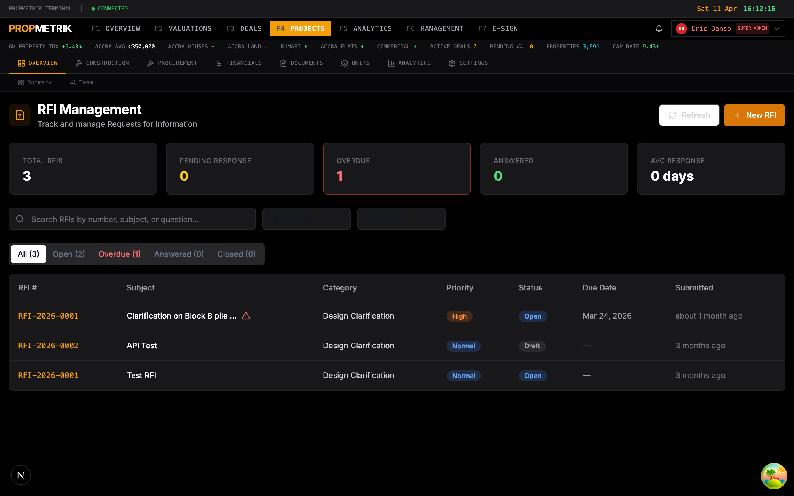

### Creating an RFI

1. Navigate to the **RFIs** tab.
2. Click **+ New RFI**.
3. Enter the **subject** (e.g., "Foundation depth clarification at Grid Line C").
4. Write the **question** with as much detail as possible.
5. Select the **priority** (Low, Medium, High, Critical).
6. Assign the RFI to the appropriate **respondent** (e.g., the architect or engineer).
7. Attach any supporting **drawings** or **photos**.
8. Click **Submit**.

### Responding to an RFI

1. The assigned respondent receives a notification.
2. Open the RFI and click **Respond**.
3. Write the response and attach any clarification documents.
4. Click **Submit Response**.
5. The RFI status changes from "Open" to "Answered."

### RFI Tracking

- View all RFIs in a filterable list showing number, subject, status, priority, date, and assignee.
- Filter by status (Open, Answered, Closed) or priority.
- Track average response time and overdue RFIs in the summary bar.

---

## 3.8 Submittals & Documents

Manage project documents, shop drawings, material submittals, and file storage.


### Uploading Documents

1. Navigate to the **Documents** tab.
2. Click **+ Upload** or drag and drop files into the upload area.
3. Select the **document category** (e.g., Drawings, Specifications, Contracts, Reports, Photos).
4. Add a **description** and optional tags.
5. Click **Upload**.

### Submittals Workflow

Submittals follow an approval workflow:

1. **Submitted** -- The contractor uploads a submittal (e.g., a shop drawing for review).
2. **Under Review** -- The architect or engineer reviews the submittal.
3. **Approved** / **Approved as Noted** / **Revise and Resubmit** / **Rejected** -- The reviewer records their decision.
4. If rejected or requiring revision, the contractor resubmits.

### Document Organization

- Documents are organized into folders by category.
- Use the **search bar** to find documents by name or tag.
- **Version control** keeps previous versions accessible when a document is updated.
- Click any document to preview it in-browser or download it.

---

## 3.9 Site Logs (Daily Logs)

Daily site logs record what happened on the construction site each day.

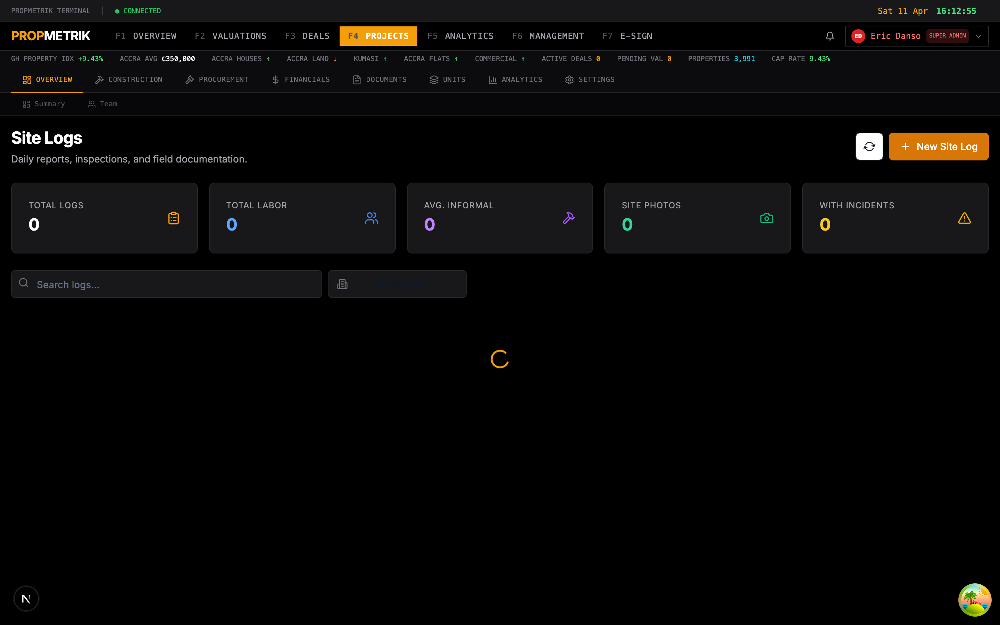

### Creating a Daily Log

1. Navigate to the **Site Logs** tab.
2. Click **+ New Log** (or the system may auto-create one for today's date).
3. Fill in the following sections:
   - **Weather**: Select conditions (sunny, cloudy, rainy, etc.) and note any weather impacts.
   - **Workforce**: Record the number and type of workers on site (masons, carpenters, electricians, laborers, etc.).
   - **Equipment**: Note which equipment was in use.
   - **Work Performed**: Describe the activities completed today.
   - **Materials Received**: Log any materials delivered to site.
   - **Visitors**: Record any visitors or inspectors who came to site.
   - **Issues/Delays**: Document any problems, delays, or safety concerns.
4. Attach **photos** from the day.
5. Click **Save** (or **Submit** to finalize and lock the log).

### Reviewing Logs

- Scroll through the log history in reverse chronological order.
- Use date filters to find logs from specific periods.
- Export logs as PDF for project records or reporting to stakeholders.

> **Tip:** Encourage site foremen to complete daily logs before leaving site each day. Consistent logging creates an invaluable record for dispute resolution and progress tracking.

---

## 3.10 Checklists & Inspections

Quality checklists ensure that construction work meets standards at each phase.

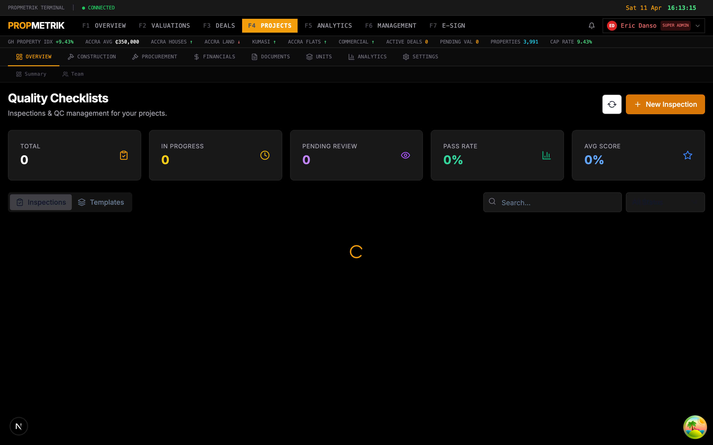

### Using Checklists

1. Navigate to the **Checklists** tab.
2. Select a checklist template (e.g., "Foundation Inspection", "Electrical Rough-in", "Final Walk-through").
3. Work through each item on the checklist:
   - Mark items as **Pass**, **Fail**, or **N/A**.
   - Add **notes** or **photos** for any item that requires attention.
4. When all items are reviewed, click **Complete Inspection**.
5. The system records the inspection result with a timestamp and the inspector's name.

### Creating Custom Checklists

1. Click **+ New Checklist Template**.
2. Enter a **template name** and optional description.
3. Add **checklist items** -- each with a name, description, and optional reference (e.g., building code section).
4. Organize items into **sections** (e.g., "Structural", "Mechanical", "Electrical").
5. Save the template. It becomes available for all projects in your organization.

### Inspection History

- View all completed inspections in a log.
- Filter by pass/fail status, date, or inspector.
- Failed items generate follow-up tasks automatically.

---

## 3.11 Punch Lists

Punch lists track deficiencies and items that need correction before project handover.

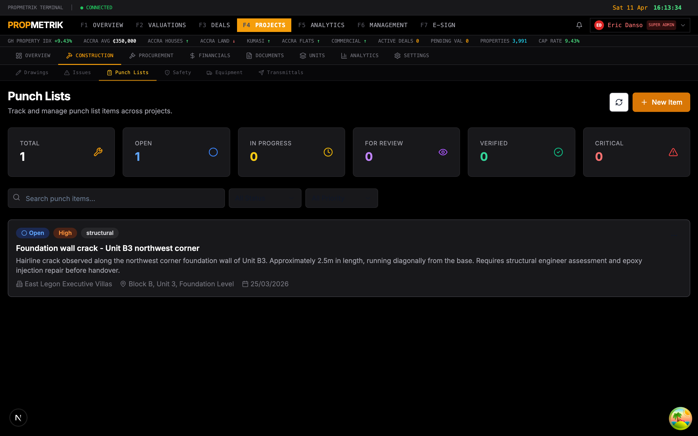

### Creating Punch List Items

1. Navigate to the **Punch Lists** tab.
2. Click **+ New Item**.
3. Enter the **description** of the deficiency (e.g., "Paint touch-up required in Unit 3B living room").
4. Select the **location** within the project (floor, unit, room).
5. Assign it to the **responsible contractor** or team member.
6. Set the **priority** (Low, Medium, High).
7. Set a **due date** for correction.
8. Attach a **photo** showing the issue.
9. Click **Save**.

### Managing Punch Lists

- View items in a list or on a floor plan overlay.
- Filter by status (Open, In Progress, Completed, Verified).
- The assigned contractor marks items as "In Progress" when they begin correction and "Completed" when done.
- The project manager or inspector then **verifies** the correction and closes the item.

### Punch List Workflow

```
Open --> In Progress --> Completed --> Verified (Closed)
                    \--> Rejected (returns to Open)
```

> **Tip:** Complete punch list resolution before issuing the project completion certificate. Unresolved punch items can delay handover and final payments.

---

## 3.12 Safety Management

Track safety incidents, maintain safety records, and ensure compliance with health and safety regulations.

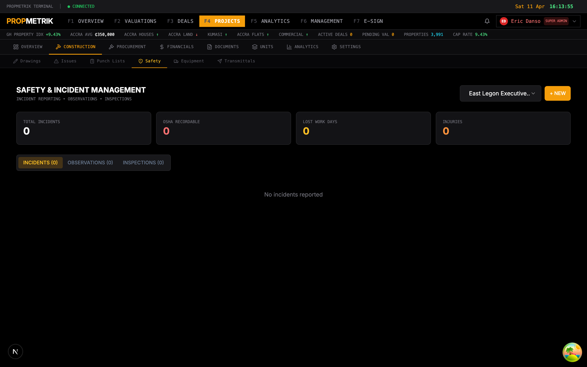

### Safety Features

**Incident Reporting**
1. Click **+ Report Incident**.
2. Select the **incident type** (Near Miss, Minor Injury, Major Injury, Property Damage, Environmental).
3. Describe the incident with details about what happened, where, and when.
4. Identify any **injured persons** and the **severity**.
5. Document **immediate actions taken**.
6. Attach **photos** of the scene.
7. Submit the report.

**Safety Observations**
- Record positive safety observations (e.g., "All workers wearing PPE on Block A").
- Track safety compliance rates over time.

**Toolbox Talks**
- Log safety briefings with date, topic, and attendees.
- Track which team members have completed required safety training.

### Safety Dashboard

- View incident statistics: total incidents, severity breakdown, and trends over time.
- Monitor days since last incident.
- Review open corrective actions.

---

## 3.13 Meetings

Schedule and document project meetings with agendas, minutes, and action items.

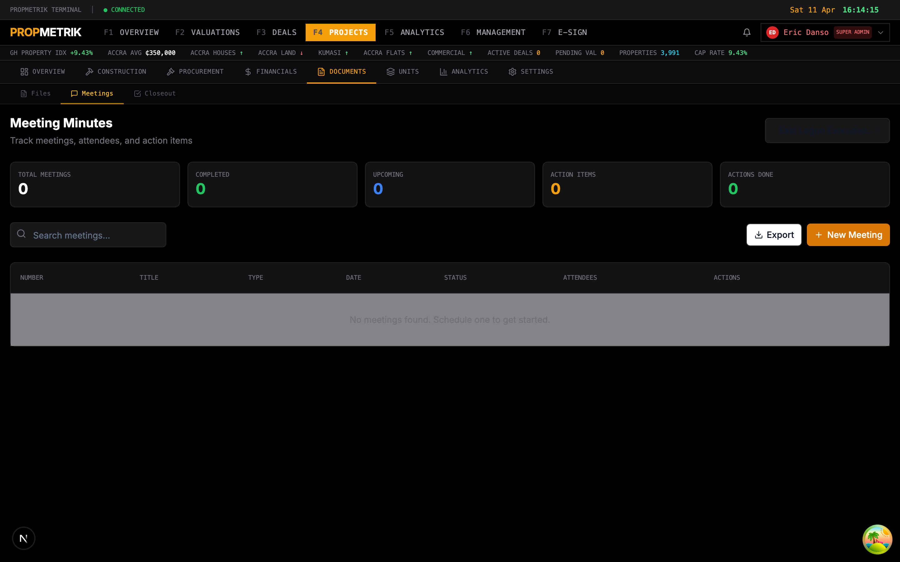

### Scheduling a Meeting

1. Navigate to the **Meetings** tab.
2. Click **+ New Meeting**.
3. Enter the meeting **title** (e.g., "Weekly Progress Meeting #12").
4. Set the **date and time**.
5. Select **attendees** from the project team.
6. Add **agenda items** -- each with a title and optional description.
7. Click **Schedule**.

### Recording Minutes

1. Open a scheduled meeting.
2. Click **Start Minutes**.
3. For each agenda item, record the **discussion summary** and any **decisions made**.
4. Add **action items** with an assigned person and due date.
5. Click **Finalize** to lock the minutes and distribute them to attendees via email.

### Meeting History

- View a chronological list of all project meetings.
- Access minutes, action items, and attendance records.
- Track action item completion rates across meetings.

---

## 3.14 Drawings

Manage architectural and engineering drawings with version control.

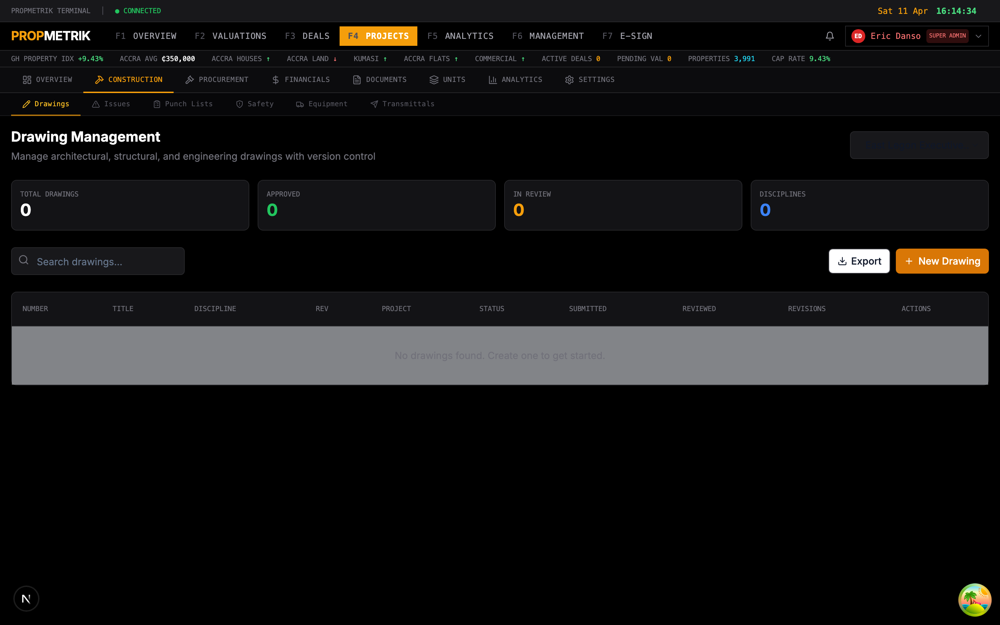

### Uploading Drawings

1. Navigate to the **Drawings** tab.
2. Click **+ Upload Drawing**.
3. Select the drawing file (PDF, DWG, or image format).
4. Enter the **drawing number** (e.g., "A-101"), **title** (e.g., "Ground Floor Plan"), and **discipline** (Architectural, Structural, MEP, etc.).
5. Select the **revision** number.
6. Click **Upload**.

### Drawing Sets

- Organize drawings into **sets** (e.g., "Issued for Construction", "As-Built", "Tender Set").
- Each set captures a snapshot of the drawings at a point in time.
- Compare revisions to see what changed between versions.

### Viewing Drawings

- Click any drawing to open the built-in viewer.
- Zoom, pan, and rotate drawings in the browser.
- Add **markups** and **annotations** directly on the drawing.
- Share annotated drawings with team members.

---

## 3.15 Procurement & Costs

Track procurement activities, purchase orders, and project costs.


### Procurement

**Creating a Purchase Order**
1. Navigate to the **Procurement** tab.
2. Click **+ New PO**.
3. Select the **vendor** from your contacts or add a new one.
4. Add **line items** with description, quantity, unit price, and cost code.
5. Set the **delivery date** and **delivery location**.
6. Review the total and click **Issue PO**.

**Tracking Deliveries**
- Mark PO items as received when materials arrive on site.
- Record partial deliveries and back-ordered items.
- Flag quality issues on received materials.

### Cost Tracking

- View a breakdown of costs by **cost code** (e.g., Earthworks, Concrete, Steel, Electrical).
- Compare **budgeted** vs. **actual** costs with variance percentages.
- Track **committed costs** (approved POs and contracts) vs. **spent costs** (invoiced/paid).
- Click **+ Add Cost** to record a new cost entry with the cost code, amount, vendor, date, and description.

> **Tip:** Integrate with Xero to automatically sync cost entries and invoices. See Chapter 12 (Integrations) for setup instructions.

---

## 3.16 Transmittals

Transmittals are formal records of document transfers between project parties.

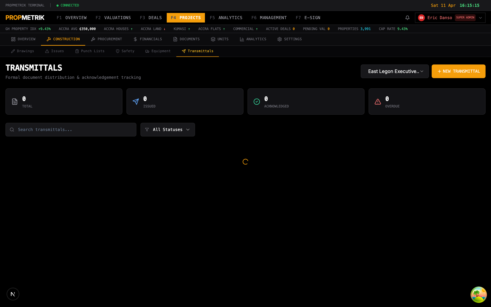

### Creating a Transmittal

1. Navigate to the **Transmittals** tab.
2. Click **+ New Transmittal**.
3. Enter the **recipient** (individual or company).
4. Add a **subject** and optional **message**.
5. Attach **documents** to be transmitted (drawings, reports, specifications, etc.).
6. Select the **purpose** (For Review, For Approval, For Information, For Construction, As Requested).
7. Click **Send**.

### Transmittal Tracking

- Each transmittal receives a unique reference number.
- Track whether the recipient has **received** and **acknowledged** the transmittal.
- Request **e-signatures** on transmittals for formal acknowledgment.
- View the full transmittal history for audit purposes.

---

## 3.17 Timesheets

Track labor hours for project team members and field workers.

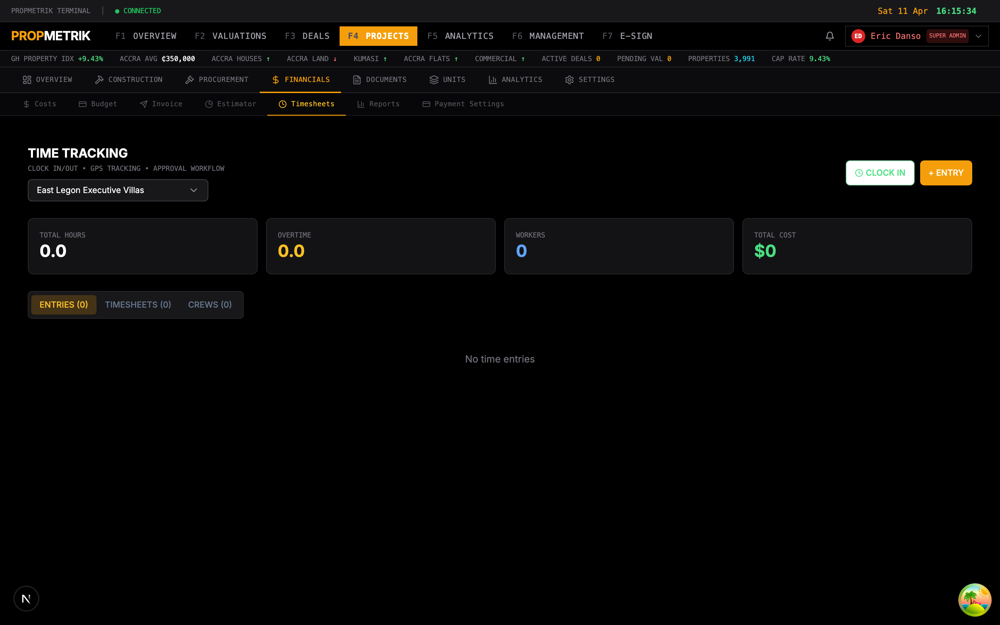

### Submitting Timesheets

1. Navigate to the **Timesheets** tab.
2. Select the **week** for the timesheet.
3. For each day, enter:
   - **Hours worked** on this project.
   - **Activity** or task description.
   - **Cost code** (for labor cost allocation).
4. Click **Submit** at the end of the week.

### Timesheet Approval

- Project managers review submitted timesheets.
- Approve, reject, or request modifications.
- Approved timesheets feed into the project's labor cost reports.

### Timesheet Reports

- View total hours by team member, week, or cost code.
- Compare planned vs. actual labor hours.
- Export timesheet data for payroll processing.

---

## 3.18 Equipment

Track construction equipment usage, availability, and maintenance.

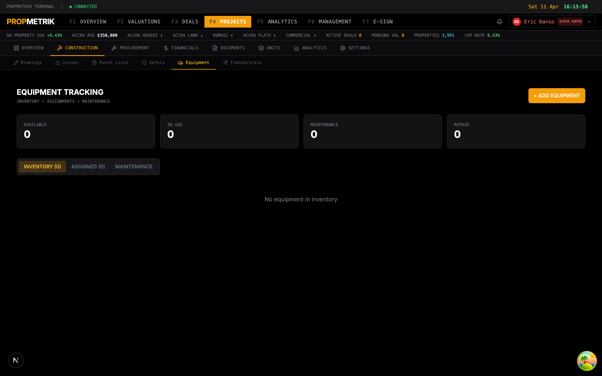

### Equipment Registry

1. Navigate to the **Equipment** tab.
2. Click **+ Add Equipment** to register a new piece of equipment.
3. Enter the equipment **name**, **type** (e.g., Excavator, Crane, Concrete Mixer), and **registration number**.
4. Record the **owner** (owned or rented) and **daily rate** if rented.
5. Set the **current status** (Available, In Use, Under Maintenance, Decommissioned).

### Equipment Tracking

- Assign equipment to specific projects and track usage days.
- Log maintenance events and next service dates.
- Calculate equipment costs per project based on usage and rental rates.

---

## 3.19 Contractors

Manage your contractor directory and track contractor performance.

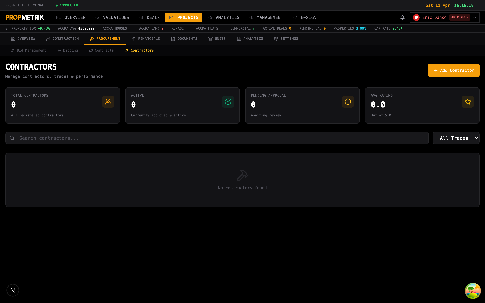

### Adding Contractors

1. Navigate to the **Contractors** tab.
2. Click **+ Add Contractor**.
3. Enter the contractor's **company name**, **contact person**, **phone**, and **email**.
4. Select their **trade** (e.g., General Contractor, Electrician, Plumber, HVAC, Landscaping).
5. Add **certifications**, **insurance details**, and **references**.
6. Click **Save**.

### Contractor Performance

- Track contractor performance across projects with ratings for quality, timeliness, safety, and communication.
- View a contractor's bid history, awarded contracts, and payment history.
- Flag contractors with performance issues for management review.

---

## 3.20 Change Orders

Manage scope changes, budget adjustments, and their approval workflow.

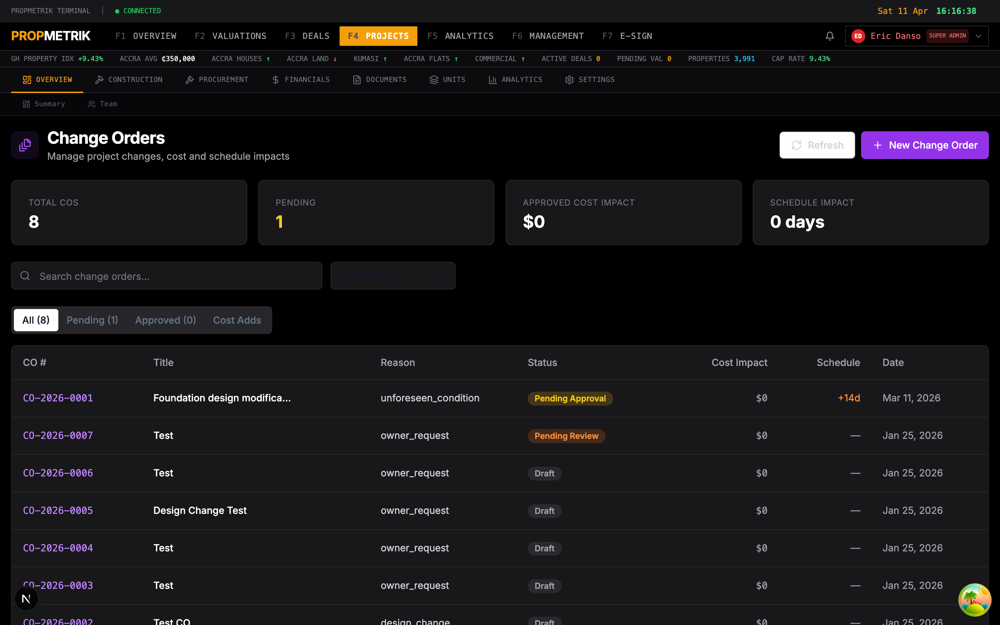

### Creating a Change Order

1. Navigate to the **Change Orders** tab.
2. Click **+ New Change Order**.
3. Enter the change order **title** and **description**.
4. Specify the **reason** (Client Request, Design Error, Site Condition, Regulatory, Value Engineering).
5. Enter the **cost impact** (positive for additions, negative for deductions).
6. Enter the **schedule impact** in days.
7. Attach supporting documents (revised drawings, cost breakdowns, photos).
8. Click **Submit for Approval**.

### Approval Workflow

Change orders follow a multi-step approval process:

1. **Draft** -- Created but not yet submitted.
2. **Pending Approval** -- Submitted and awaiting review.
3. **Approved** -- Accepted by the project owner or authorized approver.
4. **Rejected** -- Declined, with reasons noted.
5. **Executed** -- Approved and incorporated into the project budget and schedule.

### E-Signature Integration

- Change orders can be sent for **e-signature** for formal client approval.
- Click the **Request Signature** button to create an e-sign envelope.
- The client receives an email with a link to review and sign the change order.
- Signed change orders are stored with a full audit trail.

> **Tip:** Always document the reason and impact of change orders thoroughly. This protects all parties in case of disputes.

---

## 3.21 Project Closeout

The closeout module guides you through the steps to formally complete a project.

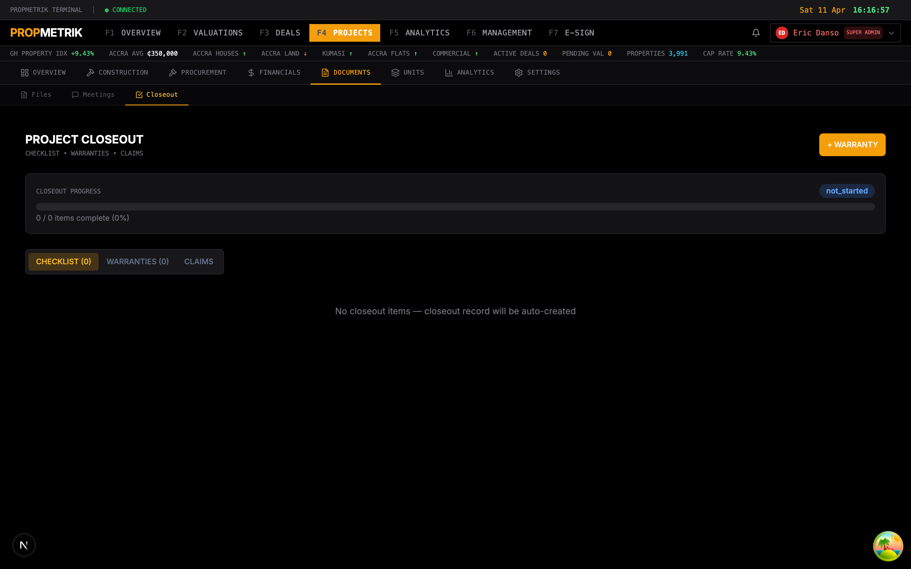

### Closeout Checklist

The closeout process includes:

1. **Punch List Completion** -- Verify all punch list items are resolved.
2. **Final Inspections** -- Complete all required inspections and obtain certificates.
3. **As-Built Drawings** -- Ensure as-built drawings are submitted and approved.
4. **O&M Manuals** -- Collect operation and maintenance manuals from contractors.
5. **Warranty Documentation** -- Gather warranty certificates for all installed systems.
6. **Final Accounts** -- Reconcile all costs, process final payments, and close purchase orders.
7. **Certificate of Completion** -- Issue the formal project completion certificate.
8. **Handover** -- Transfer the project to the owner/operator with all documentation.

### Closeout Tracking

- Each closeout item shows its status (Pending, In Progress, Complete).
- Track overall closeout progress as a percentage.
- Generate a closeout report summarizing all completed items.

---

## 3.22 Units Management

For residential and mixed-use projects, manage individual units (apartments, houses, plots).

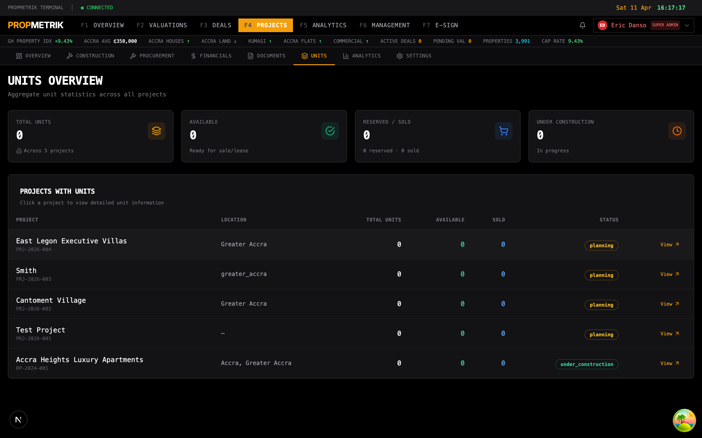

### Unit Registry

- View all units in the project with their type, area, floor, status, and assigned buyer/tenant.
- Filter by status (Available, Reserved, Sold, Under Construction, Completed).
- Click any unit to see its detail page with specifications, pricing history, and buyer information.

### Managing Units

1. Click **+ Add Unit** to create a new unit.
2. Enter the **unit number**, **type** (from the unit mix defined at project creation), **floor**, and **area**.
3. Set the **price** and **status**.
4. Assign a **buyer** or **tenant** if applicable.

---

## 3.23 Cost Estimator

The cost estimator helps you generate preliminary cost estimates for projects or individual components.

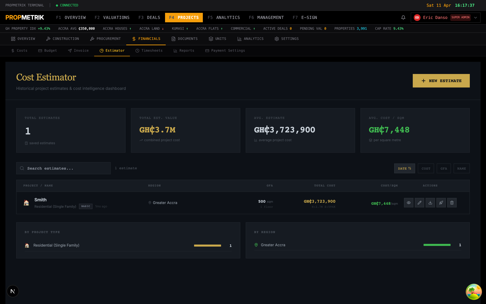

### Using the Cost Estimator

1. Navigate to the **Cost Estimator** tab.
2. Select the **estimate type** (Preliminary, Detailed, or Elemental).
3. Enter the project parameters:
   - Project type
   - Location (region and district)
   - Total area in square meters
   - Number of floors
   - Construction quality level (Economy, Standard, Premium, Luxury)
4. The estimator uses PropMetrik's construction cost database to generate a cost breakdown.
5. Review the estimate by element (Substructure, Superstructure, Finishes, Services, External Works, Preliminaries).
6. Adjust quantities or rates to refine the estimate.
7. Export the estimate as PDF or Excel.

> **Tip:** The cost estimator draws from PropMetrik's Data Hub, which includes up-to-date material and labor costs for the Ghanaian market. Estimates are most accurate when the location and project type closely match available data.

---

## 3.24 Audit Log

The audit log provides a complete history of all actions taken on a project.

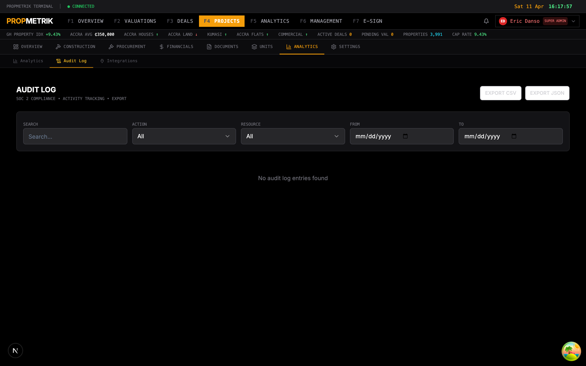

### What the Audit Log Records

Every significant action is logged, including:
- Project creation and edits
- Team member additions and removals
- Milestone updates
- Document uploads and approvals
- Cost entries and budget changes
- Change order submissions and approvals
- RFI submissions and responses
- Checklist completions

### Using the Audit Log

1. Navigate to the **Audit Log** tab.
2. View entries in reverse chronological order.
3. Each entry shows the **action**, **user**, **timestamp**, and **details**.
4. Use **filters** to narrow by action type, user, or date range.
5. Export the audit log for compliance or legal review.

---

## 3.25 Project Settings

Configure project-specific settings and preferences.

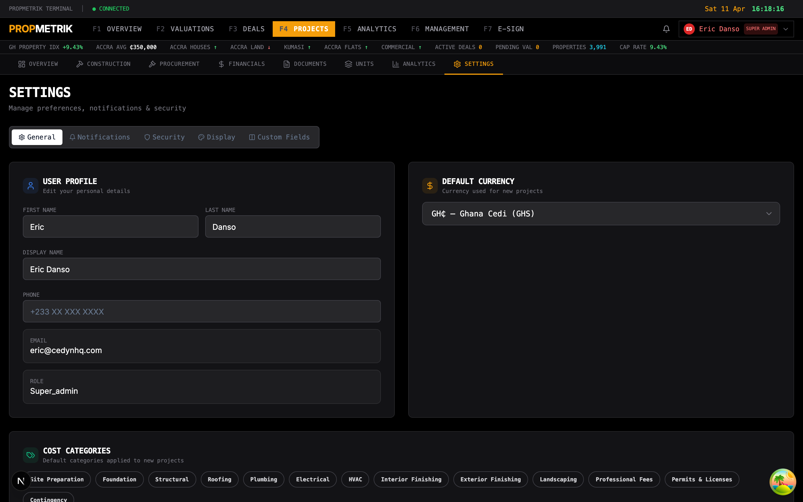

### Available Settings

- **General** -- Edit project name, description, type, and dates.
- **Notifications** -- Configure which project events trigger notifications and who receives them.
- **Numbering** -- Set prefix formats for RFIs, submittals, change orders, and transmittals (e.g., "RFI-001").
- **Permissions** -- Fine-tune which roles can access specific features.
- **Integrations** -- Connect the project to Xero, WhatsApp, or other third-party services.
- **Status** -- Change the project status (e.g., from Planning to Under Construction).
- **Archive** -- Archive the project when it is complete and no longer active.

---

## 3.26 Project Analytics

View performance analytics and dashboards for your project.

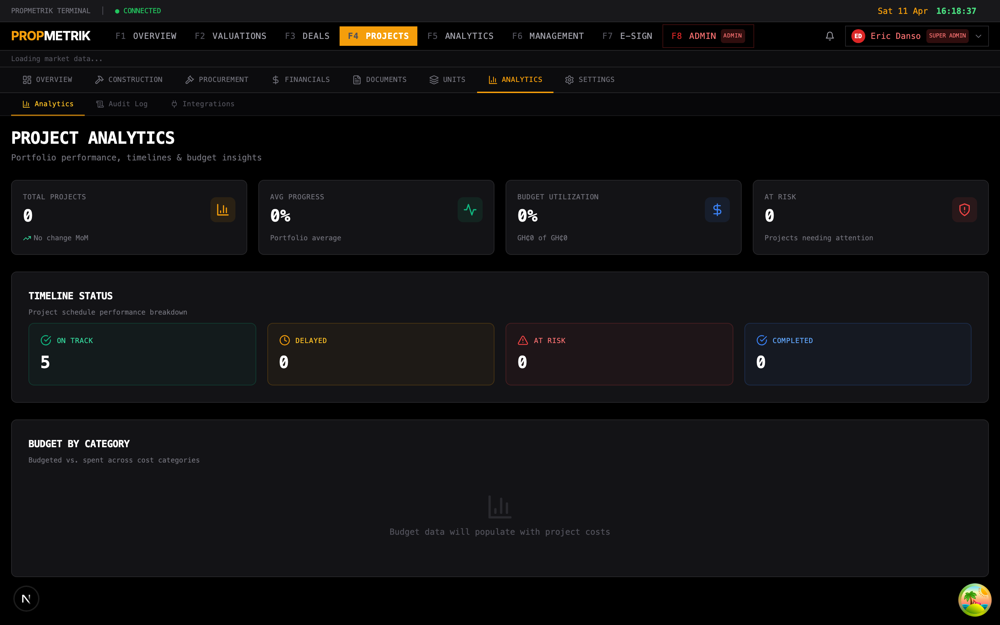

### Analytics Dashboards

- **Progress Dashboard** -- Gantt-style view of milestone completion with planned vs. actual dates.
- **Cost Dashboard** -- Budget vs. actual spending by cost code, with variance analysis and burn-down charts.
- **Schedule Performance** -- SPI (Schedule Performance Index) and earned value metrics.
- **Quality Metrics** -- Inspection pass rates, punch list closure rates, and RFI response times.
- **Safety Statistics** -- Incident rates, safety observation trends, and compliance scores.

### Using Analytics

1. Navigate to the **Analytics** tab.
2. Select the **dashboard** you want to view.
3. Use the **date range** selector to adjust the reporting period.
4. Hover over charts for detailed tooltips.
5. Click **Export** to download charts or raw data.

---

## 3.27 Reports

Generate and download formal project reports.

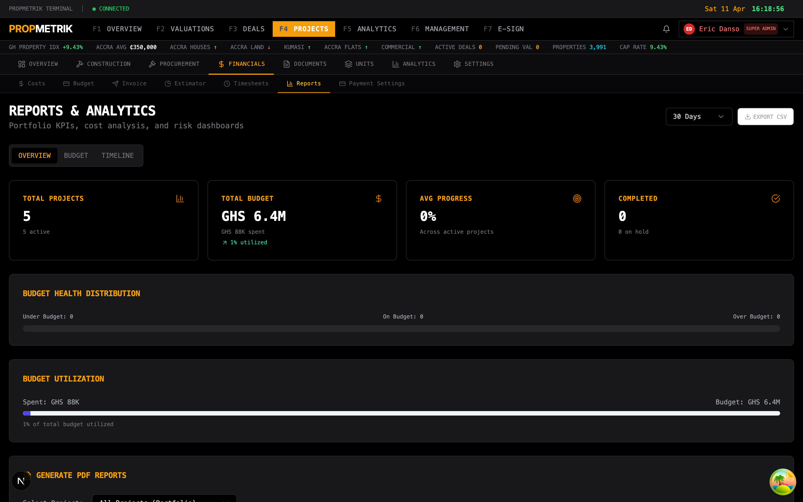

### Available Reports

| Report | Contents |
|--------|----------|
| Progress Report | Milestone status, percentage complete, photos, narrative |
| Cost Report | Budget vs. actual by cost code, committed costs, forecast |
| Monthly Report | Comprehensive monthly update combining progress, cost, and safety |
| Site Log Summary | Aggregated daily logs for a date range |
| RFI Log | All RFIs with status, dates, and response times |
| Change Order Log | All change orders with cost and schedule impacts |
| Inspection Summary | All checklist inspections with pass/fail rates |
| Closeout Report | Closeout checklist status and documentation |

### Generating a Report

1. Navigate to the **Reports** tab.
2. Select the **report type**.
3. Configure the **date range** and any filters.
4. Click **Generate**.
5. Preview the report in the browser.
6. Click **Download** to save as PDF.

> **Tip:** Schedule recurring reports (e.g., weekly progress reports) to be generated and emailed to stakeholders automatically. Configure this in Project Settings > Notifications.

---

## 3.28 Issues & Risks

Track project issues, risks, and their mitigation plans.

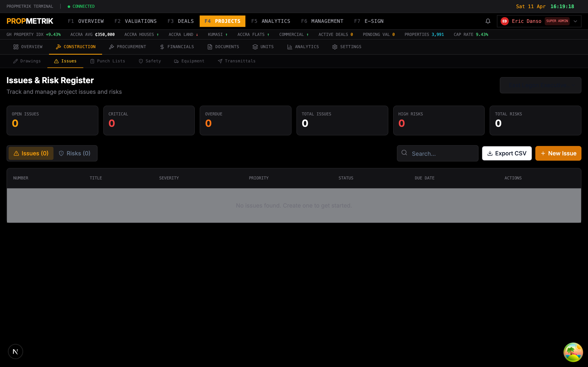

### Logging an Issue

1. Navigate to the **Issues** tab.
2. Click **+ New Issue**.
3. Enter the **title** and **description**.
4. Select the **category** (Design, Construction, Procurement, Financial, Regulatory, Environmental).
5. Set the **severity** (Low, Medium, High, Critical).
6. Assign the issue to a **responsible person**.
7. Set a **target resolution date**.
8. Click **Save**.

### Risk Register

- Maintain a risk register with identified risks, their likelihood, impact, and mitigation strategies.
- Review and update risks during regular project meetings.
- Link risks to issues when they materialize.

### Issue Tracking

- View all issues in a filterable list.
- Track issue status: Open, In Progress, Resolved, Closed.
- Monitor resolution time and overdue issues.
- Escalate critical issues to project leadership.

---

## Best Practices for Project Management

1. **Set up the project properly.** Invest time in the creation wizard. Accurate location, unit mix, and budget information pays dividends throughout the project lifecycle.

2. **Use milestone frameworks.** Pre-configured milestone sets ensure you do not miss critical construction phases. Customize them for your specific project.

3. **Log daily.** Consistent daily site logs are your best defense against disputes and your best tool for identifying trends (e.g., recurring weather delays).

4. **Close the loop on RFIs.** Track RFI response times and ensure they are answered before they block construction progress.

5. **Document change orders thoroughly.** Every scope change should have a formal change order with cost and schedule impact. Verbal agreements lead to disputes.

6. **Complete checklists at every phase transition.** Do not skip quality inspections between phases. Catching defects early is far cheaper than fixing them later.

7. **Resolve punch lists before handover.** A clean punch list at closeout leads to satisfied clients and faster final payments.

8. **Review analytics weekly.** The analytics dashboards reveal trends before they become problems. Monitor SPI, cost variance, and safety metrics regularly.

---

## Summary

| Feature | Screenshot | Key Action |
|---------|------------|------------|
| Projects List | 01 | View, filter, and search all projects |
| Create Project | 02 | 6-step wizard for new project setup |
| Schedule | 03 | Plan milestones and track phases |
| Team | 04 | Add members and assign roles |
| Bids | 05 | Create bid packages and evaluate submissions |
| Bidding | 06 | Contractor bid submission portal |
| RFIs | 07 | Submit and respond to information requests |
| Documents | 08 | Upload, organize, and manage submittals |
| Site Logs | 09 | Daily construction activity records |
| Checklists | 10 | Quality inspections and compliance checks |
| Punch Lists | 11 | Deficiency tracking and resolution |
| Safety | 12 | Incident reporting and safety compliance |
| Meetings | 13 | Schedule meetings and record minutes |
| Drawings | 14 | Drawing management with version control |
| Procurement | 15 | Purchase orders and cost tracking |
| Transmittals | 16 | Formal document transfer records |
| Timesheets | 17 | Labor hour tracking and approval |
| Equipment | 18 | Equipment registry and usage tracking |
| Contractors | 19 | Contractor directory and performance |
| Change Orders | 20 | Scope changes with approval workflow |
| Closeout | 21 | Project completion checklist |
| Units | 22 | Individual unit management |
| Cost Estimator | 23 | Preliminary cost estimation tool |
| Audit Log | 24 | Complete action history |
| Settings | 25 | Project configuration |
| Analytics | 26 | Performance dashboards |
| Reports | 27 | Formal report generation |
| Issues | 28 | Issue and risk tracking |

---

[Previous: Chapter 2 -- Dashboard & Navigation](../02-dashboard/guide.md) | [Next: Chapter 4 -- Budget & Cost Management](../04-budget-cost/guide.md)
