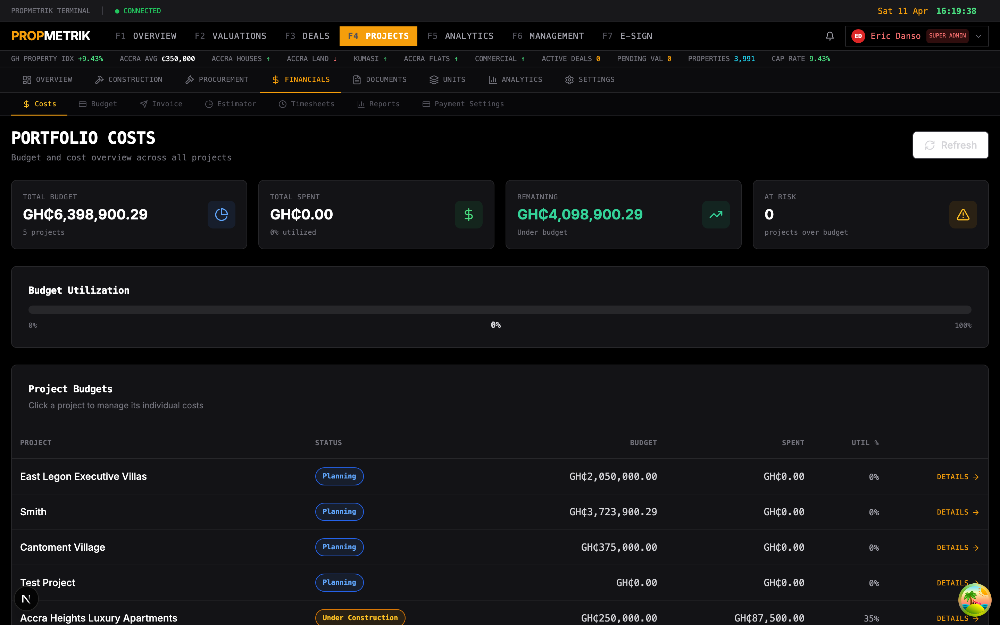
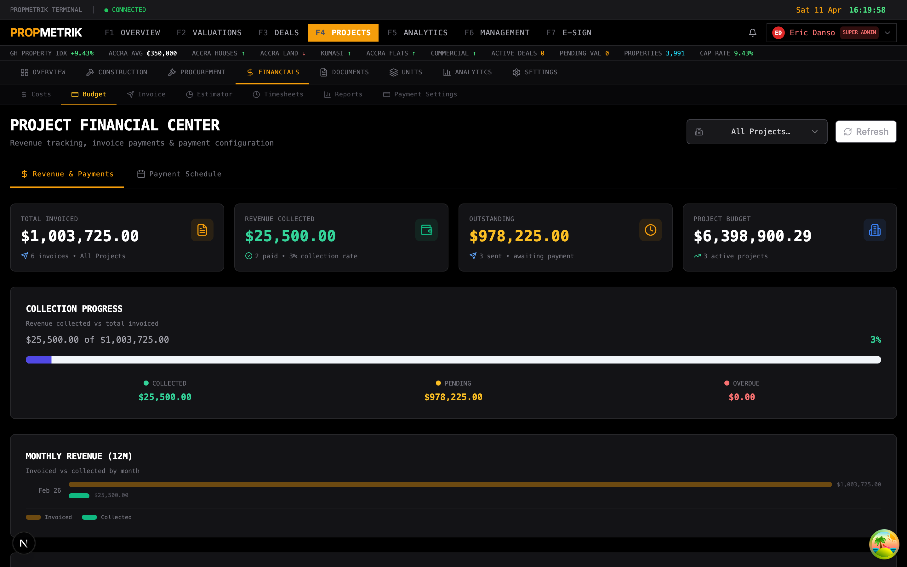
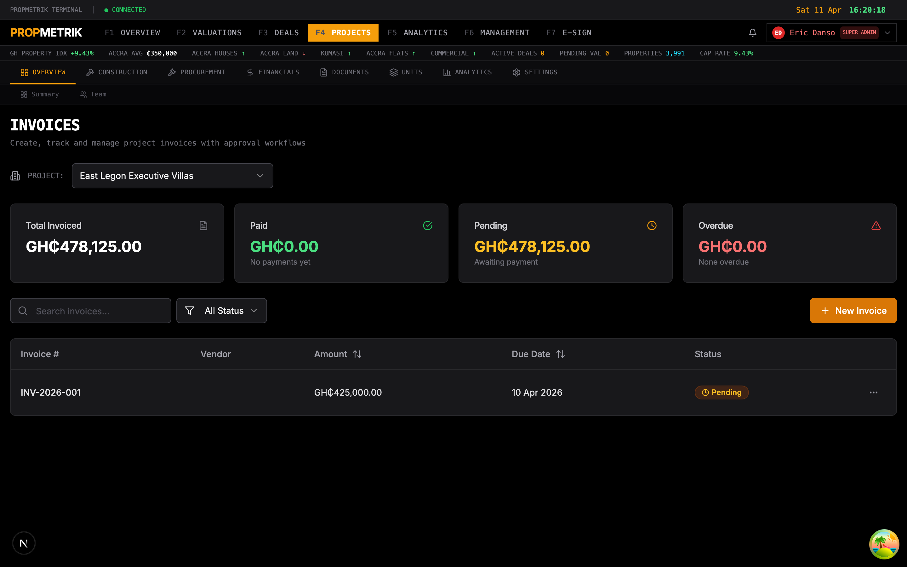
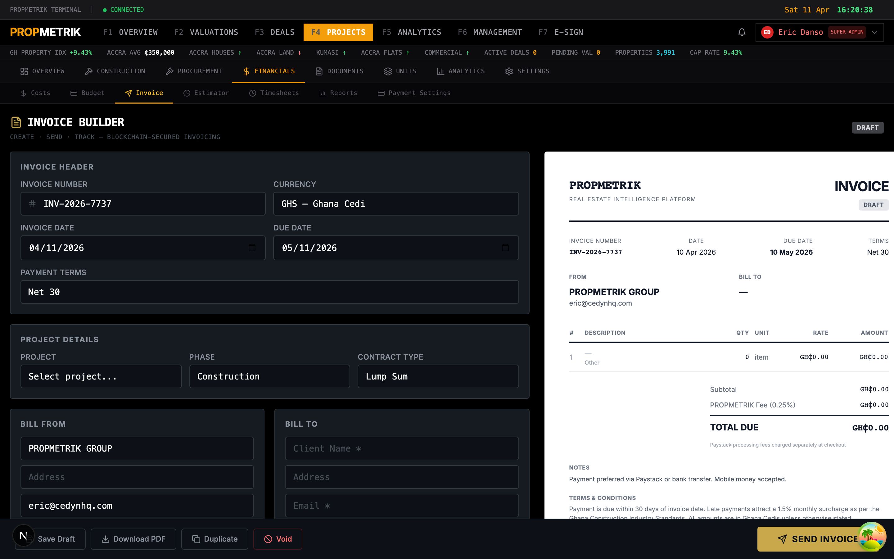
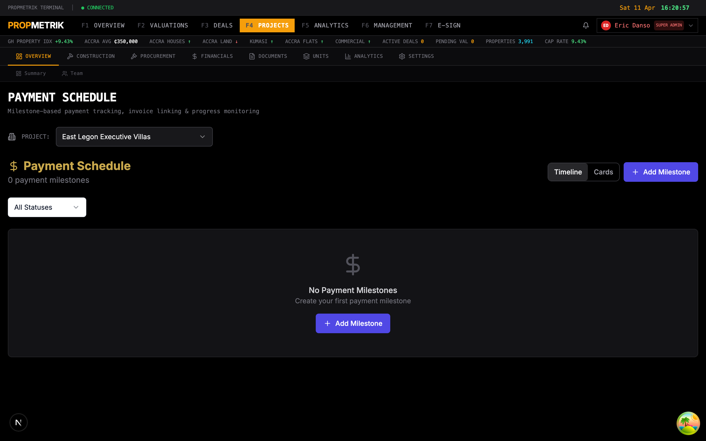
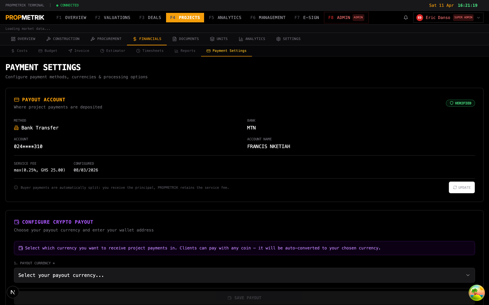

# Chapter 4: Budget & Cost Management

## Overview

The Budget & Cost Management module in PropMetrik gives project managers and finance teams full visibility into construction budgets, cost tracking, invoicing, and payment schedules. Accessible from the project sub-navigation under **Budget & Cost**, it ties directly into each project and provides real-time summaries of budgeted amounts, committed spend, actuals, and variances -- all denominated in Ghanaian Cedis (GHS) by default.

This module is designed for construction and development projects where cost control is critical. It supports 19 cost categories spanning the full development lifecycle, from land acquisition through marketing and sales, and tracks each line item through a clear status workflow: Draft, Budgeted, Committed, Invoiced, Approved, Paid, or Cancelled.

---

## 4.1 Costs Overview

Navigate to your project and select **Budget & Cost** from the project sub-navigation bar.

### Summary Cards

At the top of the page, four summary cards provide an at-a-glance financial snapshot:

| Card | Description |
|------|-------------|
| **Total Budget** | The sum of all revised budgets (or original budgets where no revision exists) across every cost line item |
| **Committed** | Total amount that has been committed to vendors or contractors, shown with percentage of total budget |
| **Spent** | Actual expenditure to date, with a utilization percentage |
| **Variance** | Difference between budget and actual spend. Displayed in green when under budget or red when over budget |

### Budget Breakdown by Category

Below the summary cards, the **Overview** tab shows a horizontal bar chart for each cost category. Each bar displays:

- The category name (e.g., Foundation, Structural, MEP)
- The percentage of budget consumed
- A progress bar that turns red when spending exceeds 100% of the budgeted amount

PropMetrik supports the following cost categories:

- Land Acquisition
- Permits & Approvals
- Design & Engineering
- Site Preparation
- Foundation
- Structural
- Roofing
- MEP (Mechanical/Electrical/Plumbing)
- Exterior Finishing
- Interior Finishing
- Landscaping
- Amenities
- Contingency
- Professional Fees
- Insurance
- Marketing & Sales
- Legal
- Financing Costs
- Other

---

## 4.2 Adding a Cost Item

1. Click the **Add Cost** button (amber, top-right corner) on the Budget & Cost page.
2. In the dialog that appears, fill in the required fields:
   - **Description** -- A clear name for this cost item (e.g., "Substructure Concrete Works")
   - **Category** -- Select from the dropdown of 19 categories
   - **Original Budget** -- The budgeted amount in your project currency
   - **Notes** (optional) -- Any additional context or justification
3. Click **Save** to add the cost item.

The new item will appear in the **Cost Items** tab with a default status of Draft.

### Cost Item Status Workflow

Each cost item progresses through the following statuses:

| Status | Meaning |
|--------|---------|
| **Draft** | Initial entry, not yet approved for budget |
| **Budgeted** | Approved and included in the project budget |
| **Committed** | A purchase order or contract has been issued |
| **Invoiced** | An invoice has been received from the vendor |
| **Approved** | The invoice has been approved for payment |
| **Paid** | Payment has been disbursed |
| **Cancelled** | The cost item has been removed or voided |

---

## 4.3 Cost Items Table

Switch to the **Cost Items** tab to view all line items in a detailed table.

### Filtering and Search

Use the controls above the table to narrow results:

- **Search** -- Type a keyword to filter by description
- **Category dropdown** -- Filter by any of the 19 cost categories
- **Status dropdown** -- Filter by Draft, Budgeted, Committed, Invoiced, Approved, Paid, or Cancelled

### Table Columns

| Column | Description |
|--------|-------------|
| Description | The cost item name |
| Category | The assigned cost category |
| Status | Current status badge with color coding |
| Budgeted | The revised budget (or original if no revision) |
| Actual | Actual costs recorded to date |
| Variance | Budget minus actual -- red if negative, green if positive |

---

## 4.4 Financials

The **Financials** tab provides aggregated financial reporting for the project.

Key features include:

- **Cash flow visualization** -- Monthly income vs. expenditure charted over time
- **Budget vs. actual comparison** -- Side-by-side comparison across all categories
- **Cumulative spend tracking** -- Running total of expenditure against the budget ceiling
- **Xero integration status** -- If connected, shows sync status for costs pushed to Xero accounting

> **Tip:** Connect your Xero account from the project settings to automatically sync cost data with your accounting software. See Chapter 10 for Xero integration setup.

---

## 4.5 Invoices

The Invoices section tracks all vendor invoices associated with the project.

### Viewing Invoices

The invoice list displays:

- Invoice number and vendor name
- Issue date and due date
- Amount in project currency
- Payment status (Pending, Paid, Overdue)

### Creating an Invoice

To create a new invoice:

1. Click **New Invoice** from the Invoices tab.
2. Select the vendor or contractor.
3. Add line items with descriptions, quantities, unit prices, and tax rates.
4. The system calculates subtotals, tax, and the grand total automatically.
5. Set the payment terms and due date.
6. Click **Create Invoice** to save.

Invoices can be linked to specific cost items, ensuring that actual spend is recorded against the correct budget line.

---

## 4.6 Payment Schedule

The Payment Schedule provides a timeline view of upcoming and completed payments.

### How It Works

- Payments are organized by milestone or date
- Each entry shows the payee, amount, due date, and status
- Overdue payments are highlighted for immediate attention
- The schedule can be filtered by status (Upcoming, Paid, Overdue)

This view is particularly useful for cash flow planning and ensuring that contractors are paid on time according to contractual milestones.

---

## 4.7 Payment Settings

Configure payment preferences and integration settings from the Payment Settings panel.

Available settings include:

- **Default currency** -- Set the project currency (GHS, USD, GBP, EUR)
- **Payment terms** -- Define standard payment terms (Net 15, Net 30, Net 60)
- **Bank details** -- Configure disbursement account information
- **Approval workflow** -- Set thresholds for payment approval levels
- **Notification preferences** -- Configure alerts for overdue invoices and upcoming payments

---

## Tips and Best Practices

1. **Set budgets early.** Enter all cost categories with their budgeted amounts at project inception. This establishes the baseline for variance tracking throughout the project lifecycle.

2. **Use the status workflow consistently.** Move cost items through the status pipeline (Draft to Budgeted to Committed to Paid) to maintain an accurate picture of financial commitments.

3. **Review variances weekly.** The Variance card on the overview page provides immediate visibility into budget overruns. Address red-flagged categories before they escalate.

4. **Link invoices to cost items.** When entering vendor invoices, always associate them with the correct cost line item. This ensures the "Actual" column reflects real spend.

5. **Plan cash flow with the Payment Schedule.** Use the milestone-based payment schedule to forecast upcoming disbursements and avoid liquidity crunches.

6. **Leverage Xero sync.** If your organization uses Xero, connect it to avoid double-entry of financial data. Cost items synced to Xero will show a sync status indicator.

7. **Use contingency wisely.** Budget a contingency line item (typically 5-10% of total budget) and monitor it separately. Avoid using contingency for planned scope changes -- those should be tracked as change orders.

---

## Navigation Reference

| Action | Path |
|--------|------|
| Open Budget & Cost | Project > Sub-nav > Budget & Cost |
| Add a cost item | Budget & Cost > Add Cost button |
| View cost details | Budget & Cost > Cost Items tab > Click row |
| Create an invoice | Budget & Cost > Invoices tab > New Invoice |
| View payment schedule | Budget & Cost > Payment Schedule tab |
| Configure settings | Budget & Cost > Payment Settings tab |
