# Chapter 5: Property Management

## Overview

PropMetrik's Property Management module is a full-featured platform for landlords, property managers, and real estate firms operating in the Ghanaian market. It covers the entire property lifecycle -- from onboarding properties and tenants, through lease management and rent collection, to maintenance tracking and financial reporting.

Access the module from the main sidebar by clicking **Property Management**. The module has its own dashboard and sub-navigation with dedicated sections for Properties, Portfolios, Tenants, Leases, Applications, Maintenance, Messages, Documents, Financials, Calendar, Team, Vendors, and Bulk Operations.

All monetary values default to Ghanaian Cedis (GHS / &#8373;).

---

## 5.1 Property Management Dashboard

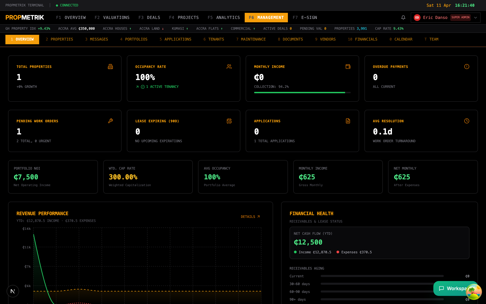

The dashboard provides a comprehensive overview of your entire property portfolio at a glance.

### Key Performance Indicators

The top row of summary cards displays:

- **Total Properties** -- Number of properties under management
- **Total Tenants** -- Active tenant count
- **Total Revenue** -- Rental income collected in the current period
- **Outstanding Balance** -- Total unpaid rent across all tenancies

### Charts and Visualizations

The dashboard includes several interactive charts:

- **Cash Flow Chart** -- Monthly income vs. expenses as an area chart, showing net cash flow trends
- **Portfolio Composition** -- Pie chart showing the breakdown of property types (residential, commercial, industrial)
- **Occupancy Rate** -- Overall portfolio occupancy displayed as a percentage with trend indicator
- **Lease Expiry Timeline** -- Upcoming lease expirations to help with renewal planning
- **Aged Receivables** -- Breakdown of outstanding rent by age bands (Current, 30-60 days, 60-90 days, 90+ days)
- **Work Order Statistics** -- Maintenance ticket counts by status, category, and average resolution time

### Quick Actions

The dashboard provides quick-access buttons for common tasks:

- Add Property
- Add Tenant
- Create Lease
- New Work Order
- View Reports

---

## 5.2 Properties

### Properties List

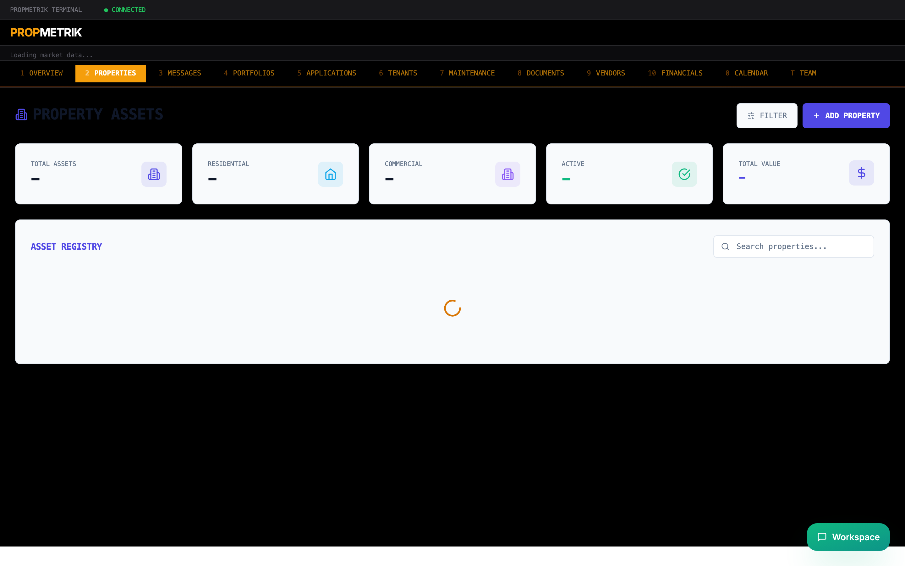

The Properties section displays all managed properties in a searchable, filterable list. Each property card shows:

- Property title and reference number
- Address and region
- Property type (Residential House, Apartment, Commercial, etc.)
- Number of units
- Occupancy status
- Monthly rental amount

Use the search bar to find properties by name, address, or reference number. Filter by property type, status, or region.

### Adding a New Property

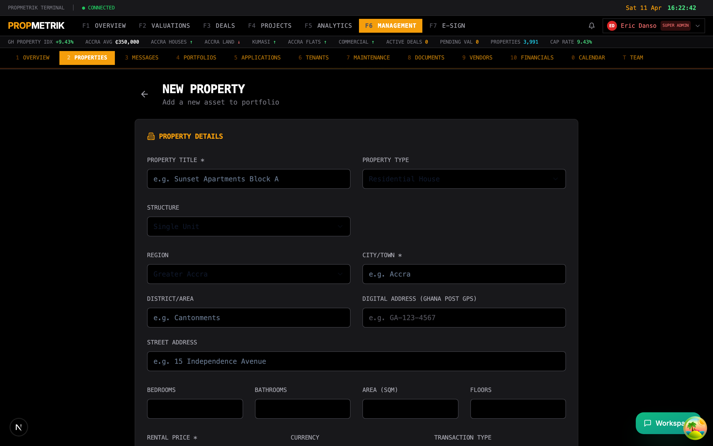

To add a new property:

1. Click **Add Property** from the Properties page or the dashboard quick actions.
2. Fill in the property details:

| Field | Description |
|-------|-------------|
| **Title** | A descriptive name (e.g., "East Legon Executive Villa") |
| **Description** | Full description of the property |
| **Region** | Select from Ghana's regions (Greater Accra, Ashanti, Western, etc.) |
| **City** | City or town name |
| **District** | Local district |
| **Street Address** | Full street address |
| **Digital Address** | Ghana Post GPS address (e.g., GA-123-4567) |
| **Property Type** | Residential House, Apartment, Commercial, Industrial, Land, Mixed Use |
| **Transaction Type** | Rental or Sale |
| **Bedrooms / Bathrooms / Floors** | Physical specifications |
| **Total Area (sqm)** | Gross floor area in square meters |
| **Price** | Monthly rent or sale price |
| **Currency** | GHS (default), USD, GBP, EUR |
| **Status** | Active, Inactive, Under Maintenance |

3. For multi-unit properties, toggle the multi-unit option and specify the number of units.
4. Click **Save** to create the property. A reference number is automatically generated.

> **Tip:** Use Ghana Post digital addresses for precise location identification. This also helps with valuation comparables matching.

---

## 5.3 Portfolios

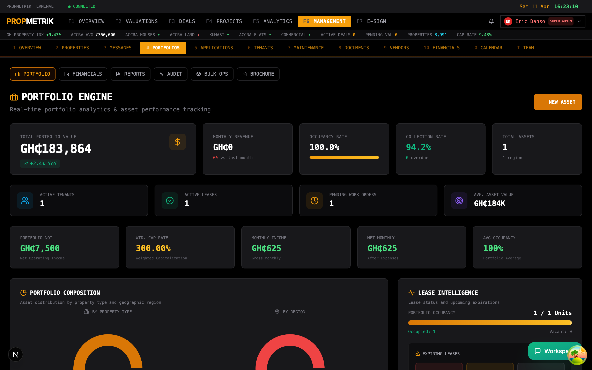

Portfolios allow you to group properties into logical collections for reporting and management purposes.

### Creating a Portfolio

1. Navigate to **Portfolios** from the Property Management sub-navigation.
2. Click **New Portfolio**.
3. Enter a portfolio name and description.
4. Add properties to the portfolio by selecting from your property list.
5. Save the portfolio.

### Portfolio Features

- **Aggregated Metrics** -- View combined financials, occupancy, and performance across all properties in the portfolio
- **Brochure Generation** -- Generate a professional portfolio brochure for investor or marketing purposes
- **Comparative Analysis** -- Compare performance metrics across properties within the portfolio

---

## 5.4 Tenants

### Tenant List


The Tenants section provides a directory of all tenants associated with your properties. Each tenant record includes:

- Full name and contact information
- Linked property and unit
- Lease status (Active, Expired, Pending)
- Outstanding balance
- Move-in date

### Adding a New Tenant

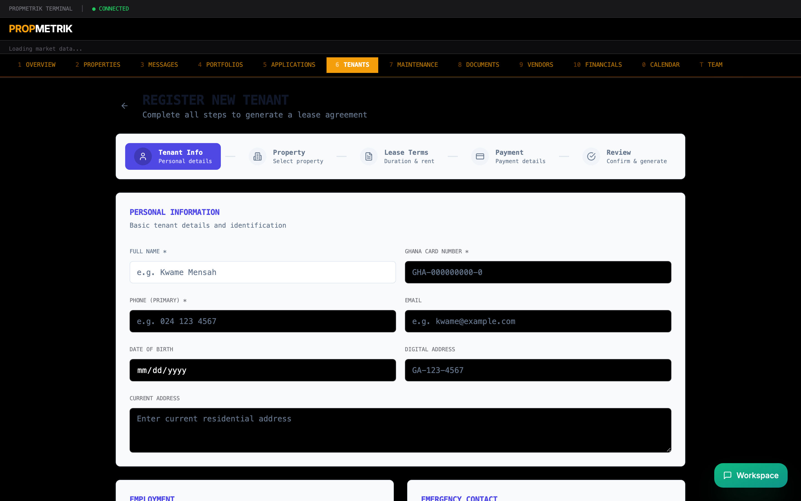

To register a new tenant:

1. Click **Add Tenant** from the Tenants page.
2. Fill in the tenant's personal details:
   - Full name
   - Email address
   - Phone number
   - Ghana Card number or passport ID
   - Emergency contact
   - Employer information (optional)
3. Optionally assign the tenant to a property and unit immediately.
4. Click **Save Tenant**.

Once a tenant is created, you can proceed to create a lease agreement linking them to a specific property.

---

## 5.5 Leases

### Lease List

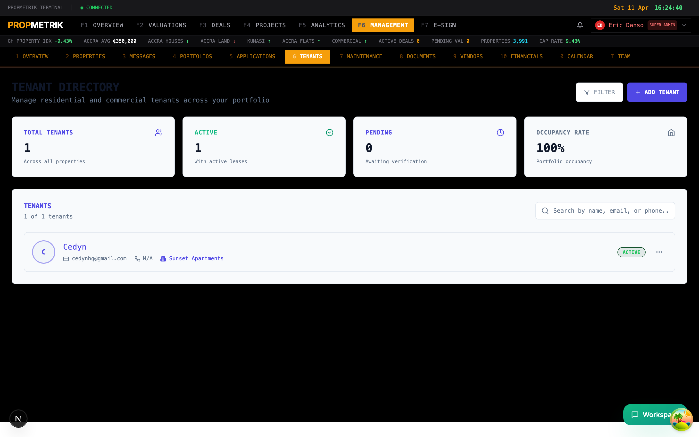

The Leases section manages all tenancy agreements. The list view shows:

- Property name and unit
- Tenant name
- Lease type (Fixed Term, Month-to-Month, Periodic)
- Start and end dates
- Monthly rent amount
- Status (Active, Expiring Soon, Expired, Terminated)

Color-coded status badges make it easy to identify leases that need attention.

### Creating a New Lease

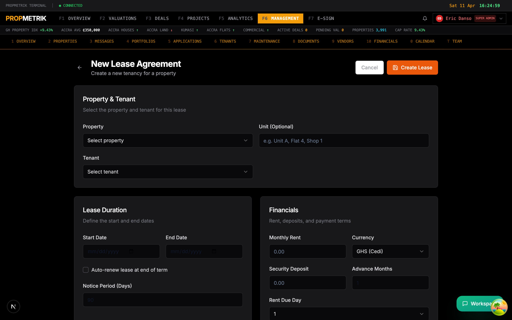

To create a lease agreement:

1. Click **New Lease** from the Leases page.
2. **Property & Tenant** -- Select the property (and unit if applicable) and the tenant.
3. **Lease Terms** -- Configure:
   - Lease type (Fixed Term, Month-to-Month)
   - Start date and end date
   - Monthly rent amount and currency
   - Security deposit amount
   - Rent frequency (Monthly, Quarterly, Annual)
   - Payment advance period (how many months paid upfront -- common in Ghana)
4. **Additional Terms** -- Add clauses such as:
   - Rent escalation percentage and schedule
   - Utility responsibilities
   - Maintenance obligations
   - Pet policy
   - Early termination terms
5. **Documents** -- Upload supporting documents (ID copies, employment letters, reference letters).
6. Click **Create Lease** to save.

> **Tip:** In the Ghanaian rental market, it is common to collect 1-2 years of rent upfront. Use the "Payment Advance" field to track prepaid rent periods accurately.

### Lease Actions

From a lease detail page, you can:

- Renew the lease with updated terms
- Terminate the lease early with documented reasons
- Generate an e-sign envelope for digital signature (see Chapter 9)
- Record rent payments
- View payment history

---

## 5.6 Applications

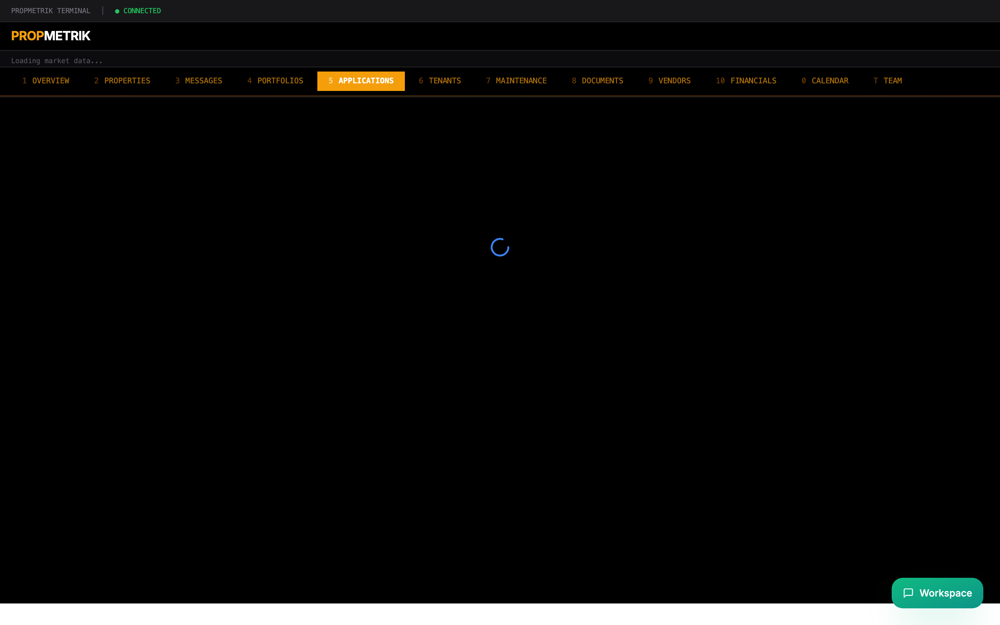

The Applications section manages rental applications from prospective tenants.

### Application Workflow

1. **Submission** -- Prospective tenants submit applications through the public application portal or are entered manually.
2. **Screening** -- Review application details including employment, references, and financial information.
3. **Approval/Rejection** -- Approve qualified applicants or reject with documented reasons.
4. **Lease Generation** -- For approved applicants, generate a lease agreement directly from the application.

### Application Statuses

| Status | Description |
|--------|-------------|
| Submitted | Application received and awaiting review |
| Under Review | Currently being evaluated |
| Approved | Application accepted, pending lease creation |
| Rejected | Application declined |
| Lease Generated | A lease has been created from this application |

To generate a lease from an approved application, click into the application detail page and use the **Generate Lease** action. This pre-fills the lease form with the applicant's details and the property information.

---

## 5.7 Maintenance

### Work Orders List

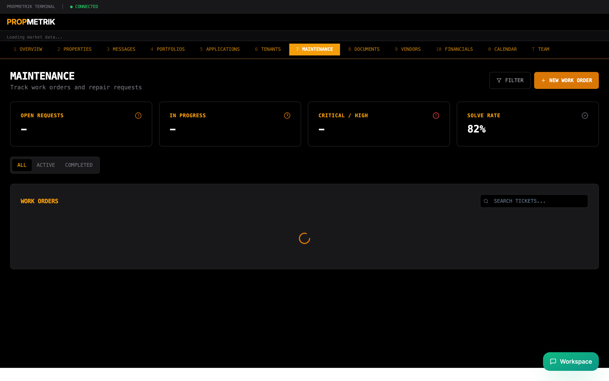

The Maintenance section tracks all repair and maintenance work orders across your portfolio.

Each work order displays:

- Title and description of the issue
- Property and unit
- Category (Plumbing, Electrical, HVAC, Carpentry, Masonry, Painting, Roofing, Pest Control, Landscaping, General, Other)
- Priority level (Low, Medium, High, Emergency)
- Status (Submitted, In Progress, Scheduled, Completed, Cancelled)
- Assigned vendor or team member
- Cost estimate and actual cost

### Creating a Work Order

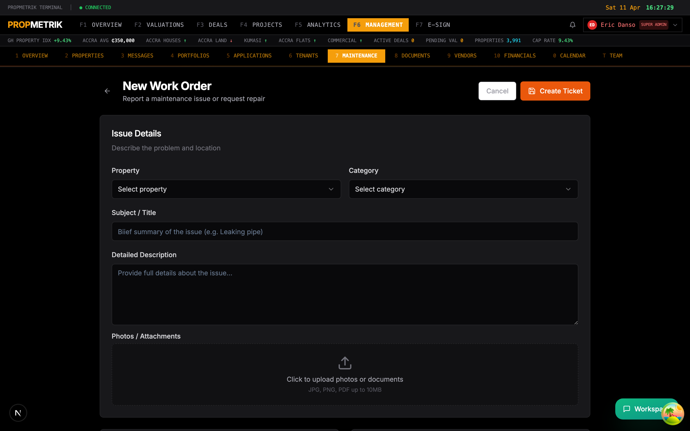

To create a new work order:

1. Click **New Work Order** from the Maintenance page.
2. Fill in the issue details:
   - **Property** -- Select the affected property
   - **Category** -- Choose the type of issue (Plumbing, Electrical, HVAC, etc.)
   - **Priority** -- Set the urgency level
   - **Title** -- Short summary of the problem
   - **Description** -- Detailed description of the issue
   - **Location** -- Specific area within the property (e.g., "Master bathroom, second floor")
3. **Assignment** -- Optionally assign to a vendor or team member.
4. **Photos** -- Upload images of the issue for documentation.
5. Click **Create Ticket** to submit.

### Work Order Lifecycle

```
Submitted --> In Progress --> Scheduled --> Completed
                                  |
                                  v
                              Cancelled
```

Tenants can also submit maintenance requests through the Tenant Portal (see Chapter 6), which automatically creates work orders visible in this section.

---

## 5.8 Messages

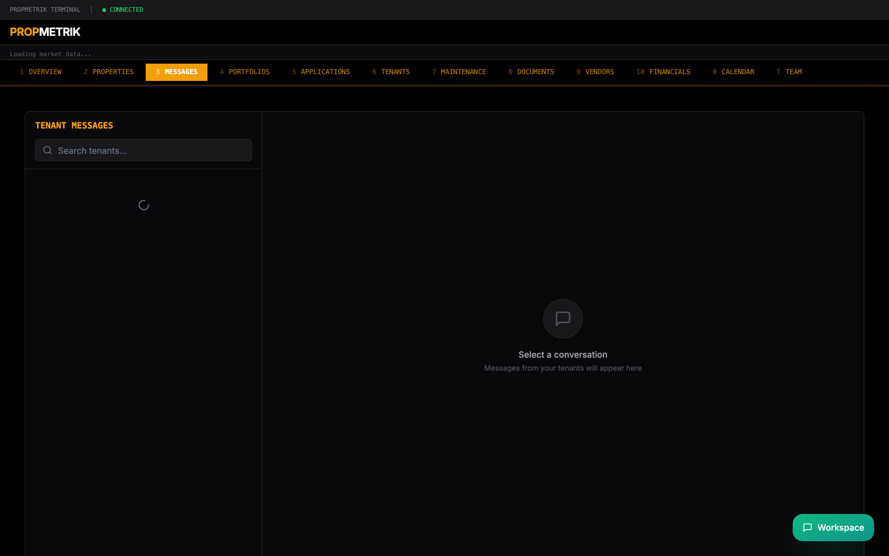

The Messages section provides a centralized communication hub for:

- **Tenant Communications** -- Send and receive messages to/from tenants
- **Team Collaboration** -- Internal discussions about properties and maintenance
- **Automated Notifications** -- System-generated messages for rent reminders, lease expirations, and maintenance updates

Messages are threaded by conversation and can include file attachments.

---

## 5.9 Documents

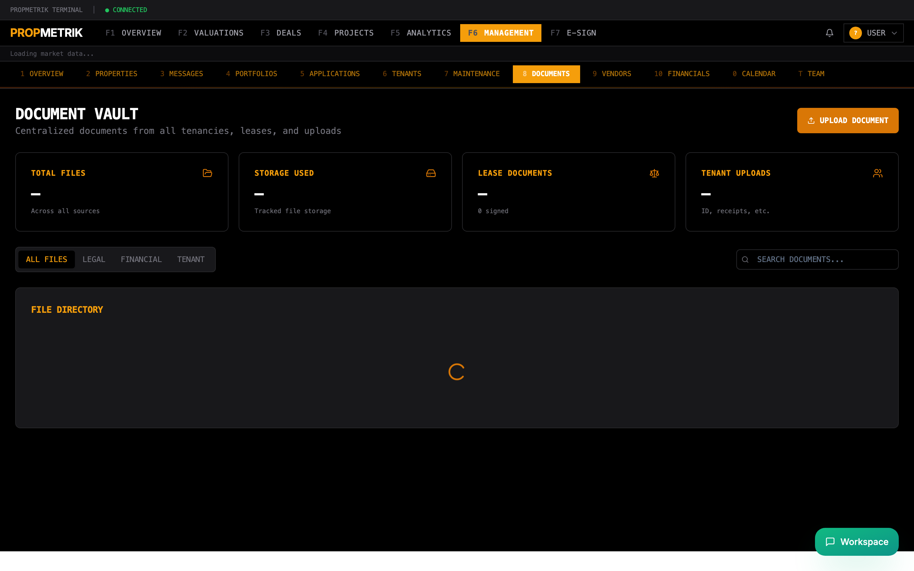

The Documents section serves as a central repository for all property-related documents.

### Document Categories

- Lease agreements (signed and unsigned)
- Tenant identification documents
- Property title documents and certificates
- Insurance policies
- Inspection reports
- Financial statements
- Vendor contracts
- Compliance certificates

### Features

- Upload documents with metadata (title, category, associated property)
- Search and filter by document type, property, or tenant
- Download individual files or bulk export
- Version tracking for updated documents

---

## 5.10 Financials

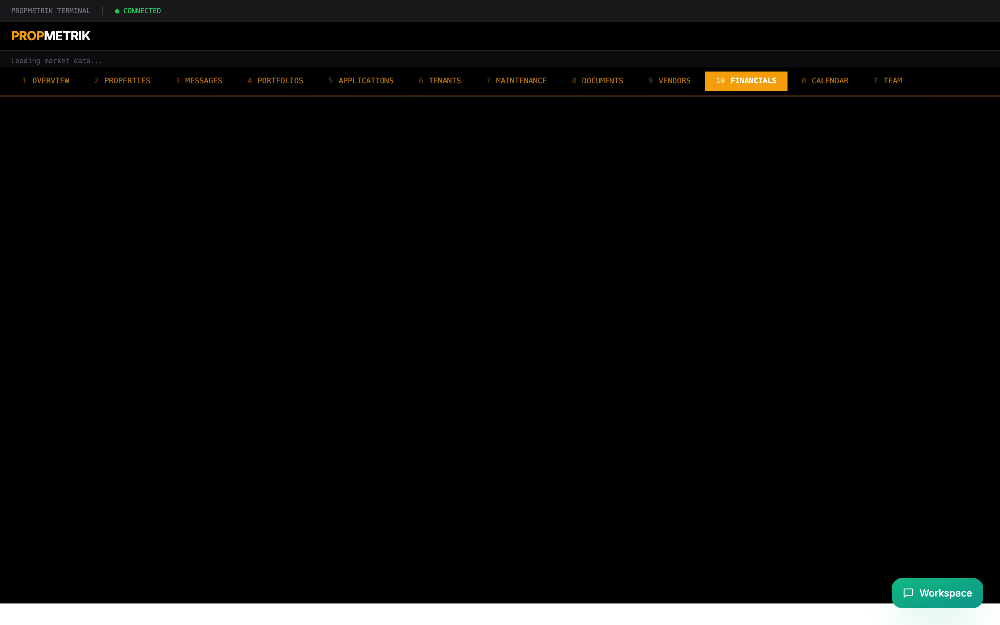

The Financials section provides detailed financial reporting across your property portfolio.

### Reports Available

- **Income Statement** -- Rental income, late fees, and other revenue by property and period
- **Expense Report** -- Maintenance costs, management fees, insurance, and other expenses
- **Cash Flow Statement** -- Net cash flow with monthly breakdown
- **Rent Roll** -- Complete listing of all active leases with rent amounts and payment status
- **Aged Receivables** -- Outstanding balances organized by age (Current, 30-60, 60-90, 90+ days)
- **Vacancy Report** -- Unoccupied units with days vacant and estimated revenue loss

### Filtering

Reports can be filtered by:

- Date range
- Property or portfolio
- Tenant
- Payment status

---

## 5.11 Calendar

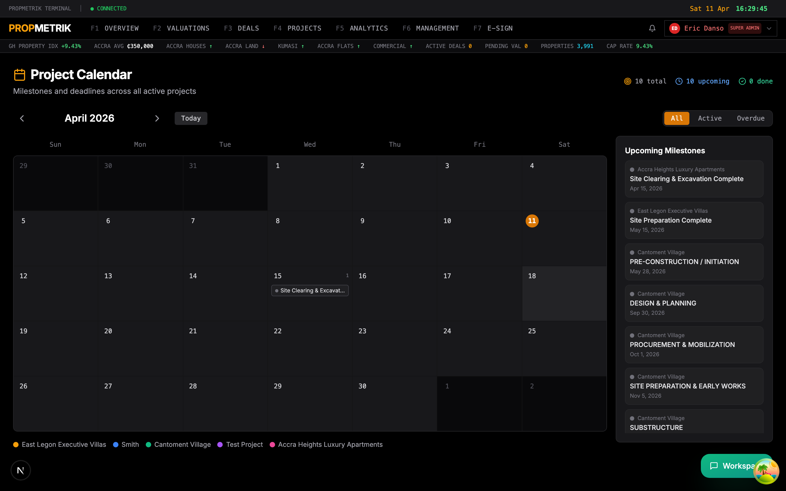

The Calendar provides a visual timeline of all property management events:

- **Lease Start/End Dates** -- When leases begin and expire
- **Rent Due Dates** -- Scheduled payment dates across all tenancies
- **Maintenance Schedules** -- Scheduled work orders and inspections
- **Inspections** -- Property inspection dates
- **Renewal Deadlines** -- When lease renewal notices are due

Events are color-coded by type for quick identification. Click any event to view details or take action.

---

## 5.12 Team

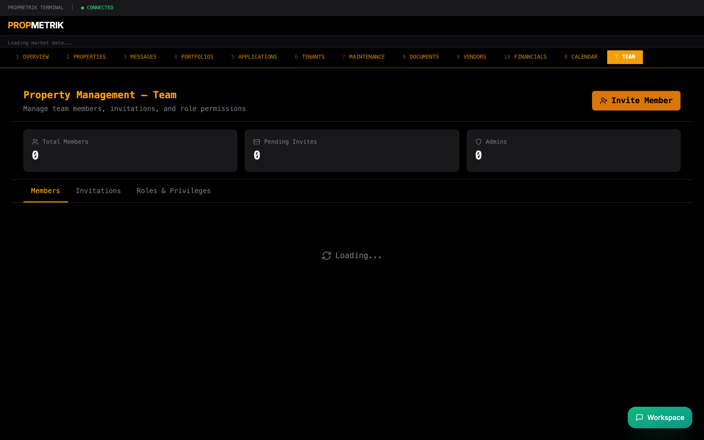

The Team section manages staff members involved in property management operations.

### Team Roles

| Role | Capabilities |
|------|-------------|
| **Property Manager** | Full access to all properties and operations |
| **Assistant Manager** | Property management with limited financial access |
| **Maintenance Coordinator** | Work order management and vendor coordination |
| **Accountant** | Financial reporting and payment processing |
| **Viewer** | Read-only access to property data |

### Adding Team Members

1. Click **Add Member** from the Team page.
2. Enter the team member's email address and select their role.
3. Send the invitation -- they will receive an email to join the organization.

---

## 5.13 Vendors

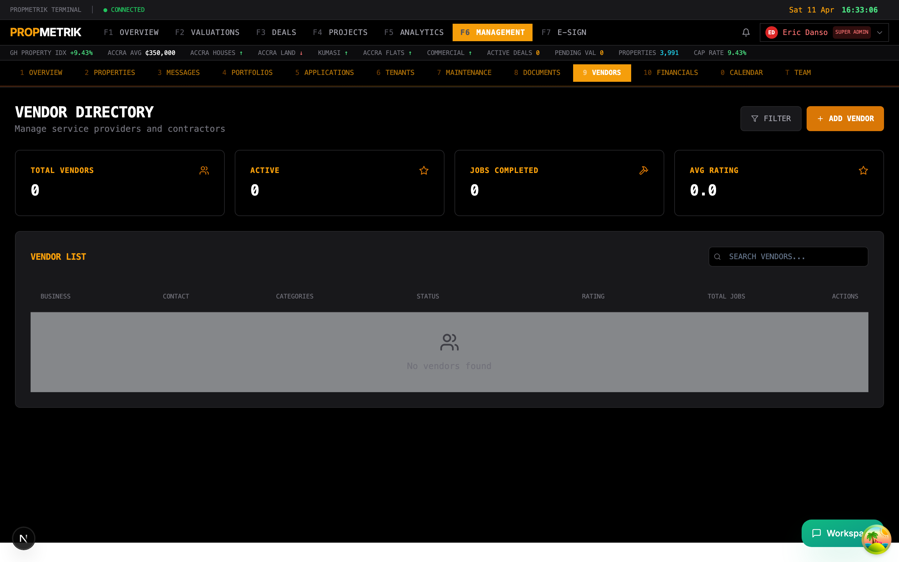

The Vendors section maintains a directory of service providers used for maintenance and property services.

### Vendor Information

Each vendor record includes:

- Company name and contact person
- Phone number and email
- Service categories (Plumbing, Electrical, HVAC, etc.)
- Rate/pricing information
- Performance rating
- Active work orders count
- Payment history

### Adding a Vendor

1. Click **Add Vendor** from the Vendors page.
2. Enter the vendor's business details, service categories, and contact information.
3. Save the vendor profile.

Vendors can be assigned to work orders from the Maintenance section. Their performance is tracked over time through completion rates and tenant satisfaction feedback.

---

## 5.14 Bulk Operations

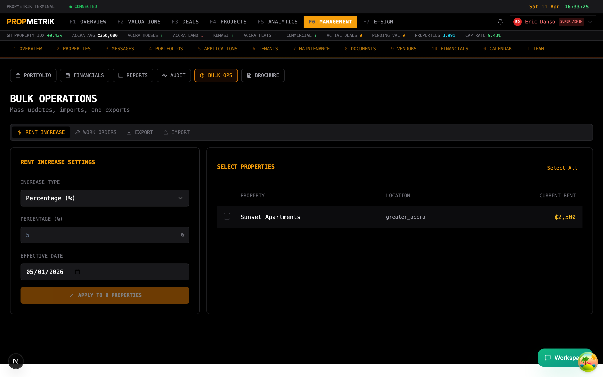

The Bulk Operations section enables mass actions across multiple properties or tenants simultaneously.

### Available Bulk Actions

- **Rent Adjustments** -- Apply percentage-based or fixed-amount rent increases across selected leases
- **Status Updates** -- Change the status of multiple properties at once
- **Communication** -- Send bulk messages or notices to selected tenants
- **Document Generation** -- Generate lease renewals or notices for multiple tenants
- **Data Export** -- Export property, tenant, or financial data in bulk

### How to Use

1. Navigate to **Bulk Operations**.
2. Select the operation type.
3. Choose the target properties, tenants, or leases using checkboxes or filters.
4. Configure the operation parameters.
5. Preview the changes before applying.
6. Confirm and execute.

> **Tip:** Always use the preview step before executing bulk operations. Changes applied in bulk are difficult to reverse individually.

---

## Tips and Best Practices

1. **Keep property records current.** Update property details whenever improvements or changes occur. Accurate records improve valuation comparables and financial reporting.

2. **Use portfolios for reporting.** Group related properties into portfolios to generate consolidated financial reports for investors or stakeholders.

3. **Set up lease renewal reminders.** The calendar automatically tracks lease expirations. Review expiring leases 60-90 days in advance to negotiate renewals.

4. **Document everything.** Upload all signed agreements, inspection reports, and compliance certificates to the Documents section. This creates an audit trail and simplifies due diligence.

5. **Track maintenance costs.** Record actual costs on every work order. This data feeds into the Financials section and helps identify properties with high maintenance burden.

6. **Leverage the application workflow.** Use the structured application process rather than informal tenant selection. Approved applications can be converted directly into lease agreements.

7. **Manage vendors proactively.** Maintain an up-to-date vendor directory with performance ratings. This speeds up maintenance response times and helps negotiate better rates.

8. **Use bulk operations for rent escalations.** When applying annual rent increases, use Bulk Operations to adjust multiple leases simultaneously with a consistent percentage.

---

## Navigation Reference

| Action | Path |
|--------|------|
| Open PM Dashboard | Sidebar > Property Management |
| Add a property | Properties > Add Property |
| Add a tenant | Tenants > Add Tenant |
| Create a lease | Leases > New Lease |
| Submit a work order | Maintenance > New Work Order |
| View financials | Property Management > Financials |
| Manage team | Property Management > Team |
| Bulk operations | Property Management > Bulk Operations |
