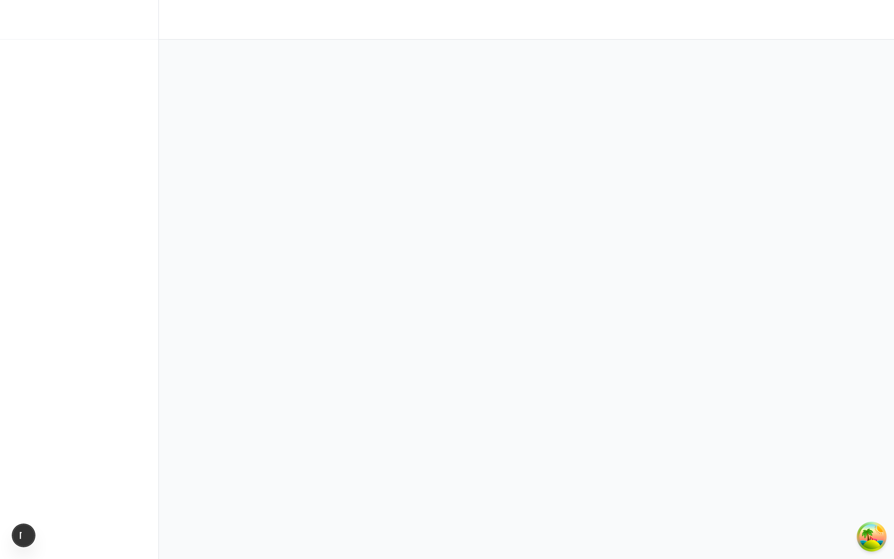
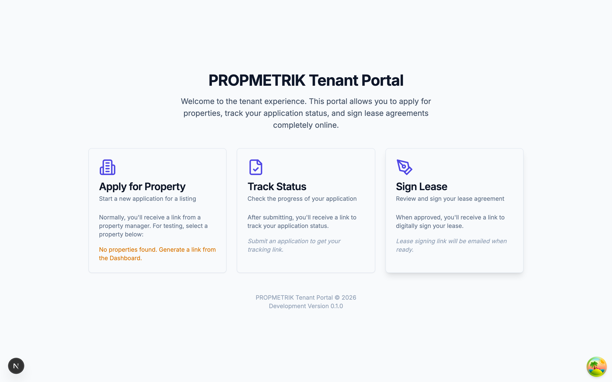
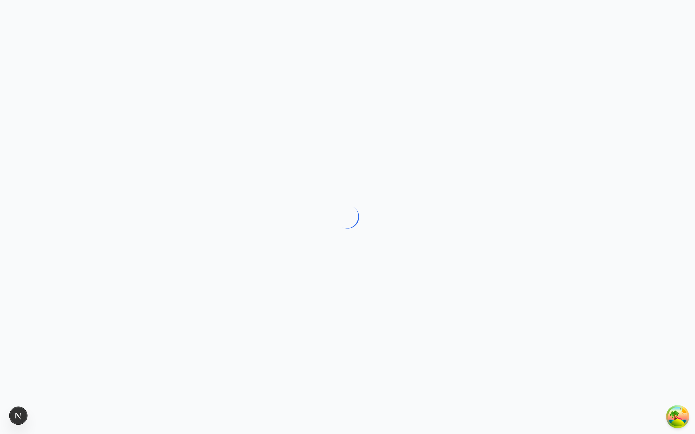

# Chapter 6: Tenant Portal

## Overview

The Tenant Portal is a self-service interface that gives tenants direct access to their lease information, payment history, maintenance requests, documents, and communications with their property manager. Unlike the main PropMetrik dashboard (which is designed for property managers and administrators), the Tenant Portal uses a clean, light-themed interface optimized for everyday tenant interactions.

Tenants access the portal through a dedicated login page and are authenticated with their own credentials -- separate from the property management team's accounts. The portal is fully responsive and works on desktop, tablet, and mobile devices.

---

## 6.1 Tenant Login

### Accessing the Portal

Tenants access the portal at the dedicated tenant login URL provided by their property manager. The login page features:

- Email and password authentication
- "Remember me" option for convenience
- Password reset functionality
- Clean, professional branding

### First-Time Login

When a property manager creates a tenant account and lease in PropMetrik, the tenant receives an email invitation with:

1. A link to set up their password
2. Instructions for accessing the portal
3. Their associated property and lease details

Once the password is set, the tenant can log in at any time to access their portal.

---

## 6.2 Portal Home / Dashboard

After logging in, tenants see their personalized dashboard with:

### Welcome Section

A greeting with the tenant's first name and their active property address.

### Summary Cards

Four key metrics displayed at the top:

| Card | Description |
|------|-------------|
| **Next Payment** | Amount due and days until the next rent payment |
| **Outstanding Balance** | Total unpaid balance, if any |
| **Maintenance Requests** | Count of open maintenance tickets |
| **Lease Progress** | Visual progress bar showing how far through the lease term they are, with days remaining |

### Quick Actions

- **Make a Payment** -- Navigate to the payments page to submit rent
- **Request Maintenance** -- Submit a new maintenance request
- **View Lease** -- Open the current lease agreement details
- **Contact Manager** -- Send a message to the property management team

### Recent Activity

The dashboard shows recent activity including:

- Latest payment transactions
- Open maintenance request status updates
- Messages from the property manager
- Upcoming lease events

---

## 6.3 Payments

Tenants can view their payment history and make rent payments directly through the portal.

### Payment Summary

The payments page shows:

- **Payment Schedule** -- Upcoming payment due dates with amounts
- **Payment History** -- Complete record of all past payments including date, amount, method, and status
- **Outstanding Balance** -- Any unpaid amounts with aging

### Making a Payment

PropMetrik supports the following payment methods for tenants:

1. **Card Payment** -- Pay with Visa or Mastercard through the integrated payment gateway (Paystack)
2. **Mobile Money** -- Pay using MTN MoMo, Vodafone Cash, or AirtelTigo Money
3. **Crypto Payment** -- Pay with supported cryptocurrencies
4. **Bank Transfer** -- View bank details for manual transfer (manual confirmation by property manager required)

To make a payment:

1. Navigate to the **Payments** section from the portal sidebar.
2. Select the payment to be made (next due rent or outstanding balance).
3. Choose your preferred payment method.
4. Enter the payment details and confirm.
5. Receive a confirmation with a transaction reference number.

> **Tip:** Set up automatic payment reminders by enabling notifications in your portal settings. You will receive email reminders 7 days, 3 days, and 1 day before rent is due.

---

## 6.4 Maintenance Requests

### Viewing Requests

The Maintenance section displays all maintenance requests submitted by the tenant. Each request shows:

- Request title and description
- Category (Plumbing, Electrical, HVAC, etc.)
- Priority level (Low, Medium, High, Urgent)
- Current status with color-coded badges:
  - **Submitted** (blue) -- Request received, awaiting review
  - **In Progress** (amber) -- Work is underway
  - **Scheduled** (purple) -- A service date has been set
  - **Completed** (green) -- Issue resolved
  - **Cancelled** (grey) -- Request withdrawn or voided

Use the search bar to filter requests by keyword, or use the status filter to view only open or completed tickets.

The summary bar at the top shows:

- Total requests submitted
- Number of open (active) requests
- Number of completed requests

### Submitting a New Request

To submit a maintenance request:

1. Click **New Request** from the Maintenance page.
2. Fill in the request details:
   - **Title** -- A brief summary of the issue (e.g., "Leaking kitchen faucet")
   - **Category** -- Select the issue type:
     - Plumbing
     - Electrical
     - AC / HVAC
     - Carpentry
     - Masonry
     - Painting
     - Roofing
     - Pest Control
     - Landscaping
     - General
     - Other
   - **Priority** -- Indicate the urgency:
     - Low -- Minor issue, no rush
     - Medium -- Should be addressed within a few days
     - High -- Affecting daily living, needs prompt attention
     - Urgent -- Emergency requiring immediate response (e.g., burst pipe, power outage)
   - **Description** -- Provide a detailed description of the problem, including when it started and any relevant context
   - **Location** -- Specify where in the property the issue is located
3. **Attach Photos** -- Upload images of the issue. Photos help the maintenance team assess the problem before dispatching.
4. Click **Submit Request**.

After submission, a success message confirms the request has been received. The property manager is notified immediately and the request appears in the Maintenance section of the Property Management module (Chapter 5).

### Tracking a Request

After submission, tenants can:

- View the current status of their request at any time
- See when a service date has been scheduled
- Receive notifications when the status changes
- Add comments or additional photos to an existing request
- View the resolution notes once the work is completed

---

## 6.5 Lease Details

Tenants can view the full details of their active lease agreement, including:

- Property address and unit
- Lease start and end dates
- Monthly rent amount
- Security deposit status
- Lease terms and conditions
- Rent escalation schedule (if applicable)
- Move-in and move-out checklist status

The lease document can be downloaded as a PDF for the tenant's records.

---

## 6.6 Documents

The Documents section gives tenants access to documents shared by their property manager, including:

- Signed lease agreement
- Move-in inspection report
- Property rules and regulations
- Utility setup instructions
- Community notices
- Receipts and payment confirmations

Tenants can also upload documents requested by the property manager (such as updated identification or insurance certificates).

---

## 6.7 Messages

Tenants can communicate directly with their property management team through the built-in messaging system. Features include:

- Send and receive messages with the property manager
- Attach files and images to messages
- Receive real-time notifications for new messages
- Message history preserved for reference

---

## 6.8 Profile & Settings

From the Settings page, tenants can:

- Update their personal information (name, phone, email)
- Change their password
- Configure notification preferences (email, SMS, push)
- Set communication language preferences
- View their account activity log

---

## Tips and Best Practices for Tenants

1. **Submit maintenance requests promptly.** Early reporting of issues prevents small problems from becoming costly repairs. Use the photo upload feature to help the maintenance team understand the issue before visiting.

2. **Choose the right priority level.** Reserve "Urgent" priority for genuine emergencies (flooding, fire damage, security breaches). Overusing urgent priority delays response to truly critical issues.

3. **Check your dashboard regularly.** The portal dashboard summarizes everything you need to know -- upcoming payments, open maintenance tickets, and lease milestones.

4. **Keep your contact information current.** Update your phone number and email address in Settings to ensure you receive important notifications about payments, maintenance visits, and lease renewals.

5. **Download your lease agreement.** Keep a personal copy of your signed lease for your records. You can download it from the Lease Details section at any time.

6. **Use the payment history for receipts.** Your complete payment history is available in the Payments section. Each transaction can be viewed or downloaded as a receipt for tax or personal records.

---

## Navigation Reference

| Action | Path |
|--------|------|
| View dashboard | Tenant Portal > Home |
| Make a payment | Tenant Portal > Payments |
| Submit maintenance request | Tenant Portal > Maintenance > New Request |
| View lease details | Tenant Portal > Lease |
| Access documents | Tenant Portal > Documents |
| Send a message | Tenant Portal > Messages |
| Update profile | Tenant Portal > Settings |
