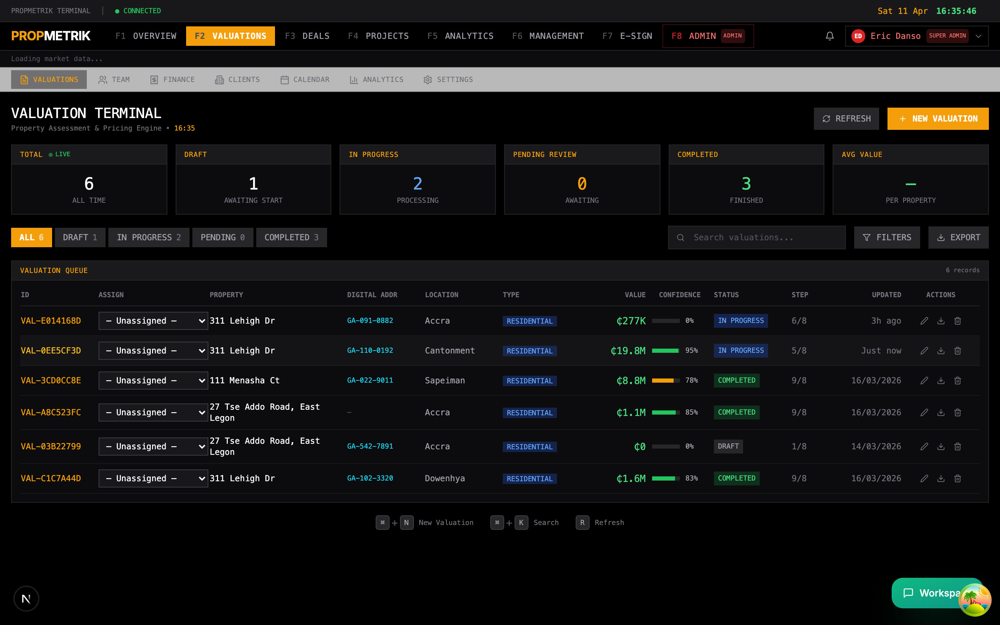
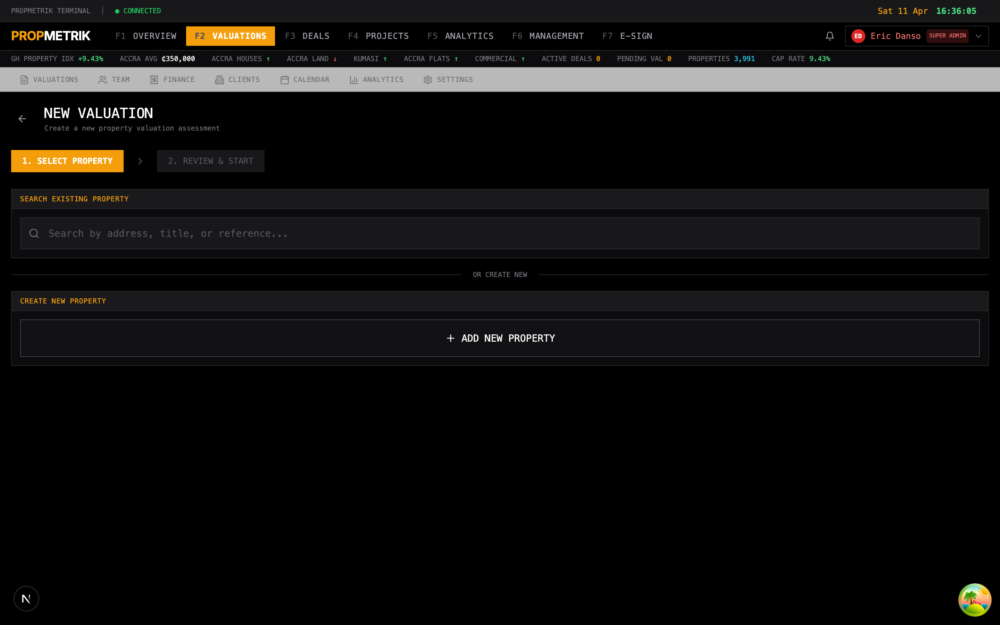
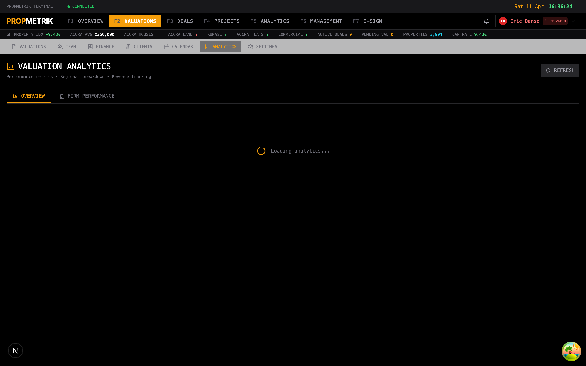
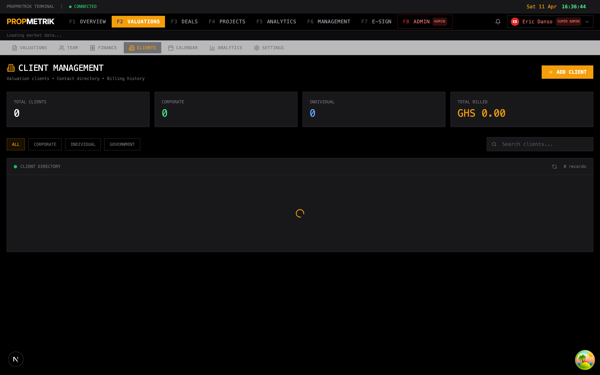
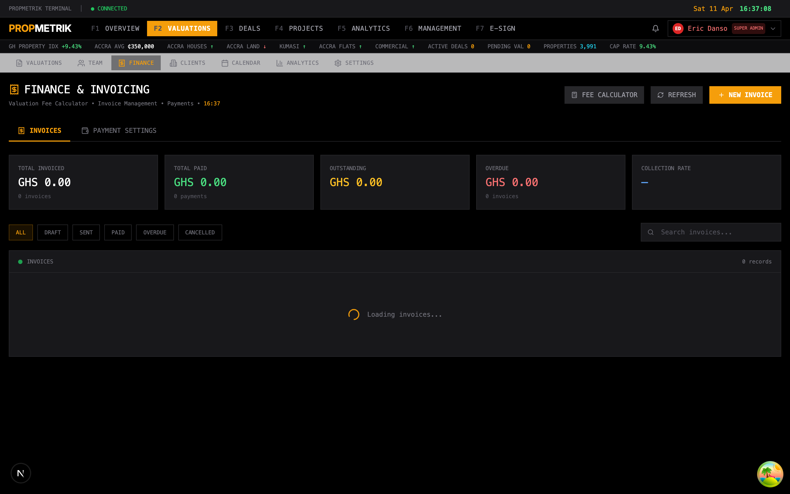
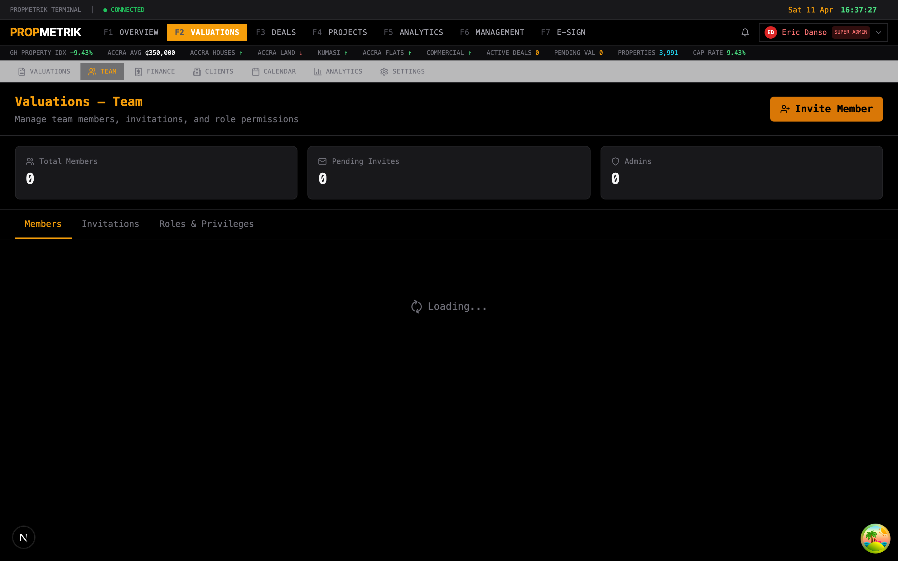
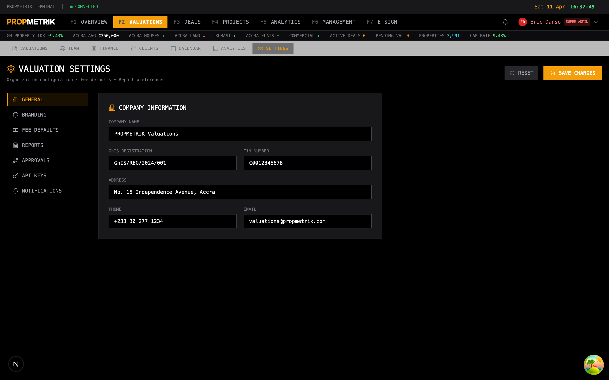

# Chapter 7: Valuations

## Overview

The Valuations module is PropMetrik's core professional service -- a comprehensive, RICS and GhIS (Ghana Institution of Surveyors) compliant valuation platform built specifically for the Ghanaian real estate market. It supports the full valuation lifecycle from instruction to final report, covering six valuation approaches: Sales Comparison, Cost Approach, Income Approach, Depreciated Replacement Cost (DRC), Residual Method, and Profits Method.

The platform provides:

- A structured, step-by-step workflow that guides valuers through each stage of a valuation
- Automated comparable search drawing from PropMetrik's property database
- Built-in construction cost data from the Data Hub, calibrated for Ghanaian regions and quality tiers
- RICS-compliant cap rate calculation with evidence grading (Category A, B, C)
- Sensitivity analysis and reconciliation tools
- Professional report generation with in-browser editing
- Team management with role-based assignments for valuation firms
- Client management and billing

Access the module from the main sidebar by clicking **Valuations**.

---

## 7.1 Valuations Dashboard



The main Valuations page displays all valuations in a terminal-style list view.

### Statistics Bar

At the top, summary metrics show:

- **Total Valuations** -- Count of all valuations
- **In Progress** -- Active valuations being worked on
- **Completed** -- Finalized valuations
- **Average Confidence** -- Mean confidence score across completed valuations

### Valuation List

Each valuation entry displays:

- **Reference Number** -- Auto-generated unique identifier
- **Property Address** -- Subject property location
- **Property Type Badge** -- Residential, Commercial, Industrial, Land, or Mixed Use
- **Valuation Purpose** -- Market Value, Mortgage, Insurance, Tax Assessment, Investment, or Development
- **Status** -- Draft, In Progress, Pending Review, or Completed
- **Assigned Valuer** -- The lead valuer (for organization accounts)
- **Last Updated** -- Relative timestamp

### Filtering

Use the filter tabs to view valuations by status:

- ALL -- Show every valuation
- DRAFT -- Newly created, not yet started
- IN PROGRESS -- Active work underway
- PENDING -- Awaiting review or approval
- COMPLETED -- Finalized valuations

The search bar allows filtering by property address, reference number, or client name.

### Valuer Assignment (Organization Accounts)

For valuation firms with organization accounts, managers can assign valuations to team members directly from the list view using the assignee dropdown. Only users with management roles (Super Admin, Firm Principal, Admin, Senior Valuer, Manager) can reassign valuations.

---

## 7.2 Creating a New Valuation



### Step-by-Step Creation

Creating a new valuation follows a guided wizard:

#### Step 1: Property Selection

Choose the subject property using one of two methods:

**Search Existing Properties:**
1. Type at least 2 characters in the search field.
2. Results appear from PropMetrik's property database.
3. Click a property to select it.
4. The system pre-fills property details from the database.

**Create New Property:**
1. Click **Create New Property**.
2. Select the property type:
   - **Residential** -- Houses, apartments, villas
   - **Commercial** -- Offices, retail, hotels
   - **Industrial** -- Warehouses, factories
   - **Land** -- Vacant land, plots
   - **Mixed Use** -- Multi-purpose buildings
3. Fill in the comprehensive property form (address, specifications, condition, etc.).

#### Step 2: Valuation Purpose

Select the purpose of the valuation:

| Purpose | Description |
|---------|-------------|
| **Market Value** | Fair market value for sale or purchase |
| **Mortgage** | Lending/collateral valuation for banks |
| **Insurance** | Replacement cost for insurance purposes |
| **Tax Assessment** | Property tax basis valuation |
| **Investment** | Investment analysis and returns |
| **Development** | Development feasibility analysis |

#### Step 3: Region

Select the property's region from Ghana's administrative regions:

- Greater Accra
- Ashanti
- Western
- Eastern
- Central
- Volta
- Northern
- Upper East
- Upper West
- Brong Ahafo

The selected region affects construction cost data, regional adjustment factors, and comparable searches.

#### Step 4: Confirmation

Review the property details, valuation purpose, and region before creating the valuation. Click **Create Valuation** to proceed.

Once created, you are redirected to the valuation detail page to begin the workflow.

---

## 7.3 Valuation Workflow

The valuation workflow is organized into a clear sequence of steps, displayed as a step indicator at the top of the valuation detail page. The workflow adapts dynamically based on the valuation methods selected.

### Core Steps (Always Present)

| Step | Name | Description |
|------|------|-------------|
| 1 | Property Setup | Review and refine subject property details |
| 2 | Floor Plans | Create or upload floor plans with room measurements |
| 3 | HBU Analysis | Highest and Best Use analysis (4-test framework) |
| 4 | Method Selection | Choose which valuation methods to apply |

### Method-Specific Steps (Conditional)

Based on the methods selected in Step 4, additional steps appear:

| Method | Additional Steps |
|--------|-----------------|
| Sales Comparison | Comparable Search, Market Analysis |
| Income Approach | Rental Market, Income Analysis |
| Cost Approach | Cost Inputs |
| DRC Method | DRC Analysis |
| Residual Method | Residual Analysis |
| Profits Method | Profits Analysis |

### Final Steps (Always Present)

| Step | Name | Description |
|------|------|-------------|
| Reconciliation | Weight and reconcile results from all methods |
| Report | Generate, edit, and finalize the valuation report |

---

## 7.4 Subject Property (Step 1)

The Subject Property page uses PropMetrik's Comprehensive Property Form to capture all details about the property being valued.

### Sections Covered

**Basic Information:**
- Address (street, city, region, Ghana Post digital address)
- Property type and sub-type
- Year built
- Condition assessment
- Quality rating (Basic, Standard, Premium, Luxury)

**Physical Characteristics:**
- Gross Floor Area (GFA) in square meters
- Plot size / land area
- Number of bedrooms, bathrooms, and floors
- Parking spaces
- Building materials and construction type

**Location Quality:**
- Neighborhood rating (Prime, Good, Secondary, Tertiary)
- View quality
- Accessibility rating
- Proximity to amenities

**Engagement Details:**
- Client name and contact information
- Valuation date
- Date of inspection
- Special instructions or assumptions

**Title and Tenure:**
- Land title type
- Tenure details
- Encumbrances or restrictions

After reviewing and updating all fields, click **Save & Continue** to proceed to Floor Plans.

> **Tip:** Spend adequate time on property data entry. Accurate property details directly affect the quality of comparable matching, construction cost estimates, and the overall confidence score of the valuation.

---

## 7.5 Floor Plans (Step 2)

The Floor Plans page provides tools for creating detailed floor plans with room-by-room measurements.

### Room Types

PropMetrik's floor plan builder uses room types aligned with Ghana Building Code minimum area requirements:

| Room Type | Minimum Area (sqm) |
|-----------|-------------------|
| Living Room | 13.0 |
| Dining Room | 9.0 |
| Bedroom | 9.0 |
| Kitchen | 4.5 |
| Bathroom | 2.5 |
| Toilet | 1.5 |
| Corridor | 1.2 |
| Storage | 1.0 |
| Garage | 15.0 |
| Balcony | 2.0 |

### Creating a Floor Plan

For each floor of the building:

1. Set the **Floor Number** and **Floor Name** (e.g., "Ground Floor", "First Floor").
2. Add rooms by clicking **Add Room**.
3. For each room, specify:
   - Room type (from the dropdown)
   - Room name (optional custom name)
   - Length and width in meters
   - The area is calculated automatically
4. The total floor area is summed from all rooms.

### Professional Floor Plan Builder

PropMetrik includes a professional floor plan builder (powered by Konva canvas) that allows:

- Visual drag-and-drop room placement
- Automatic dimension labeling
- Scale-accurate floor plan rendering
- Export of floor plans as images
- Canvas data saved for future editing

### Saving Floor Plans

Click **Save Floor Plans** to store all floor data. The total GFA calculated from floor plans is cross-referenced with the property data for consistency.

Click **Next** to proceed to HBU Analysis.

---

## 7.6 Highest and Best Use Analysis (Step 3)

The HBU Analysis page implements the standard four-test framework used in RICS/IVS-compliant valuations to determine the Highest and Best Use of the property.

### The Four Tests

Each test must be evaluated and documented:

#### Test 1: Legally Permissible

Determines whether the proposed use is allowed under applicable laws and regulations.

Factors evaluated (with weighted scoring):

| Factor | Weight |
|--------|--------|
| Zoning Compliance | 30% |
| Building Code Compliance | 25% |
| Environmental Regulations | 20% |
| Private Restrictions (Covenants) | 15% |
| Land Use Permits Available | 10% |

#### Test 2: Physically Possible

Determines whether the proposed use can be physically accommodated on the site.

| Factor | Weight |
|--------|--------|
| Site Size Adequate | 25% |
| Topography Suitable | 20% |
| Access Available | 20% |
| Utilities Available | 20% |
| Soil Conditions Appropriate | 15% |

#### Test 3: Financially Feasible

Determines whether the proposed use would generate sufficient returns.

| Factor | Weight |
|--------|--------|
| Market Demand Exists | 30% |
| Revenue Exceeds Costs | 25% |
| Return on Investment Adequate | 20% |
| Financing Available | 15% |
| Development Timeline Reasonable | 10% |

#### Test 4: Maximally Productive

Determines whether the proposed use is the most profitable among all legally permissible, physically possible, and financially feasible uses.

| Factor | Weight |
|--------|--------|
| Highest Net Return | 30% |
| Best Use of Capital | 25% |
| Optimal Site Utilization | 20% |
| Long-term Value Stability | 15% |
| Community Alignment | 10% |

### Use Scenarios

You can add and compare multiple use scenarios (e.g., "Continue as Residential", "Convert to Office", "Redevelop as Mixed Use"). Each scenario is evaluated against all four tests, and the system identifies the scenario that passes all four and produces the maximum value.

### Documenting HBU

For each test, record:

- **Pass/Fail** for each factor
- **Notes** explaining the reasoning
- **Overall Test Result** (automatically calculated from weighted factor scores)

The concluded HBU is carried forward to inform method selection and the final valuation report.

---

## 7.7 Method Selection (Step 4)

The Method Selection page presents all available valuation methods with detailed information to help the valuer choose the most appropriate approach(es).

### Available Methods

#### Sales Comparison Approach

- **Description:** Compares the subject property to similar properties that have recently sold, with adjustments for differences.
- **Best for:** Residential (95% applicability), Land (90%), Commercial (70%)
- **Data Requirements:** Recent comparable sales, property characteristics, market conditions data, location quality metrics
- **Advantages:** Most direct reflection of market value, based on actual transactions, easy to understand
- **Limitations:** Requires sufficient comparable sales, adjustments can be subjective, less reliable in inactive markets

#### Cost Approach

- **Description:** Estimates the cost to reconstruct the property, minus depreciation, plus land value.
- **Best for:** Specialized properties, new construction, insurance valuations
- **Data Requirements:** Construction cost data, depreciation estimates, land value
- **Advantages:** Useful when comparables are scarce, good for new or unique properties
- **Limitations:** Depreciation estimates can be subjective, does not directly reflect market forces

#### Income Approach

- **Description:** Values property based on its income-producing potential using direct capitalization.
- **Best for:** Commercial (90% applicability), investment properties, rental properties
- **Data Requirements:** Rental income data, operating expenses, capitalization rates
- **Advantages:** Reflects investment value, accounts for income potential
- **Limitations:** Requires reliable income and expense data, cap rate selection is critical

#### DRC (Depreciated Replacement Cost)

- **Description:** Used for specialized properties with no market evidence.
- **Best for:** Government/institutional buildings, religious buildings, heritage properties, utilities
- **Data Requirements:** Specialized construction costs, useful life estimates, Modern Equivalent Asset (MEA) factors
- **Advantages:** Only viable method for truly specialized properties
- **Limitations:** Does not reflect market value, requires significant judgment

#### Residual Method

- **Description:** Used for development land valuation by working backwards from completed value.
- **Best for:** Development land, redevelopment opportunities
- **Formula:** Land Value = GDV - Development Costs - Developer's Profit
- **Advantages:** Directly models the development equation
- **Limitations:** Highly sensitive to input assumptions, multiple variable interaction

#### Profits Method

- **Description:** Values trading properties where value relates to business potential.
- **Best for:** Hotels, hospitals, schools, restaurants, fuel stations, healthcare facilities
- **Data Requirements:** Revenue projections, operating cost ratios, cap rates
- **Advantages:** Reflects the economic reality of trading properties
- **Limitations:** Relies on business projections, separation of property value from business goodwill

### Selecting Methods

1. Review the applicability scores for each method based on your property type.
2. Click to select one or more methods. Most valuations use 2-3 methods.
3. The system highlights recommended methods based on property type.
4. Click **Continue** to proceed.

The workflow adapts to show only the steps relevant to your selected methods.

> **Tip:** Selecting multiple methods provides cross-validation and increases confidence in the final value. RICS best practice recommends using at least two independent methods where sufficient data exists.

---

## 7.8 Comparable Search (Sales Comparison)

The Comparables page is the entry point for the Sales Comparison Approach. It provides a powerful search engine for finding comparable properties.

### Search Parameters

Configure the search with the following filters:

| Parameter | Description |
|-----------|-------------|
| **Maximum Distance** | Radius from the subject property (in km) |
| **Price Range** | Minimum and maximum sale price |
| **GFA Range** | Minimum and maximum gross floor area |
| **Bedrooms** | Minimum and maximum bedroom count |
| **Maximum Age** | How recent the comparable sale must be (in months) |

### Search Results

Each comparable result displays:

- Reference number and title
- Address and neighborhood
- Property type
- Bedrooms, bathrooms, and parking
- Gross floor area and plot size
- Sale price and price per square meter
- Sale date
- Distance from subject
- Quality score

### Data Quality and Gap Analysis

The system provides a **Gap Analysis** showing:

- How many comparables were found within the search parameters
- Data quality assessment for the available comparables
- Identification of missing data points or under-represented property characteristics
- Recommendations for adjusting search parameters if insufficient comparables are found

### Contributing New Comparables

If the database lacks sufficient comparables, the **Contribution Workflow** allows valuers to submit new comparable properties:

1. Click **Submit Comparable**.
2. Fill in the comprehensive property form with all known details.
3. The submission is added to the platform's database for future use by all valuers.

### Selecting Comparables

Click the selection button on each comparable to add it to your **Comparable Basket**. Selected comparables are saved and carried forward to the Market Analysis page.

---

## 7.9 Market Analysis (Sales Comparison)

The Market Analysis page is the core of the Sales Comparison Approach. It provides a comprehensive adjustment grid for analyzing selected comparables.

### Market Context Panel

A dedicated panel displays current market context:

- Economic indicators relevant to the property's region
- Market conditions assessment (rising, stable, declining)
- Trend data for the property type and location

### Adjustment Grid

The adjustment grid applies RICS-compliant adjustments to each comparable property. Adjustment categories include:

| Adjustment Factor | Description |
|-------------------|-------------|
| **Time** | Adjusts for market movement since the sale date |
| **Location** | Adjusts for differences in neighborhood quality |
| **Size** | Adjusts for differences in GFA (typically inverse relationship) |
| **Condition** | Adjusts for property condition differences |
| **Quality** | Adjusts for construction quality and finishes |
| **Age** | Adjusts for building age differences |
| **Amenities** | Adjusts for features like parking, pool, garden |
| **View** | Adjusts for view quality differences |
| **Access** | Adjusts for road access and connectivity |

For each comparable, the grid shows:

- Unadjusted price per square meter
- Individual adjustment percentages (positive or negative)
- Total net adjustment
- Adjusted price per square meter
- Weight assigned to this comparable

### Weighting Options

The system supports multiple weighting approaches:

- **Quality Weighted** -- Automatically weights comparables by similarity score
- **Simple Average** -- Equal weight to all comparables
- **Median** -- Uses the median adjusted value
- **Manual** -- Valuer assigns custom weights (must sum to 100%)

Weight locks allow the valuer to fix certain weights while adjusting others.

### Value Indication

The weighted average of adjusted values produces the **Indicated Value by Sales Comparison**.

---

## 7.10 Rental Market (Income Approach)

The Rental Market page is the equivalent of the Comparables page, but for rental properties used in the Income Approach.

### Rental Comparable Search

Search for rental comparables using:

- Distance radius from subject
- Rent range (monthly)
- GFA range
- Bedrooms and bathrooms
- Maximum listing age

### Rental Adjustment Grid

Similar to the sales adjustment grid, the rental grid adjusts comparables for:

- Location
- Size
- Condition
- Quality
- Amenities
- Furnishing level
- Lease terms

### Market Rent Estimation

The system calculates:

- **Indicated Market Rent** -- Weighted average of adjusted rental comparables
- **Rent per Square Meter** -- Normalized rental rate for comparability
- **Confidence Score** -- Based on quantity, quality, and similarity of comparables

The indicated market rent feeds directly into the Income Approach analysis.

---

## 7.11 Income Approach

The Income Approach page implements the Direct Capitalization method for valuing income-producing properties.

### Rent Input Mode

Two modes are available:

- **System-Estimated** -- Uses the rental comparable engine from the Rental Market page to estimate indicative market rent
- **User-Entered** -- Allows manual override when the valuer has superior market evidence

### Income Calculation Workflow

The page walks through the following calculation steps:

#### 1. Primary Rental Income

- **Monthly Rent** -- Gross monthly rent (system-estimated or user-entered)
- **Occupancy Rate** -- Assumed stabilized occupancy (default 100% for single-unit residential)

#### 2. Potential Gross Income (PGI)

Total income assuming 100% occupancy at market rent.

```
PGI = Monthly Rent x 12
```

#### 3. Vacancy and Collection Losses

- **Vacancy Rate** -- Expected downtime between tenancies
  - Prime locations: 3-5%
  - Standard locations: 5-8%
  - Secondary locations: 8-15%
- **Collection Loss** -- Allowance for non-payment or delayed collection

#### 4. Effective Gross Income (EGI)

```
EGI = PGI - Vacancy Loss - Collection Loss
```

#### 5. Operating Expenses

Recurring costs required to maintain the property:

| Expense | Description |
|---------|-------------|
| Management Fee | Professional or implicit management (even if owner-managed) |
| Maintenance | Regular upkeep and repairs |
| Insurance | Property insurance premiums |
| Property Tax / Rates | Local authority charges |
| Utilities | Only landlord-borne utilities |
| Security | Guard services or security systems |

The **Expense Ratio** (operating expenses as a percentage of EGI) serves as a reasonableness check against market norms.

#### 6. Net Operating Income (NOI)

```
NOI = EGI - Operating Expenses
```

NOI excludes financing costs and income taxes, consistent with direct capitalization methodology.

#### 7. Capitalization Rate

The cap rate is the most critical input. PropMetrik supports two modes:

**System-Calculated** -- Uses a RICS-compliant fallback hierarchy:
1. **Category A** (Highest Quality) -- Derived from verified transaction data or partner bank data
2. **Category B** (Good Quality) -- Derived from adjusted listing prices with market-based discounts
3. **Category C** (Limited Quality) -- Based on published surveys, valuer judgment, or market defaults

**User-Entered** -- Manual override when the valuer has superior evidence.

Each evidence category has a confidence level indicator.

#### 8. Value by Income Approach

```
Value = NOI / Cap Rate
```

The indicated value is displayed with a confidence bar reflecting data quality.

> **Tip:** The cap rate has the single largest impact on income approach values. A 1% change in cap rate can shift the value by 10-20%. Use the Sensitivity Analysis in the Reconciliation step to quantify this impact.

---

## 7.12 Cost Approach

The Cost Approach page estimates value by calculating the cost to reproduce or replace the improvements, minus depreciation, plus land value.

### Construction Cost Data

PropMetrik integrates with the **Data Hub** to provide current construction cost rates for Ghana, organized by:

**Quality Tiers:**

| Tier | Description |
|------|-------------|
| Basic/Economy | Sandcrete blocks, basic finishes |
| Standard | Quality blocks, standard finishes |
| Premium | High-quality materials, good finishes |
| Luxury | Premium materials, imported finishes |
| Custom | User-customized pricing and materials |
| Ultra Luxury | Bespoke, international standards |

**Regional Factors:**

Each region in Ghana has a **location factor** applied to the base construction cost. Greater Accra typically has a factor of 1.0 (baseline), while more remote regions may have factors above 1.0 (reflecting higher transport costs for materials).

### Editable Construction Cost Panel

The system pre-fills construction costs from the Data Hub based on the property's type, quality tier, and region. However, all values are editable:

- **Base Cost per sqm** -- Can be overridden with valuer's own evidence
- **Material Indices** -- Individual material cost adjustments
- **Regional Factor** -- Adjustable location multiplier

### Depreciation

Three types of depreciation are calculated:

| Type | Description |
|------|-------------|
| **Physical Depreciation** | Age-related wear and tear, automatically estimated from effective age |
| **Functional Obsolescence** | Outdated design, inefficient layouts, inadequate specifications |
| **External Obsolescence** | Neighborhood decline, environmental issues, economic factors |

Each depreciation type is entered as a percentage and has GhIS/RICS-aligned tooltip guidance.

### Land Value

Land value is estimated separately using one of these methods:

- Direct comparison with recent land sales
- Extraction from improved property sales
- Allocation based on typical land-to-value ratios
- Residual method for development land

### Cost Approach Formula

```
Replacement Cost New = Base Cost x GFA x Regional Factor x Material Adjustments
Depreciated Value    = Replacement Cost New x (1 - Physical) x (1 - Functional) x (1 - External)
Value by Cost        = Depreciated Value + Land Value
```

---

## 7.13 DRC (Depreciated Replacement Cost)

The DRC Method page is designed for specialized properties that lack market evidence, making other approaches impractical.

### Applicable Property Types

DRC is used for:

- Government offices
- Religious buildings (churches, mosques)
- Educational facilities (schools, universities)
- Health clinics and hospitals
- Libraries and museums
- Heritage/conservation properties
- Recreation and sports facilities
- Industrial warehouses and factories

### Specialized Construction Costs

The system provides construction cost data specific to each specialized property type, sourced from the Data Hub. Fallback costs are available when API data is unavailable:

| Property Type | Fallback Cost/sqm (GHS) |
|---------------|------------------------|
| Government Office | 6,000 |
| Religious Building | 4,500 |
| Educational | 4,500 |
| Health Clinic | 7,000 |
| Hospital | 9,000 |
| Library | 5,500 |
| Museum | 7,000 |
| Heritage/Conservation | 8,000 |
| Recreation Facility | 6,000 |
| Stadium/Sports | 7,000 |

### Useful Life and MEA Factors

Each specialized property type has:

- **Useful Life** -- Expected total lifespan in years (e.g., 80 years for religious buildings, 50 years for educational facilities)
- **MEA Factor** (Modern Equivalent Asset) -- Adjusts for the cost of a modern equivalent that provides the same utility. A factor of 0.85 for educational buildings reflects that modern school designs are more efficient.

### DRC Calculation

```
Gross Replacement Cost = Construction Cost/sqm x GFA x Regional Factor
Modern Equivalent Asset = GRC x MEA Factor
Depreciation           = (Effective Age / Useful Life) x MEA Value
DRC Value              = MEA Value - Depreciation + Land Value
```

### Key Considerations

- DRC produces an estimate of worth to the occupier, not market value
- It is a method of last resort when no market evidence exists
- The resulting value should be clearly labeled as DRC and not market value in the report

---

## 7.14 HBU Analysis (Highest and Best Use)

See Section 7.6 above for the full HBU Analysis documentation.

---

## 7.15 Residual Method

The Residual Method page values development land by working backwards from the Gross Development Value of the completed scheme.

### Development Parameters

**Site Characteristics:**

| Input | Description |
|-------|-------------|
| Plot Size (sqm) | Total land area available for development |
| Plot Coverage (%) | Building footprint as percentage of land area |
| Number of Floors | Building height in stories |
| Efficiency Ratio (%) | Net saleable area as percentage of gross building area |
| Development Type | House, Apartment, Townhouse, Commercial, Office, Industrial, Warehouse |

**Gross Development Value (GDV):**

| Input | Description |
|-------|-------------|
| Sale Price per sqm | Market price for completed units |
| Net Saleable Area | Calculated from plot x coverage x floors x efficiency |
| GDV | Total expected revenue from the completed development |

### Development Costs

| Cost Component | Description |
|----------------|-------------|
| Construction Cost | Base cost per sqm from Data Hub (adjustable) |
| Professional Fees (%) | Architect, engineer, QS, project management fees |
| Contingency (%) | Allowance for unforeseen costs (higher in emerging markets) |
| Marketing (%) | Sales, advertising, and promotion costs |
| Sales Commission (%) | Brokerage/agency fees on disposal |
| Legal Fees (%) | Conveyancing and development legal costs |

### Finance Costs

| Input | Description |
|-------|-------------|
| Interest Rate (%) | Development finance rate including lender margin |
| Loan-to-Value (%) | Proportion of costs funded by debt |
| Development Timeline (months) | Total construction and sales period |
| Finance Model | S-Curve model for time-phased cost drawdown |

The **S-Curve finance model** reflects that construction costs are not drawn evenly over time -- they follow an S-shaped curve with slower spend at the beginning and end, and peak expenditure mid-project. This produces a more accurate finance cost estimate than simple linear averaging.

### Developer's Profit

The required developer's profit margin (typically 15-25% of GDV for Ghanaian developments) is treated as a deduction.

### Residual Land Value Calculation

```
Residual Land Value = GDV - Total Construction Costs - Professional Fees 
                      - Contingency - Marketing - Finance Costs 
                      - Developer's Profit
```

If the residual is negative, the system flags that the development is not financially viable at the stated assumptions.

> **Tip:** The Residual Method is highly sensitive to input assumptions. Small changes in construction costs, sale prices, or finance rates can dramatically shift the land value. Always run the Sensitivity Analysis (in Reconciliation) to understand the range of possible outcomes.

---

## 7.16 Profits Method

The Profits Method page values trading properties where value derives from the business potential of the property.

### Property Types Supported

| Type | Revenue Metric | Typical Revenue/Unit (GHS) |
|------|---------------|---------------------------|
| Hotel | Rooms | 120,000 |
| Hospital | Beds | 180,000 |
| School | Students | 24,000 |
| Restaurant | Per sqm | 6,000 |
| Fuel Station | Pumps | 480,000 |
| Healthcare | Per sqm | 4,800 |

### Calculation Steps

#### 1. Revenue Estimation

Enter the number of revenue-generating units (rooms, beds, students, pumps, etc.) and the revenue per unit. The system provides default rates that can be adjusted.

#### 2. Operating Costs

Pre-configured operating cost ratios by property type. For example, a hotel typically has:

| Cost Category | Percentage of Revenue |
|--------------|----------------------|
| Cost of Sales | 25% |
| Staff Costs | 30% |
| Utilities | 8% |
| Maintenance | 5% |
| Admin & Marketing | 10% |

All percentages are editable based on the valuer's knowledge of the specific property.

#### 3. Net Operating Profit

```
Gross Revenue          = Units x Revenue per Unit
Total Operating Costs  = Sum of all cost percentages x Revenue
Net Operating Profit   = Gross Revenue - Total Operating Costs
```

#### 4. Capitalization

The net operating profit is capitalized using a market-derived cap rate (system-calculated or user-entered) to arrive at the property value.

```
Value = Net Operating Profit / Cap Rate
```

### Key Considerations

- The Profits Method values the property as a going concern
- Care must be taken to separate property value from personal goodwill
- Operating cost ratios should reflect a reasonably efficient operator, not the actual operator
- Results should be cross-checked against other methods where possible

---

## 7.17 Reconciliation

The Reconciliation page brings together results from all selected valuation methods and produces a final value opinion.

### Method Results Summary

A summary panel displays each method's indicated value, confidence score, and applicable weight:

| Method | Indicated Value | Confidence | Weight |
|--------|----------------|------------|--------|
| Sales Comparison | &#8373;X,XXX,XXX | 85% | 40% |
| Income Approach | &#8373;X,XXX,XXX | 78% | 35% |
| Cost Approach | &#8373;X,XXX,XXX | 72% | 25% |

### Weight Assignment

Assign weights to each method based on:

- Reliability of the data used
- Applicability to the property type
- Quality of the analysis
- Number and similarity of comparables

**Weight Governance Features:**

- **Weight Locks** -- Lock a weight to prevent accidental changes while adjusting others
- **Justification Fields** -- Document why each weight was chosen
- **Auto-normalization** -- Weights automatically adjust to sum to 100%

### Sensitivity Analysis

The built-in sensitivity analysis tool quantifies how changes in key inputs affect the final value.

**Available Sensitivity Drivers:**

| Driver | Applicable Method |
|--------|-------------------|
| Construction Cost | Cost Approach |
| Land Value | Cost Approach |
| Depreciation | Cost Approach |
| Price per sqm | Sales Comparison |
| Comparable Adjustments | Sales Comparison |
| Rental Rate | Income Approach |
| Cap Rate | Income Approach |
| Vacancy Rate | Income Approach |
| GDV | Residual Method |
| Replacement Cost | DRC |

Configure the sensitivity range (default +/- 10%) and select the driver to analyze. The system produces a table and chart showing how the final value changes across the range.

### Reconciled Value

The weighted average produces the **Reconciled Market Value**:

```
Reconciled Value = Sum(Method Value x Method Weight)
```

### Finalization Safeguards

Before finalizing, the system requires:

1. **Reconciliation Notes** -- Document the reasoning for the final value
2. **Adjustment Rationale** -- Explain any manual adjustments
3. **Disclaimer Acceptance** -- Acknowledge that the value opinion is subject to the stated assumptions and limiting conditions

Click **Finalize & Generate Report** to proceed to report generation.

---

## 7.18 Report Generation

The Report page produces a professional RICS-compliant valuation report.

### Report Workflow

1. **Create/Load Report** -- The system checks for existing draft reports or creates a new one.
2. **Generate Content** -- All valuation data (property details, method analyses, reconciliation) is compiled into a structured report.
3. **In-Browser Editing** -- The generated report opens in a Tiptap-based rich text editor where the valuer can:
   - Edit text and formatting
   - Add or remove sections
   - Insert additional commentary
   - Review and polish language
4. **Approval Workflow** -- Submit for review and signature by authorized signatories.
5. **Export** -- Download the final report as a PDF.

### Report Sections

A standard PropMetrik valuation report includes:

- Cover page with branding and reference details
- Table of contents
- Executive summary with the concluded value
- Instructions and purpose of valuation
- Subject property description
- Location and neighborhood analysis
- Tenure and title details
- Inspection findings
- HBU analysis conclusions
- Selected methodology overview
- Sales comparison analysis (if applicable)
- Income approach analysis (if applicable)
- Cost approach analysis (if applicable)
- Additional method analyses (DRC, Residual, Profits)
- Reconciliation and final value opinion
- Sensitivity analysis results
- Assumptions and limiting conditions
- Appendices (floor plans, photographs, comparable details)
- Valuer certification and signature

### Report Modes

- **Edit Mode** -- Full editing capabilities with the rich text editor
- **Read-Only Mode** -- Preview the report without editing
- **Regenerate** -- Re-generate the report content from the latest valuation data (useful after making changes to method inputs)

### Approval and Signing

Once the report is ready:

1. Click **Prepare for Approval**.
2. The report status changes to "Pending Approval".
3. The designated signatory reviews and approves.
4. An e-signature envelope can be created for digital signing.
5. The final signed report is saved and can be downloaded as PDF.

---

## 7.19 Valuation Analytics



The Analytics page provides aggregated insights across all valuations in the organization.

### Available Analytics

- **Valuation Volume** -- Number of valuations completed over time
- **Average Turnaround Time** -- Days from instruction to report delivery
- **Revenue per Valuation** -- Average fees earned
- **Method Usage** -- Distribution of valuation methods used
- **Property Type Distribution** -- Breakdown by residential, commercial, industrial, etc.
- **Regional Heat Map** -- Concentration of valuations by region
- **Confidence Score Trends** -- Average confidence over time
- **Valuer Performance** -- Comparison of output and quality across team members

---

## 7.20 Client Management



The Clients section manages the relationships with instructing parties.

### Client Records

Each client record includes:

- Client name and organization
- Contact information
- Engagement history (all valuations performed for this client)
- Total fees billed
- Outstanding invoices
- Notes and relationship details

### Managing Clients

1. Navigate to **Clients** from the Valuations sub-navigation.
2. Click **Add Client** to create a new record.
3. Fill in the client details and save.
4. Future valuations can be linked to existing clients for engagement tracking.

---

## 7.21 Valuation Finance



The Finance section tracks revenue and billing for valuation services.

### Features

- **Fee Schedule** -- Configure standard fees by property type and valuation purpose
- **Invoice Generation** -- Create invoices for completed valuations
- **Revenue Tracking** -- Track billed vs. received revenue
- **Outstanding Payments** -- Monitor unpaid invoices
- **Financial Reports** -- Export revenue reports by period, client, or valuer

---

## 7.22 Valuation Team



The Team section manages the valuation firm's staff.

### Team Roles

| Role | Access Level |
|------|-------------|
| **Firm Principal** | Full access, can sign reports, manage all settings |
| **Senior Valuer** | Can create and complete valuations, assign team |
| **Valuer** | Can work on assigned valuations |
| **Analyst** | Can view and contribute data but not finalize |
| **Admin** | Administrative access to settings, clients, and billing |

### Team Management

- Add new team members by email invitation
- Assign roles and permissions
- View workload distribution
- Track individual performance metrics

---

## 7.23 Valuation Settings



The Settings section configures organization-wide valuation preferences.

### Configuration Options

- **Default Currency** -- Set the default currency for new valuations (GHS, USD, GBP, EUR)
- **Report Template** -- Configure the default report structure and branding
- **Numbering Scheme** -- Set the reference number format and sequence
- **Quality Thresholds** -- Minimum confidence scores required for report completion
- **Data Hub Connection** -- Configure access to construction cost data and market indices
- **Integration Settings** -- Connect to external data sources and APIs
- **Firm Details** -- Organization name, address, registration numbers, and logo for reports

---

## Tips and Best Practices

### General Workflow

1. **Follow the step sequence.** The workflow is designed so that each step builds on the previous one. Skipping steps (e.g., going directly to Market Analysis without completing Property Setup) results in missing data and lower confidence scores.

2. **Complete the Subject Property form thoroughly.** Every field matters -- property condition, quality rating, neighborhood rating, and view quality all affect comparable matching and adjustment calculations.

3. **Always perform HBU Analysis.** Even when the highest and best use appears obvious, documenting the four-test analysis demonstrates professional rigor and is required for RICS compliance.

### Sales Comparison

4. **Select 3-5 comparables.** Too few comparables reduce reliability; too many can introduce noise. Aim for 3-5 high-quality comparables within a reasonable distance and time frame.

5. **Keep total adjustments under 25%.** If the total net adjustment to a comparable exceeds 25%, the comparable may not be sufficiently similar. Consider finding better matches.

6. **Contribute missing comparables.** If the database lacks adequate comparables for your area or property type, submit new sales data through the Contribution Workflow. This improves the platform for all users.

### Income Approach

7. **Verify the cap rate source.** Always check whether the cap rate is Category A (transaction-based), B (listing-based), or C (survey/default). Category A evidence is the most reliable.

8. **Use realistic vacancy rates.** Do not default to 0% vacancy for residential properties. Even single-unit properties experience vacancy between tenancies.

### Cost Approach

9. **Cross-reference Data Hub costs.** The Data Hub provides base construction costs, but always validate against your own market evidence, especially for properties outside Greater Accra.

10. **Do not underestimate depreciation.** Physical depreciation accumulates faster in tropical climates. Properties in Ghana may experience accelerated deterioration from humidity, termite damage, and weather exposure.

### Residual Method

11. **Run sensitivity analysis on every residual valuation.** The residual method is notoriously sensitive to input assumptions. The Sensitivity Analysis tool in Reconciliation quantifies this risk.

12. **Use the S-Curve finance model.** It produces more accurate finance cost estimates than linear averaging, as it reflects the actual pattern of construction expenditure.

### Reconciliation

13. **Document your weight rationale.** When assigning weights to methods in Reconciliation, always fill in the justification fields. Reviewers and auditors will scrutinize unexplained weight allocations.

14. **Accept the finalization disclaimer.** The disclaimer is not a formality -- it ensures the value opinion is qualified with appropriate assumptions and limiting conditions.

### Report

15. **Review the generated report carefully.** The auto-generated report compiles all data accurately, but the commentary and conclusions should be reviewed and personalized by the signing valuer.

16. **Use the edit mode for Polish.** The in-browser editor supports full formatting. Add context-specific commentary, photographs, and observations that reflect your professional inspection findings.

---

## Navigation Reference

| Action | Path |
|--------|------|
| View all valuations | Sidebar > Valuations |
| Create new valuation | Valuations > New Valuation |
| Open valuation detail | Valuations > Click row |
| Edit subject property | Valuation > Subject tab |
| Create floor plans | Valuation > Floor Plans tab |
| Run HBU analysis | Valuation > HBU Analysis tab |
| Select methods | Valuation > Methods tab |
| Search comparables | Valuation > Comparables tab |
| Run market analysis | Valuation > Market Analysis tab |
| Search rental comparables | Valuation > Rental Market tab |
| Run income analysis | Valuation > Income tab |
| Run cost approach | Valuation > Cost tab |
| Run DRC analysis | Valuation > DRC tab |
| Run residual method | Valuation > Residual tab |
| Run profits method | Valuation > Profits tab |
| Reconcile values | Valuation > Reconciliation tab |
| Generate report | Valuation > Report tab |
| View analytics | Valuations > Analytics |
| Manage clients | Valuations > Clients |
| View finances | Valuations > Finance |
| Manage team | Valuations > Team |
| Configure settings | Valuations > Settings |
