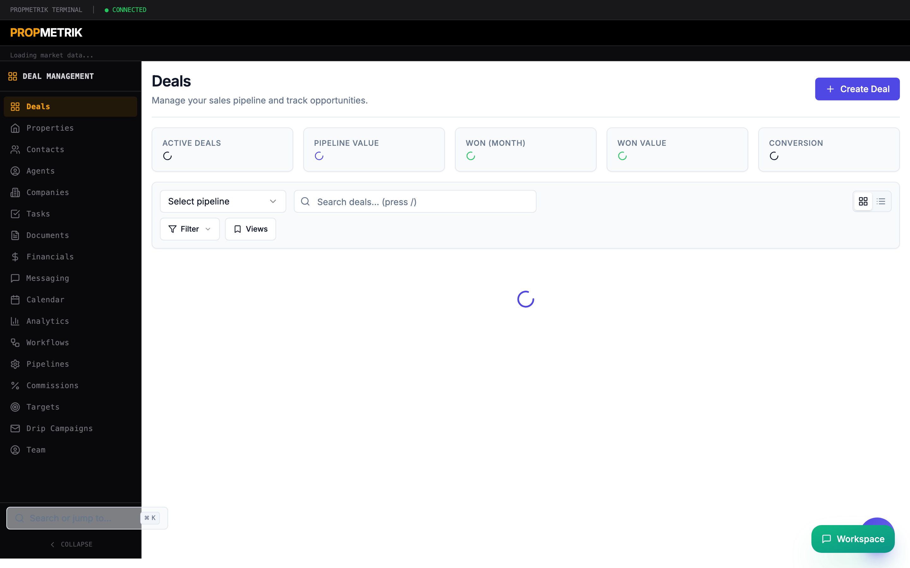
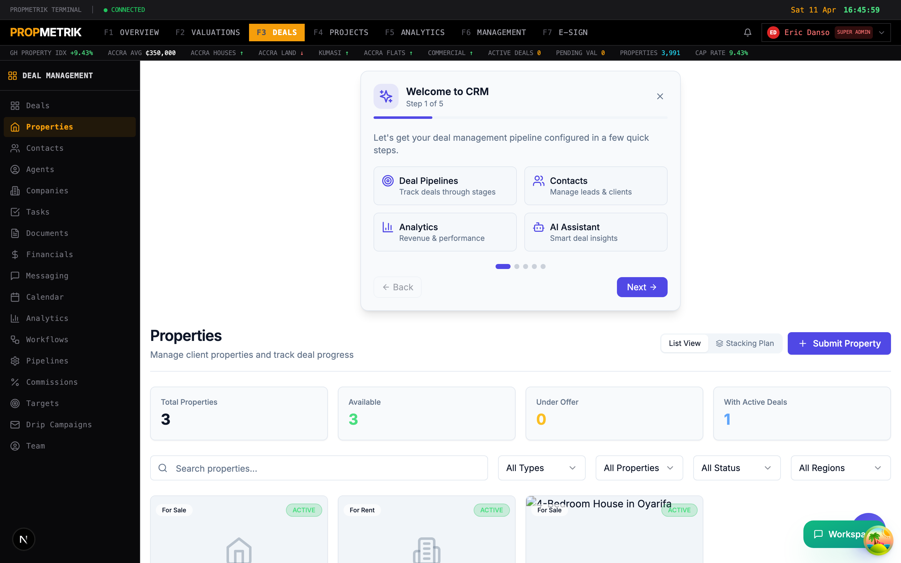

# Chapter 8 -- Deals / CRM

## Overview

The PropMetrik Deals module is a full-featured Customer Relationship Management system built for real estate firms operating in the Ghanaian market. It gives your team a single workspace to track every opportunity from first contact to closed deal, manage agent performance, automate follow-ups, and forecast revenue -- all in Ghana Cedis.

The CRM is accessible from **Dashboard > Deals** and features a dedicated left sidebar for quick navigation between sub-modules. On your first visit, an onboarding wizard walks you through the key concepts. A floating AI assistant is always available in the bottom-right corner for natural-language queries about your pipeline.

---

## 8.1 Deals List & Pipeline Board

The main Deals page is where you spend most of your time. It shows your active pipeline in two views:

- **Kanban view** -- drag-and-drop cards between stage columns.
- **List view** -- a sortable table with bulk-select checkboxes.

Toggle between views using the grid/list icons in the toolbar.

### Key Metrics Bar

Five summary cards sit at the top of the page:

| Card | What It Shows |
|------|---------------|
| Active Deals | Total open deals across the selected pipeline |
| Pipeline Value | Sum of all active deal values in GHS |
| Won (Month) | Deals closed-won in the current calendar month |
| Won Value | Total Cedis value of won deals this month |
| Conversion | Percentage of deals that moved from first stage to won |

### Filtering & Search

- **Pipeline selector** -- switch between pipelines (e.g. "Sales", "Lettings", "Development").
- **Search bar** -- type to filter by deal title, deal number, or primary contact name. Press `/` to focus the search bar from anywhere on the page.
- **Filter Builder** -- click the filter icon to add advanced conditions (field, operator, value). Conditions can be combined with AND/OR logic.
- **Saved Views** -- save a filter configuration as a named view and recall it later.

### Kanban Board

Each column represents a pipeline stage. Cards show:

- Deal title and deal number
- Primary contact name
- Deal value in GHS
- Deal type badge (Sale, Rental, Development)
- Assigned agent

**To move a deal between stages:**

1. Click and hold a deal card.
2. Drag it to the target stage column.
3. A confirmation dialog appears -- optionally add a note explaining the stage change.
4. Click **Move Deal** to confirm.

### List View & Bulk Actions

Switch to list view for a tabular layout with multi-select checkboxes.

1. Click the **list icon** in the toolbar.
2. Select individual deals using the row checkboxes, or click the header checkbox to select all.
3. A **Bulk Action Bar** appears at the bottom with options:
   - **Delete** -- permanently remove selected deals.
   - **Change Stage** -- move all selected deals to a chosen stage.
   - **Add Tags** -- apply comma-separated tags to selected deals.
   - **Export** -- download a CSV file of the selected deals.

> **Tip:** Use the keyboard shortcut `V` to toggle between Kanban and List views. Press `?` to see all available keyboard shortcuts.

---

## 8.2 Contacts

Contacts are the people and organisations your firm interacts with -- buyers, sellers, tenants, landlords, developers. Navigate to **Deals > Contacts** from the CRM sidebar.

### Contact Cards

Each contact card displays:

- Name and avatar
- Email and phone number
- Company affiliation
- Location (city/region)
- Lead status badge (New, Contacted, Qualified, Unqualified, Nurturing)
- Tags

### Creating a Contact

1. Click **+ New Contact** in the top-right corner.
2. Fill in the required fields: first name, last name, and email.
3. Set the **Lead Status** to categorise where this person sits in your funnel.
4. Optionally attach the contact to a **Company** and add a physical **Address**.
5. Click **Save** to create the contact.

### Searching & Filtering Contacts

- Use the search bar to find contacts by name, email, or phone.
- Use the **Filter Builder** for advanced queries (e.g. lead_status equals "Qualified" AND city contains "Accra").
- Save frequently-used filters as **Saved Views**.

### Bulk Operations

Select multiple contacts using checkboxes, then use the Bulk Action Bar to:

- Merge duplicate contacts
- Delete contacts
- Export to CSV
- Add or remove tags

### Import Wizard

To import contacts from a spreadsheet:

1. Click the **Upload** icon in the toolbar.
2. Upload a CSV or Excel file.
3. Map columns to PropMetrik fields (name, email, phone, company, etc.).
4. Review the preview and click **Import**.

### Contact Detail Page

Click any contact card to open its detail page, which includes:

- Full contact information with edit capability
- Activity timeline (calls, emails, meetings, notes)
- Associated deals
- Relationship map showing connections to other contacts and companies
- Communication history

### Relationship Map & Merge

- Click the **Network** icon to view a visual relationship map.
- Click **GitMerge** to open the merge dialog and combine duplicate contacts.

---

## 8.3 Agents

Agents are the sales professionals and brokers on your team. Manage their profiles, track performance, and configure commission structures from **Deals > Agents**.

### Agent Stats Dashboard

Four metric cards appear at the top:

- **Total Agents** -- how many agents are registered.
- **Active Agents** -- agents with at least one open deal.
- **Total Deals** -- aggregate deal count across all agents.
- **Revenue** -- total commission-eligible revenue.

### Creating an Agent

1. Click **+ New Agent**.
2. Enter the agent's name, email, phone, and licence number.
3. Select a **Specialisation** (Residential Sales, Commercial Leasing, Land, Development, etc.).
4. Set the agent's **Status** (Active, Inactive, Suspended).
5. Configure the **Commission Rate** (percentage of deal value).
6. Click **Save**.

### Agent Detail Page

Click an agent card to see:

- Profile information and photo
- Performance metrics (deals won, revenue generated, conversion rate)
- Active and historical deals
- Commission history
- Activity timeline

> **Tip:** Use the dropdown menu (three dots) on each agent card for quick actions like Edit or View Profile.

---

## 8.4 Companies

Companies represent the organisations your contacts belong to -- developers, corporate tenants, investment firms, government agencies. Navigate to **Deals > Companies**.

### Creating a Company

1. Click **+ New Company**.
2. Enter the company name, industry, website, and address.
3. Link existing contacts as employees or representatives.
4. Click **Save**.

### Company Detail

Each company page shows:

- Company profile and logo
- List of associated contacts with their roles
- Active deals involving the company
- Total deal value and deal history

---

## 8.5 Properties

The Properties sub-module maintains a registry of real estate assets linked to your deals. Navigate to **Deals > Properties**.

### Adding a Property

1. Click **+ New Property** or use the **Submit Property** form for external submissions.
2. Enter property details: title, type (residential, commercial, land, mixed-use), address, city, region.
3. Add financials: asking price, valuation, rental income.
4. Upload photos and documents.
5. Click **Save**.

### Property Detail Page

Click any property to view:

- Full property details with photo gallery
- Location on map
- Linked deals and contacts
- Valuation history
- Documents and attachments

---

## 8.6 Pipelines

Pipelines define the stages a deal moves through from initial inquiry to close. Navigate to **Deals > Pipelines**.

### Default Pipeline

PropMetrik ships with a default pipeline. You can customise it or create additional ones for different deal types (sales, lettings, developments).

### Creating a Pipeline

1. Click **+ New Pipeline**.
2. Enter a name and select a deal type (Sale, Rental, Development, or All).
3. Check **Set as Default** if this should be the primary pipeline.
4. Click **Create**.

### Managing Stages

Each pipeline has an ordered list of stages. For each stage you configure:

- **Stage Name** -- e.g. "Initial Inquiry", "Viewing Scheduled", "Offer Made", "Under Contract", "Closed".
- **Color** -- choose from 9 colour options (Gray, Blue, Green, Yellow, Orange, Red, Purple, Pink, Amber).
- **Probability** -- the win probability at this stage (0--100%). Used for revenue forecasting.

**To reorder stages:**

1. Click the up/down arrows on each stage row.
2. Or drag the grip handle to reorder.

**To add a stage:**

1. Click **+ Add Stage** at the bottom of the stage list.
2. Enter the stage name, colour, and probability.
3. Click **Save**.

### Pipeline Designer

Click the **Settings** icon to open the visual Pipeline Designer, which provides a flowchart-style view of your pipeline with branching logic and automation rules.

> **Tip:** Set stage probabilities accurately -- they feed directly into the Revenue Forecaster on the Financials page.

---

## 8.7 Tasks

The Tasks module helps your team stay on top of follow-ups, viewings, document collection, and other action items. Navigate to **Deals > Tasks**.

### Creating a Task

1. Click **+ New Task**.
2. Enter the task title and description.
3. Set the **Due Date** and **Priority** (Low, Medium, High, Urgent).
4. Assign the task to a team member.
5. Link to a deal, contact, or property (optional).
6. Click **Save**.

### Task Views

- **List view** -- all tasks sorted by due date.
- **Board view** -- Kanban-style columns by status (To Do, In Progress, Done).
- **Calendar view** -- tasks plotted on a calendar.

### Overdue Handling

Tasks past their due date are highlighted in red and can trigger automated workflow notifications if configured.

---

## 8.8 Targets

Set and track sales targets for your team. Navigate to **Deals > Targets**.

### Setting a Target

1. Click **+ New Target**.
2. Select the **Target Type**: Revenue, Deal Count, or Commission.
3. Choose the **Period**: Monthly, Quarterly, or Annual.
4. Set the **Target Value** in GHS.
5. Assign to an individual agent or the entire team.
6. Click **Save**.

### Tracking Progress

Each target card shows:

- Target value vs. current achievement
- Progress bar with percentage complete
- Trend indicator (on track, at risk, behind)
- Days remaining in the period

---

## 8.9 Commissions

Track, calculate, and approve agent commissions. Navigate to **Deals > Commissions**.

### Commission Calculation

Commissions are automatically calculated when a deal is marked as won, based on:

- **Deal Value** -- the final transaction price.
- **Commission Rate** -- set on the agent profile.
- **Split Percentage** -- how the commission is divided between the agent and the company.

The system computes:

- **Gross Commission** = Deal Value x Commission Rate
- **Agent Share** = Gross Commission x Split Percentage
- **Company Share** = Gross Commission - Agent Share

### Commission Tabs

The commissions page has three tabs:

| Tab | Purpose |
|-----|---------|
| Overview | Summary metrics: total payable, paid, pending |
| Pending | Commissions awaiting approval with Approve/Reject actions |
| History | All past commission records with export option |

### Approving Commissions

1. Navigate to the **Pending** tab.
2. Review each commission record: agent name, deal, gross amount, split.
3. Click **Approve** to mark for payment, or **Reject** with a reason.
4. Approved commissions move to the History tab and are included in payroll exports.

### Payment Settings

Configure payment methods and schedules from the **Payment Settings** tab within Deal Financials (see Chapter 10).

---

## 8.10 Drip Campaigns

Automate email follow-up sequences for leads and contacts. Navigate to **Deals > Drip Campaigns**.

### Creating a Campaign

1. Click **+ New Campaign**.
2. Enter a **Name** and optional **Description**.
3. Select a **Trigger Type**:
   - **Manual** -- you enrol contacts by hand.
   - **On contact created** -- automatically enrols new contacts.
   - **On deal stage change** -- triggers when a deal enters a specific stage.
4. Click **Create**.

### Adding Email Steps

Each campaign consists of a sequence of timed email steps:

1. Select a campaign from the list.
2. Click **+ Add Step**.
3. Enter the **Subject** line and **Body** content.
4. Set the **Delay** (number of days after the previous step).
5. Click **Add Step**.

### Managing Campaigns

- **Play/Pause** -- toggle the campaign active/inactive using the play/pause button.
- **Delete** -- remove a campaign (confirmation required).
- **View Enrollments** -- see which contacts are currently enrolled and their progress through the sequence.

> **Tip:** Create a "Welcome" campaign with a 3-step sequence: Day 0 introduction, Day 3 property recommendations, Day 7 follow-up call request.

---

## 8.11 Documents

Manage documents associated with your deals -- offers, contracts, ID copies, title deeds. Navigate to **Deals > Documents**.

### Uploading Documents

1. Click **+ Upload Document**.
2. Select the file from your computer (PDF, Word, Excel, images).
3. Tag the document with a category (Contract, Offer, ID, Title Deed, Valuation Report, etc.).
4. Link to a deal, contact, or property.
5. Click **Upload**.

### Document Actions

- **View** -- preview the document in-browser.
- **Download** -- save a local copy.
- **Edit** -- update metadata, tags, or linked entities.
- **Send for Signature** -- route the document to the E-Sign module (see Chapter 9).

---

## 8.12 Messaging

Communicate with contacts and team members directly from the CRM. Navigate to **Deals > Messaging**.

### Features

- **Threaded conversations** -- messages are grouped by contact or deal.
- **Email integration** -- send and receive emails without leaving PropMetrik.
- **SMS notifications** -- send text messages to contacts (requires WhatsApp/SMS configuration).
- **Templates** -- use pre-built message templates for common communications.
- **Attachments** -- share documents, photos, and files directly in conversations.

---

## 8.13 Workflows

Automate repetitive tasks and business logic with event-driven workflows. Navigate to **Deals > Workflows**.

### Available Triggers

| Trigger | Fires When |
|---------|-----------|
| Deal Created | A new deal is added |
| Deal Stage Changed | A deal moves between pipeline stages |
| Deal Won | A deal is marked as won |
| Deal Lost | A deal is marked as lost |
| Contact Created | A new contact is added |
| Contact Updated | A contact record is modified |
| Activity Logged | A call, email, or meeting is recorded |
| Task Completed | A task is marked as done |
| Task Overdue | A task passes its due date |
| Document Signed | An e-sign envelope is completed |
| Time-based | A scheduled time trigger |
| Manual | Triggered by clicking "Run" |
| Webhook | Triggered by an external HTTP request |

### Creating a Workflow

1. Click **+ New Workflow**.
2. Enter a name and description.
3. Select the **Trigger Type** from the list above.
4. Click **Create** to open the workflow editor.

### Workflow Editor

The detail page lets you build a sequence of actions:

- **Send Email** -- automated email to a contact or team member.
- **Create Task** -- generate a follow-up task.
- **Update Deal** -- change deal fields (stage, value, tags).
- **Send Notification** -- push notification to team members.
- **Wait** -- pause for a specified duration before the next action.
- **Condition** -- branch logic based on deal or contact attributes.

### Monitoring

Each workflow card shows:

- Total executions
- Successful vs. failed executions
- Last run timestamp
- Active/paused status

Click a workflow to view its **Execution History**, which logs every run with timestamps, inputs, outputs, and error messages.

> **Tip:** Start simple -- create a workflow that sends an email notification when a deal is won, then gradually add more complex automation.

---

## 8.14 Deal Financials

The financial centre for your deals module. Navigate to **Deals > Financials**.

### Tabs

| Tab | Purpose |
|-----|---------|
| Overview | Revenue metrics, deal value distribution, payment status summary |
| Payment Settings | Configure payment providers (Paystack, bank transfer), commission payout schedules |
| Forecast | AI-powered revenue forecasting based on pipeline data and stage probabilities |

See Chapter 10 for a deeper dive into financial features.

---

## 8.15 Deal Team

Manage team members assigned to deals. Navigate to **Deals > Team**.

### Adding Team Members

1. Open a deal's detail page.
2. Click the **Team** tab.
3. Click **+ Add Member**.
4. Search for a user by name or email.
5. Assign a role (Lead Agent, Support Agent, Analyst, Manager).
6. Click **Add**.

### Team Roles

- **Lead Agent** -- primary deal owner, receives all notifications.
- **Support Agent** -- assists with viewings, paperwork.
- **Analyst** -- reviews financials and valuations.
- **Manager** -- oversight and approval authority.

---

## 8.16 Deal Analytics

Gain insights into your sales performance. Navigate to **Deals > Analytics**.

### Available Reports

- **Pipeline Velocity** -- average time deals spend in each stage.
- **Conversion Funnel** -- drop-off rates between stages.
- **Win/Loss Analysis** -- reasons for won and lost deals.
- **Agent Performance** -- league table of agent metrics.
- **Revenue Trends** -- monthly and quarterly revenue charts.
- **Deal Source Analysis** -- which lead sources produce the most valuable deals.

---

## 8.17 Deal Detail Page

Click any deal from the Kanban board or list to open its detail page.

### Sections

- **Header** -- deal title, number, type badge, stage badge, and assigned agent.
- **Overview** -- deal value, property address, expected close date, probability.
- **Timeline** -- chronological feed of all activities, stage changes, notes, and emails.
- **Contacts** -- linked contacts with roles (buyer, seller, tenant, landlord).
- **Documents** -- attached files with upload, preview, and e-sign options.
- **Tasks** -- deal-specific tasks with status and due dates.
- **Team** -- assigned team members and their roles.
- **Notes** -- free-form notes added by team members.
- **Activity Log** -- system-generated audit trail.

### Quick Actions

From the deal detail page header:

- **Edit** -- modify deal fields.
- **Move Stage** -- advance or revert the deal to a different stage.
- **Send for Signature** -- create an e-sign envelope linked to this deal.
- **Create Task** -- add a follow-up task.
- **Add Note** -- record a comment or observation.

### Slide-in Panel

On the main deals page, clicking a deal card opens a **slide-in panel** on the right side instead of navigating to a new page. This panel provides a quick summary with tabs for Overview, Timeline, and Actions, letting you review deal details without losing your board context.

> **Tip:** Use the AI Assistant (floating chat icon) to ask questions like "Show me deals in Accra above GHS 500,000" or "Which agent has the highest conversion rate this quarter?"

---

## Keyboard Shortcuts

| Shortcut | Action |
|----------|--------|
| `V` | Toggle Kanban / List view |
| `/` | Focus the search bar |
| `?` | Open keyboard shortcuts help dialog |

---

## Summary

The Deals / CRM module brings together every aspect of real estate deal management -- from lead capture and pipeline tracking to commission calculation and revenue forecasting. Use the sidebar navigation to move between sub-modules, the AI assistant for quick queries, and workflows to automate repetitive tasks.
