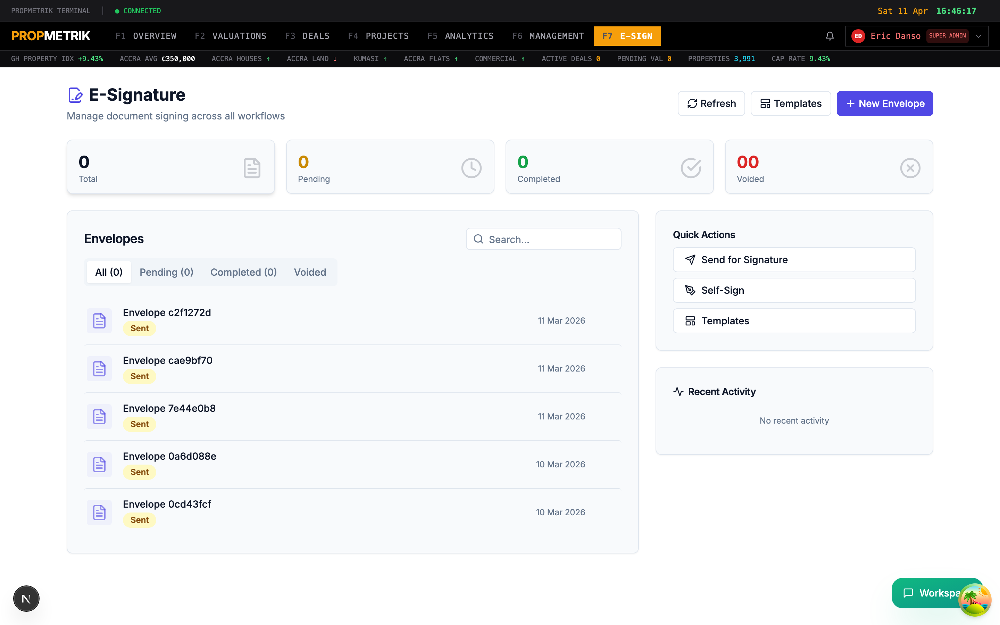
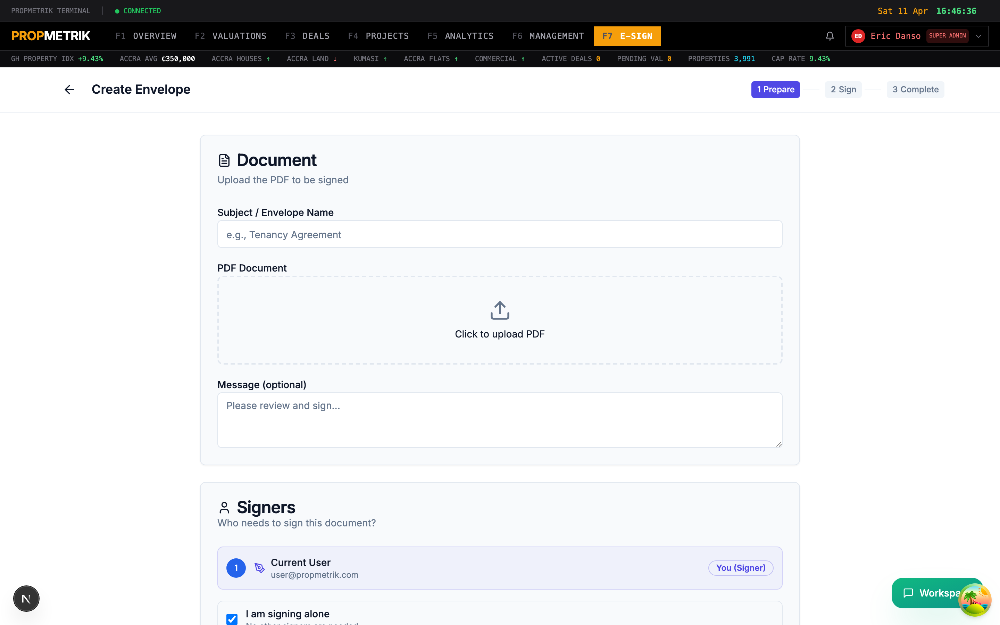
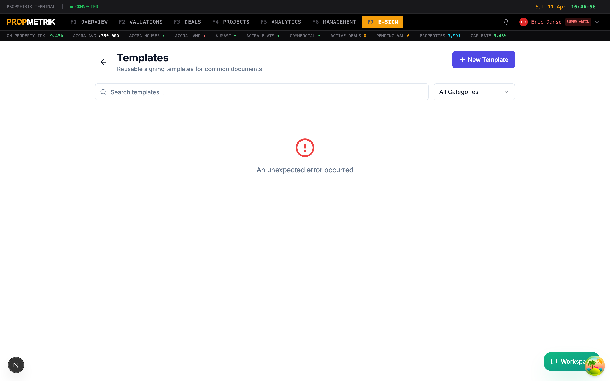
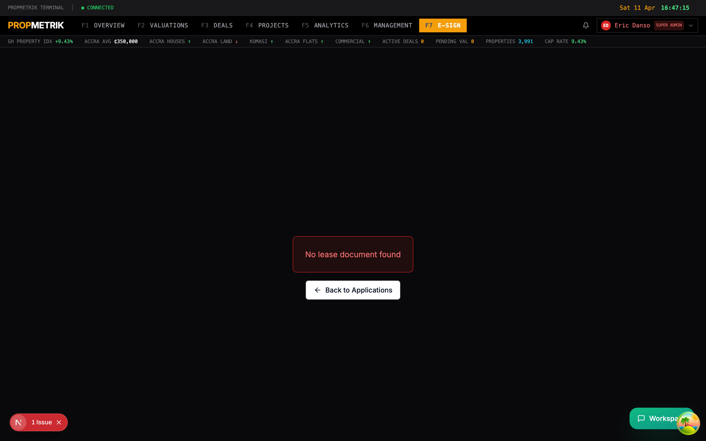

# Chapter 9 -- E-Signature

## Overview

The PropMetrik E-Signature module lets you send documents for legally-binding electronic signatures without leaving the platform. It integrates directly with Deals, Property Management, and Valuations so you can route leases, offers, change orders, transmittals, and valuation reports for signing with a few clicks.

The module is accessible from **Dashboard > E-Signature** and supports three signing modes:

- **Send for Signature** -- send a document to one or more external recipients.
- **Self-Sign** -- sign a document yourself without sending it to anyone else.
- **Sign and Send** -- sign your portion first, then route to additional signers.

---

## 9.1 E-Sign Dashboard

The main E-Signature page provides a bird's-eye view of all your signing activity.

### Stats Cards

Four clickable cards at the top summarise your envelope status:

| Card | Description |
|------|-------------|
| Total | All envelopes ever created |
| Pending | Envelopes with status Draft, Pending, Sent, or Delivered |
| Completed | Fully signed envelopes |
| Voided | Voided or declined envelopes |

Click any card to filter the envelope list below to that status category.

### Envelope List

The main panel shows your envelopes in a searchable, tabbed list:

- **All** -- every envelope regardless of status.
- **Pending** -- envelopes awaiting signatures.
- **Completed** -- successfully signed envelopes.
- **Voided** -- cancelled or declined envelopes.

Each row displays:

- Envelope name (or auto-generated ID)
- Status badge (colour-coded: green for completed, yellow for sent/pending, blue for delivered, red for voided/declined, gray for draft)
- Context type and entity name (e.g. "Lease: Unit 4B, Ridge Apartments")
- Creation date
- Actions menu (View, Download, Resend, Void)

### Quick Actions Sidebar

On the right side of the dashboard:

- **Send for Signature** -- jump straight to the new envelope wizard.
- **Self-Sign** -- start a self-signing session.
- **Templates** -- manage reusable signing templates.

### Recent Activity Feed

Below the quick actions, a timeline shows the latest signing events:

- Who signed and when
- Envelopes sent, voided, or declined
- System events (reminders, expiry warnings)

### Toolbar Actions

- **Refresh** -- reload the envelope list and stats.
- **Templates** -- navigate to template management.
- **+ New Envelope** -- create a new signing envelope.

---

## 9.2 Creating a New Envelope

Click **+ New Envelope** to launch the envelope creation wizard. The wizard guides you through four steps.

### Step 1: Prepare

**Choose your signing mode:**

- **Send to Others** -- you are not a signer; recipients sign the document.
- **Self-Sign** -- only you sign; no recipients needed.
- **Sign and Send** -- you sign first, then send to additional recipients.

**Upload a document:**

1. Click the upload area or drag a PDF file into it.
2. The file name appears with a file-type icon.
3. You can upload multiple documents for a single envelope.

**Add recipients (for Send and Sign-and-Send modes):**

1. Click **+ Add Recipient**.
2. Enter the recipient's **Name** and **Email**.
3. Set the **Role**: Signer, Reviewer, or CC (copy only).
4. Each recipient is assigned a unique colour for field placement.
5. Add as many recipients as needed.

**Set envelope details:**

- **Envelope Name** -- a descriptive title (e.g. "Lease Agreement -- 14 Oxford Street").
- **Message** -- optional text that appears in the signing invitation email.
- **Expiry** -- optional deadline after which the envelope is automatically voided.

Click **Next** to proceed.

### Step 2: Place Fields

The field placement editor displays your uploaded PDF with a toolbar for adding signature fields.

**Available field types:**

| Field | Purpose |
|-------|---------|
| Signature | Full signature (drawn, typed, or uploaded) |
| Initials | Short initials field |
| Date Signed | Auto-filled date stamp |
| Text | Free-text input |
| Checkbox | Boolean yes/no field |
| Name | Auto-filled signer name |
| Email | Auto-filled signer email |

**To place a field:**

1. Select the field type from the toolbar.
2. Select the recipient (colour-coded) who should fill this field.
3. Click on the PDF at the position where the field should appear.
4. Drag the handles to resize.
5. Repeat for all required fields.

**Navigation:**

- Use page controls to navigate multi-page documents.
- Zoom in/out for precise placement.

Click **Next** when all fields are placed.

### Step 3: Sign / Review

**For Self-Sign and Sign-and-Send modes:**

1. Your signature fields are highlighted.
2. Click each field to provide your signature (draw, type, or upload an image).
3. Fill any other required fields (date, initials).

**For Send-to-Others mode:**

1. Review the document with all placed fields.
2. Verify recipient details and field assignments.

Click **Next** to proceed.

### Step 4: Complete / Send

- Review the final envelope summary: document name, recipients, field count.
- Click **Send** to dispatch the envelope.
- A success banner confirms the envelope was created and sent.
- You are redirected to the E-Sign dashboard.

> **Tip:** If you frequently send similar documents (e.g. tenancy agreements), create a Template first to save time on field placement.

---

## 9.3 Templates

Templates let you pre-configure documents with field placements so you can reuse them across multiple envelopes. Navigate to **E-Signature > Templates**.

### Creating a Template

1. Click **+ New Template**.
2. Enter a **Template Name** and optional **Description**.
3. Select a **Category** (Lease, Offer, Contract, Valuation, General).
4. Add **Tags** for easy searching.
5. Upload the base PDF document.
6. Place fields on the document (same interface as Step 2 of envelope creation).
7. Click **Save Template**.

### Using a Template

When creating a new envelope:

1. In Step 1, click **Use Template** instead of uploading a new document.
2. Select a template from the list.
3. The document and pre-placed fields are loaded automatically.
4. Add recipients and adjust fields as needed.
5. Continue through the wizard.

### Managing Templates

Each template card shows:

- Template name and description
- Category badge
- Creation date
- Usage count

Use the dropdown menu on each card to:

- **Edit** -- modify the template fields or metadata.
- **Duplicate** -- create a copy for customisation.
- **Download** -- save the base document.
- **Delete** -- remove the template (confirmation required).

### Searching Templates

Use the search bar to filter templates by name, description, or tags.

---

## 9.4 Lease Envelopes

The Lease Envelope workflow is specifically designed for residential and commercial tenancy agreements. It is triggered from the Property Management module.

### How It Works

1. Navigate to a lease or tenancy in **Property Management > Leases**.
2. Click **Send for Signature** on the lease detail page.
3. PropMetrik generates an envelope pre-populated with:
   - Tenant name and contact details
   - Landlord/property manager as the second signer
   - Lease terms (start date, end date, rent amount, deposit)
   - The tenancy agreement document
4. Review the pre-placed fields and adjust if needed.
5. Click **Send** to dispatch.

### Tracking

The envelope is linked to the lease record. You can track its status from either:

- The E-Sign dashboard (filtered by context type "Lease")
- The lease detail page in Property Management

When the envelope is fully signed:

- The lease status automatically updates to "Active".
- A signed PDF copy is stored in the lease's documents.
- An audit trail entry is created.

---

## 9.5 Report Envelopes

Valuation reports can be routed for formal sign-off through the E-Sign module.

### How It Works

1. Navigate to a valuation report in **Valuations > Reports**.
2. Click **Send for Signature** on the report detail page.
3. PropMetrik creates an envelope with:
   - The valuation report PDF
   - The lead valuer as the primary signer
   - The peer reviewer or quality manager as the secondary signer
4. Field placements are pre-configured based on the report template.
5. Click **Send**.

### Sign-off Workflow

1. The lead valuer receives a signing invitation via email.
2. They review the report and apply their signature.
3. The reviewer receives their invitation after the valuer completes signing.
4. Once all parties sign, the report status updates to "Approved".
5. The signed PDF replaces the draft in the report record.

### Integration with Change Orders and Transmittals

E-Sign also integrates with Project Management workflows:

- **Change Orders** -- route construction change orders for client and contractor signatures.
- **Transmittals** -- get formal acknowledgement of document transmittals.

From any change order or transmittal detail page, click **Send for Signature** to create a linked envelope.

---

## 9.6 Envelope Detail Page

Click any envelope in the list to view its detail page.

### Information Displayed

- **Status** -- current status with colour-coded badge.
- **Document** -- preview of the uploaded PDF.
- **Recipients** -- list of signers with their status (pending, signed, declined).
- **Audit Trail** -- chronological log of every event (created, sent, viewed, signed, completed).
- **Timestamps** -- created, sent, last activity, completed/voided dates.

### Available Actions

| Action | When Available | Description |
|--------|---------------|-------------|
| View | Always | Preview the document |
| Download | Always | Download the document (signed version if completed) |
| Resend | Pending/In Progress | Re-send the signing invitation email |
| Void | Pending/In Progress | Cancel the envelope permanently |

> **Tip:** Use the **Resend** action if a recipient reports they never received the signing email. The system sends a fresh invitation with a new signing link.

---

## 9.7 Envelope Status Reference

| Status | Colour | Meaning |
|--------|--------|---------|
| Draft | Gray | Envelope created but not yet sent |
| Pending | Yellow | Awaiting action |
| Sent | Yellow | Invitation emails dispatched |
| Delivered | Blue | Emails confirmed delivered |
| In Progress | Blue | At least one signer has started |
| Completed | Green | All parties have signed |
| Signed | Green | Document is fully signed |
| Voided | Red | Cancelled by the sender |
| Declined | Red | Rejected by a recipient |
| Expired | Orange | Past the expiry deadline |

---

## Summary

The E-Signature module eliminates the need for physical document signing. Create envelopes from scratch or from templates, place signature fields with drag-and-drop precision, and track every step of the signing process. Integration with Leases, Valuations, Change Orders, and Transmittals means documents flow seamlessly from creation to legally-signed completion.
