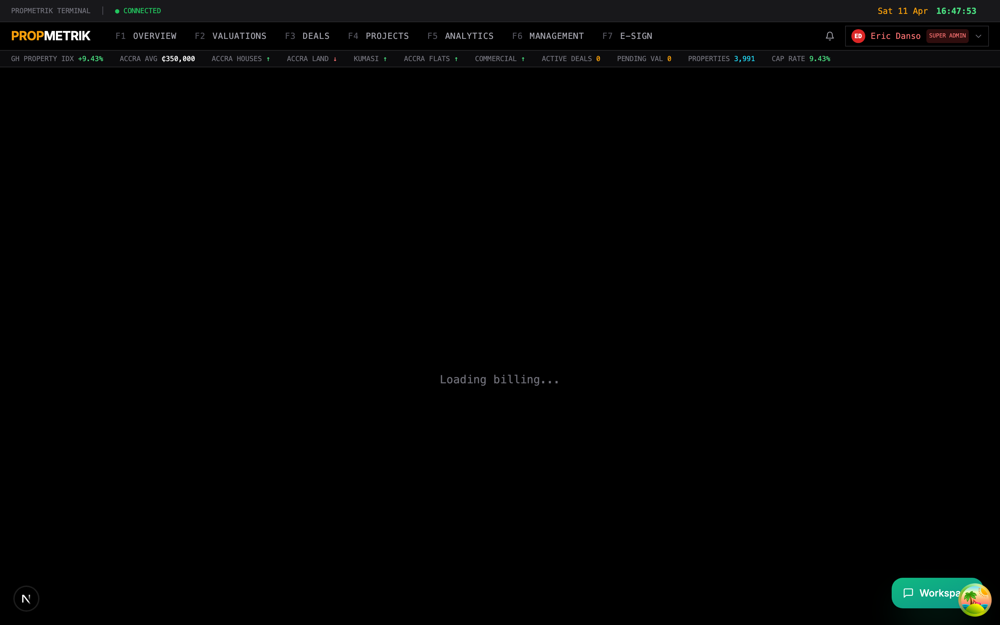
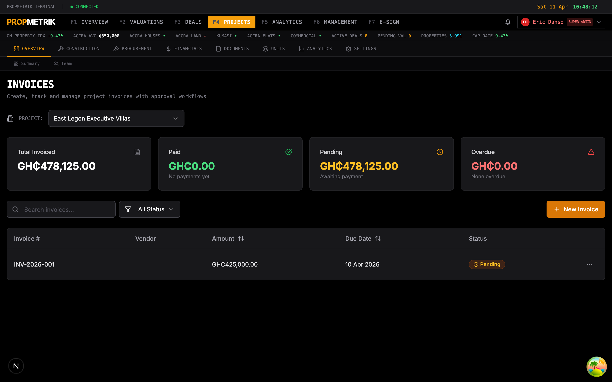
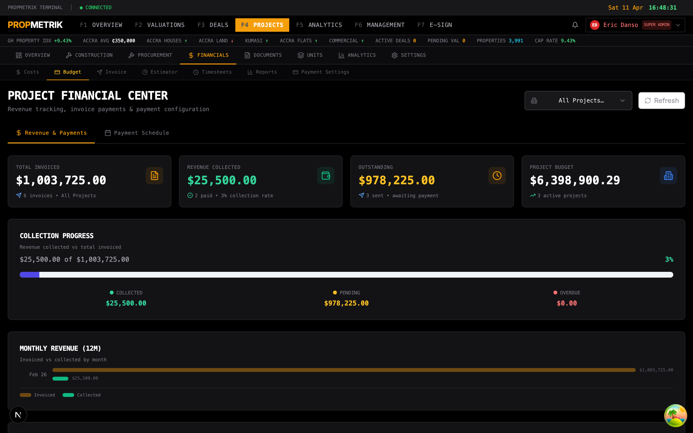
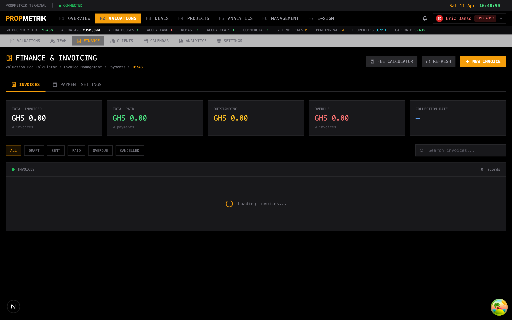
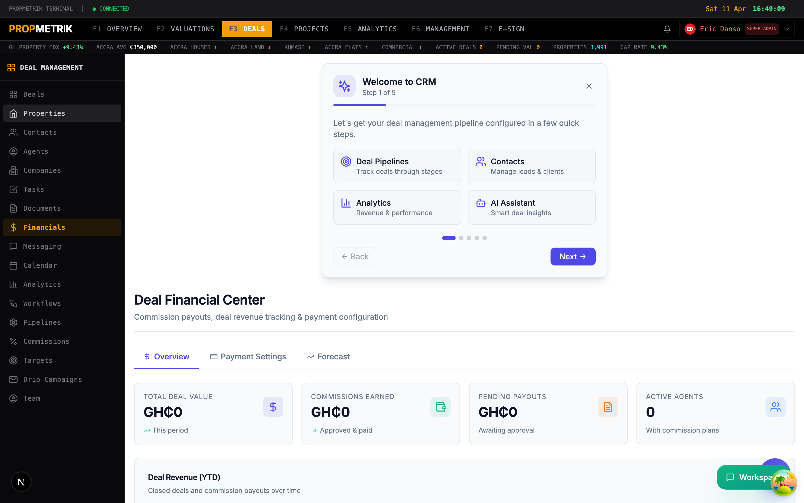
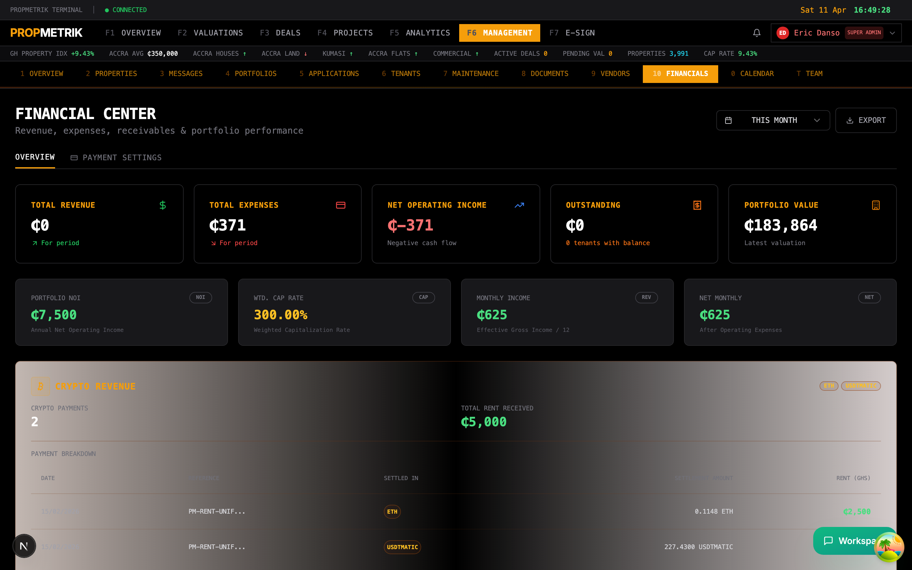

# Chapter 10 -- Financial / Invoicing

## Overview

PropMetrik consolidates financial management across every module -- Billing & Subscriptions, Project Management invoices, Deal commissions, Valuation fee tracking, and Property Management rent collection -- into a unified set of financial tools. All values are denominated in Ghana Cedis (GHS / GH₵) by default, with multi-currency support for international transactions.

This chapter covers the six financial surfaces in the platform:

1. **Billing & Subscriptions** -- your PropMetrik subscription and usage metering.
2. **Project Invoices** -- construction project billing with draw schedules and pay applications.
3. **Project Financials** -- budget vs. actual cost tracking with Xero sync.
4. **Valuation Finance** -- fee schedules, billing for valuation assignments.
5. **Deal Financials** -- commission payouts, revenue forecasting, payment configuration.
6. **Property Management Financials** -- rent collection, arrears, landlord statements.

---

## 10.1 Billing & Subscriptions

Navigate to **Dashboard > Billing** to manage your PropMetrik subscription.

### Current Plan

The top section displays your active subscription:

- **Plan Name** -- the tier you are on (Starter, Professional, Enterprise).
- **Billing Interval** -- monthly or annual.
- **Price** -- in GH₵ per month or per year.
- **Status** -- active, trial, past due, or cancelled.
- **Current Period** -- start and end dates of the current billing cycle.
- **Trial** -- if on a trial, the expiry date is shown.

### Usage Metrics

A set of progress bars show how much of your plan limits you have consumed:

| Metric | Description |
|--------|-------------|
| Users | Team members vs. plan limit |
| Properties | Managed properties vs. limit |
| Projects | Active construction projects vs. limit |
| Deals | Active CRM deals vs. limit |
| Valuations | Valuation reports created vs. limit |
| Storage | Document storage used vs. limit |
| API Calls | API requests this period vs. limit |

Each bar turns amber at 80% and red at 95% utilisation.

### Add-ons

Optional modules that extend your plan:

- Extra user seats
- Additional storage
- Advanced analytics
- WhatsApp integration
- API access

To add or remove add-ons:

1. Scroll to the **Add-ons** section.
2. Click **Manage** next to the add-on.
3. Adjust the quantity.
4. Confirm the change -- billing is prorated.

### Payment History

A table of past invoices with:

- Invoice date
- Amount in GH₵
- Status (Paid, Pending, Failed)
- Download link for receipt PDF

### Payment Method

Configure your payment method:

- **Paystack** -- card payments via Paystack (the primary provider for Ghana).
- **Bank Transfer** -- manual bank transfer with reference number.
- **Mobile Money** -- MTN MoMo, Vodafone Cash, AirtelTigo Money.

---

## 10.2 Project Invoices

Navigate to **Projects > Invoices** or use the **Invoice Builder** for construction project billing.

### Invoice List

The invoices page shows all project invoices with:

- Invoice number (auto-generated sequence)
- Project name
- Client / contractor name
- Amount in GH₵
- Status badge (Draft, Sent, Partially Paid, Paid, Overdue, Voided)
- Due date
- Payment reference (Paystack reference if paid online)

### Creating an Invoice

1. Click **+ New Invoice** or navigate to **Projects > Invoice Builder**.
2. Select the **Project** from the dropdown.
3. Choose the **Invoice Type**:
   - **Progress Payment** -- based on percentage of work completed.
   - **Milestone Payment** -- tied to a specific project milestone.
   - **Retention Release** -- release of held-back retention funds.
   - **Variation / Change Order** -- additional work outside original scope.
   - **Final Account** -- closing invoice for project completion.
4. Add **Line Items**:
   - Description of work
   - Quantity
   - Unit price
   - Amount (auto-calculated)
5. Apply **Retention** (typically 5--10% withheld until defects liability period).
6. Add **Taxes** (VAT, NHIL, COVID levy as applicable in Ghana).
7. Set the **Due Date**.
8. Add **Notes** or terms.
9. Click **Save as Draft** or **Send** to dispatch to the client.

### Invoice Actions

| Action | Description |
|--------|-------------|
| Edit | Modify a draft invoice |
| Send | Email the invoice to the client |
| Record Payment | Log a manual payment received |
| Download PDF | Export the invoice as a PDF |
| Void | Cancel the invoice |
| Duplicate | Create a copy for the next billing period |

### Draw Schedule / Pay Applications

For construction projects, the draw schedule tracks planned disbursements against actual payments:

1. Navigate to **Projects > [Project] > Draws / Pay Apps**.
2. View the schedule of planned draws aligned to construction phases.
3. Submit a **Pay Application** for each draw:
   - Current work completed this period
   - Materials stored on site
   - Less retention
   - Less previous payments
   - Net amount due
4. The client reviews and approves or rejects the application.
5. Approved amounts become payable invoices.

> **Tip:** Link invoices to Change Orders so you can trace every billing item back to its authorisation.

---

## 10.3 Project Financials

Navigate to **Projects > Financials** or open a specific project and go to **Budget & Cost**.

### Budget vs. Actual

The financials dashboard provides a real-time view of project financial health:

- **Original Budget** -- the initial approved budget.
- **Revised Budget** -- budget after approved change orders.
- **Committed Costs** -- purchase orders and subcontracts issued.
- **Actual Costs** -- invoices received and payments made.
- **Variance** -- difference between budget and actual (green = under, red = over).
- **% Complete** -- financial percentage complete.
- **Estimated at Completion (EAC)** -- projected total cost.
- **Estimate to Complete (ETC)** -- remaining costs.

### Cost Categories

Costs are broken down by category:

| Category | Examples |
|----------|---------|
| Materials | Cement, steel, timber, sand, tiles |
| Labour | Skilled and unskilled labour, overtime |
| Equipment | Crane hire, scaffolding, tools |
| Subcontractors | Electrical, plumbing, painting |
| Professional Fees | Architect, engineer, surveyor |
| Permits & Fees | Building permits, utility connections |
| Overhead | Site office, insurance, security |
| Contingency | Risk allowance |

### Adding a Cost

1. Click **+ Add Cost**.
2. Select the **Cost Category** from the dropdown.
3. Enter the **Description**, **Vendor**, **Amount**, and **Date**.
4. Attach a receipt or invoice document (optional).
5. Click **Save**.

### Xero Integration

PropMetrik syncs project costs with Xero accounting software:

1. Navigate to **Projects > Integrations** or the Xero settings panel.
2. Click **Connect to Xero** to start the OAuth2 flow.
3. Authorise PropMetrik to access your Xero organisation.
4. Once connected, you can:
   - **Sync Costs** -- push project costs to Xero as bills or invoices.
   - **Map Contacts** -- link PropMetrik vendors to Xero contacts.
   - **Track Status** -- see sync status with timestamps and error logs.

Each cost record shows a Xero sync badge indicating whether it has been synced, is pending, or failed.

> **Tip:** Set up automatic sync to push new costs to Xero daily, reducing manual data entry and ensuring your accounting records stay current.

---

## 10.4 Valuation Finance

Financial tracking for valuation assignments and fee billing.

### Fee Schedules

Configure fee schedules based on property type and valuation purpose:

| Property Type | Market Value | Insurance | Mortgage | Rent Review |
|--------------|-------------|-----------|----------|------------|
| Residential | GH₵ 2,500 | GH₵ 1,800 | GH₵ 2,000 | GH₵ 1,500 |
| Commercial | GH₵ 5,000 | GH₵ 3,500 | GH₵ 4,000 | GH₵ 3,000 |
| Industrial | GH₵ 8,000 | GH₵ 6,000 | GH₵ 7,000 | GH₵ 5,000 |
| Land | GH₵ 3,000 | -- | GH₵ 2,500 | -- |

Fees are guidelines -- you can override them per assignment.

### Billing a Valuation

1. Open a valuation report.
2. Navigate to the **Finance** tab.
3. The system pre-fills the fee based on property type and purpose.
4. Adjust the fee if needed (discounts, complexity surcharges).
5. Click **Generate Invoice** to create a billing record.
6. The invoice can be sent to the client via email or printed.

### Revenue Tracking

The valuation finance dashboard shows:

- Total revenue this month/quarter/year
- Revenue by valuer (performance leaderboard)
- Outstanding fees (unpaid invoices)
- Fee collection rate (percentage of billed fees collected)
- Revenue trend chart

---

## 10.5 Deal Financials

Navigate to **Deals > Financials** for the CRM financial centre.

### Overview Tab

Summary cards show:

- **Total Pipeline Value** -- sum of all active deal values.
- **Won Revenue** -- closed-won deal values for the period.
- **Pending Commissions** -- commissions calculated but not yet paid.
- **Paid Commissions** -- commissions disbursed to agents.

Below the cards, a revenue breakdown chart shows deal value by:

- Deal type (Sale, Rental, Development)
- Pipeline stage
- Agent
- Time period

### Payment Settings Tab

Configure how commissions and deal-related payments are processed:

1. Select the **Payment Provider**:
   - Paystack (automatic card/mobile money payouts)
   - Bank Transfer (manual processing)
2. Set **Payout Frequency**: weekly, bi-weekly, or monthly.
3. Configure **Approval Workflow**: require manager approval before payout, or auto-approve.
4. Set **Commission Calculation Rules**:
   - When to calculate (on deal won, on payment received, manual)
   - Default split percentages
   - Tiered commission structures (higher rates for higher deal values)

### Forecast Tab

The AI-powered Revenue Forecaster uses your pipeline data to project future revenue:

- **Weighted Pipeline** -- deal values multiplied by stage probabilities.
- **Monthly Forecast** -- expected closings per month based on deal velocity.
- **Best / Worst / Expected Cases** -- three scenario projections.
- **Confidence Interval** -- statistical range for the forecast.

The forecaster accounts for:

- Historical conversion rates by stage
- Average deal cycle length
- Seasonal patterns in the Ghanaian real estate market
- Agent-specific performance trends

> **Tip:** Keep your pipeline stages' probability percentages accurate -- they directly feed the revenue forecasting model.

---

## 10.6 Property Management Financials

Navigate to **Property Management > Financials** for rent collection and landlord accounting.

### Rent Collection Dashboard

- **Expected Rent** -- total rent due this month across all managed properties.
- **Collected** -- rent received to date.
- **Outstanding** -- unpaid rent (arrears).
- **Collection Rate** -- percentage of expected rent collected.
- **Advance Payments** -- rent paid ahead of schedule.

### Arrears Management

A table of overdue rent payments with:

- Tenant name and unit
- Amount overdue
- Days overdue
- Last payment date
- Contact information
- Action buttons: Send Reminder, Record Payment, Escalate

**To send a rent reminder:**

1. Select one or more tenants with arrears.
2. Click **Send Reminder**.
3. Choose the communication channel: Email, SMS, or WhatsApp.
4. Review the auto-generated reminder message.
5. Click **Send**.

### Landlord Statements

Generate monthly or periodic financial statements for property owners:

1. Select the **Property** and **Period**.
2. The system compiles:
   - Gross rent collected
   - Less management fees
   - Less maintenance expenses
   - Less any other deductions
   - Net amount due to landlord
3. Click **Generate Statement** to create a PDF.
4. Click **Send to Landlord** to email the statement.

### Payment Recording

To record a rent payment:

1. Navigate to the tenant's lease or the arrears list.
2. Click **Record Payment**.
3. Enter:
   - Amount received
   - Payment date
   - Payment method (Cash, Bank Transfer, Mobile Money, Cheque)
   - Reference number
4. Click **Save**.
5. The tenant's balance updates automatically.

### Rent Receipts

After recording a payment, you can generate and send a rent receipt:

1. Click **Generate Receipt** on the payment record.
2. The receipt includes: tenant name, property, amount, date, method, and receipt number.
3. Click **Send** to email or WhatsApp the receipt to the tenant.

---

## 10.7 Financial Reports

Across all modules, PropMetrik provides exportable financial reports:

| Report | Module | Description |
|--------|--------|-------------|
| Profit & Loss | Projects | Revenue vs. costs for a project |
| Cash Flow | Projects | Inflows and outflows by period |
| Aged Receivables | PM / Deals | Outstanding invoices by age bracket |
| Commission Statement | Deals | Agent commission summary for a period |
| Landlord Statement | PM | Net income statement for property owners |
| Fee Revenue | Valuations | Valuation fees billed and collected |
| Budget Variance | Projects | Budget vs. actual with variance analysis |
| Tax Summary | All | VAT, NHIL, and levy summary for filing |

### Exporting

All financial tables and reports support:

- **CSV Export** -- for spreadsheet analysis.
- **PDF Export** -- for client or management reporting.
- **Xero Sync** -- for accounting integration (project costs).

> **Tip:** Schedule monthly financial reports using the Workflow automation to have them emailed to stakeholders on the first of each month.

---

## Summary

PropMetrik's financial tools cover the entire lifecycle of real estate finance in Ghana -- from subscription billing and project cost management to agent commissions and rent collection. The Xero integration bridges the gap between operational and accounting systems, while the AI-powered revenue forecaster helps you plan with confidence.
