# Chapter 11 -- Data Hub & Analytics

## Overview

The PropMetrik Data Hub is the intelligence engine that powers every analytical feature in the platform. It ingests real estate data from government registries, financial institutions, partner APIs, community contributions, and public web sources, then processes it through ETL pipelines, quality checks, and machine-learning models to produce market intelligence for the Ghanaian property market.

The Data Hub and Analytics modules are split across two areas of the platform:

- **Analytics** (Dashboard > Analytics) -- consumer-facing dashboards for market insights, forecasting, risk, affordability, construction costs, and ML model outputs.
- **Data Hub Administration** (Dashboard > Admin > Data Hub) -- backend administration for data sources, ingestion pipelines, quality management, spiders, and system configuration.

All analytics use PropMetrik's terminal-style dark UI with amber accents and monospaced typography.

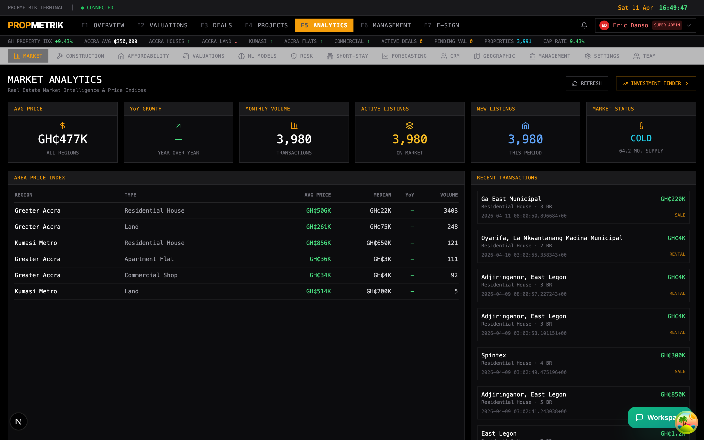

---

## Part A: Analytics Dashboards

### 11.1 Market Analytics (Main)

Navigate to **Dashboard > Analytics** to access the main market intelligence dashboard.

#### KPI Summary Bar

Six metric panels across the top:

| Panel | Shows |
|-------|-------|
| AVG PRICE | Average property price across all regions (GH₵) |
| YoY GROWTH | Year-over-year price change (green positive, red negative) |
| MONTHLY VOLUME | Transaction count for the current period |
| ACTIVE LISTINGS | Properties currently on the market |
| NEW LISTINGS | Properties listed this period |
| MARKET STATUS | Temperature reading (Hot, Warm, Balanced, Cool, Cold) with months of supply |

#### Area Price Index

A table showing price indices by region and property type:

- Region name
- Property type (Residential, Commercial, Land, etc.)
- Average price (GH₵)
- Median price
- Year-over-year change
- Transaction volume

#### Recent Transactions

A sidebar panel listing the latest property transactions with:

- Location
- Property type and bedrooms
- Final price in GH₵
- Price per square metre
- Transaction date and type (sale/rental)

#### Supply & Demand by Region

A table breaking down each region's market dynamics:

- Total supply
- Properties sold in the last 30 days
- Inventory months (how long current supply would last at current sales pace)
- Average days on market
- Market temperature (colour-coded: red for hot, amber for warm, green for balanced, blue for cool)

#### Price Distribution

A horizontal bar chart showing the percentage of transactions in each price bracket (e.g. "GH₵ 100K--200K: 23%").

#### Price Index Trend (12 Months)

A sparkline bar chart showing monthly median prices and month-over-month change percentages for the trailing 12 months.

#### Market Activity by Region

A comprehensive table with:

- Transaction count and total value
- Average price
- Active and new listings
- Average days on market
- Average discount from asking price

> **Tip:** Click the **INVESTMENT FINDER** button in the header to jump to the Investment Analysis module for buy-side recommendations.

---

### 11.2 Affordability Analytics

Navigate to **Dashboard > Analytics > Affordability**.

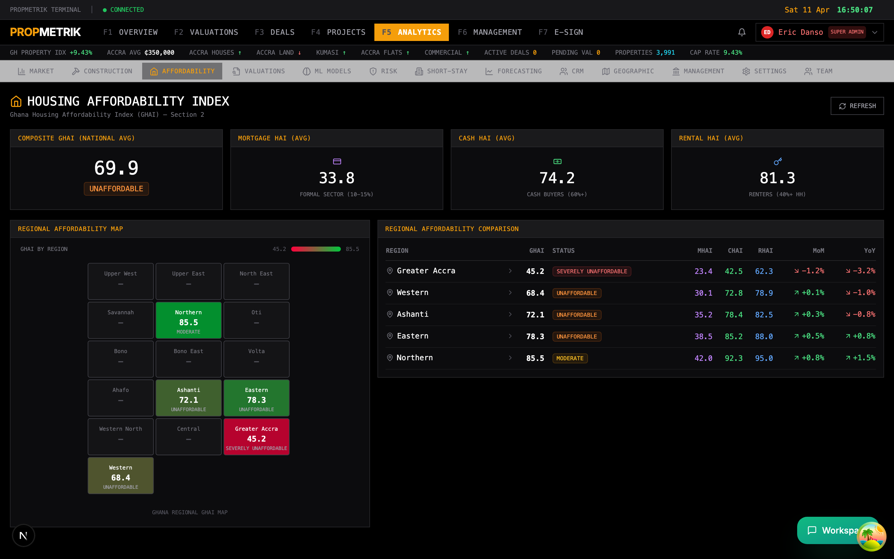

The Ghana Housing Affordability Index (GHAI) is a PropMetrik-exclusive composite index that measures how affordable housing is across regions.

#### GHAI Components

| Component | Abbreviation | Description |
|-----------|-------------|-------------|
| Mortgage Housing Affordability Index | MHAI | Affordability via mortgage financing |
| Cash Housing Affordability Index | CHAI | Affordability for outright cash purchases |
| Rental Housing Affordability Index | RHAI | Rental affordability relative to income |
| Cost Affordability Index | CAI | Construction cost vs. income |
| Location Affordability Index | LAI | Transport and infrastructure costs |
| Market Accessibility Score | MAS | How easy it is to enter the market |

#### Regional Dashboard

For each region the dashboard shows:

- GHAI composite score with category (Affordable, Moderate, Stretched, Unaffordable)
- Individual component scores
- Median property price and household income
- Current mortgage rate
- Median monthly rent
- Trend direction and month-over-month / year-over-year changes

#### Regional Heatmap

A colour-coded map of Ghana showing affordability by region. Darker colours indicate less affordable areas.

#### Alerts

The system generates alerts when:

- A region's GHAI changes category (e.g. Moderate to Stretched)
- Mortgage rates change significantly
- A region's affordability deteriorates rapidly

---

### 11.3 Construction Cost Analytics

Navigate to **Dashboard > Analytics > Construction**.

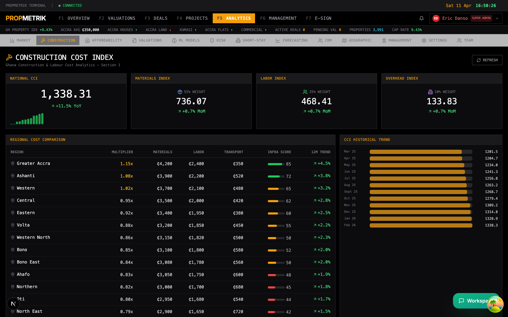

#### Construction Cost Index (CCI)

The national CCI is a weighted composite of three components:

- **Materials** -- cost of building materials (cement, steel, timber, etc.)
- **Labour** -- skilled and unskilled construction labour rates
- **Overhead** -- site management, insurance, permits

Each component shows:

- Current index value
- Component weight in the composite
- Month-over-month change
- Year-over-year change

#### Regional Cost Multipliers

A table showing how costs vary by region:

- Regional multiplier (1.0 = national average)
- Distance from port (affects transport costs)
- Transport factor
- Infrastructure score
- Cost component breakdown (materials, labour, transport)
- 6-month and 12-month trends

#### Material Prices

A detailed table of current material prices:

- Category and sub-category
- Unit price in GH₵ with unit of measure
- Local vs. import percentage
- Price volatility rating (Low, Medium, High)
- Month-over-month and year-over-year changes

> **Tip:** Use the CCI trend chart to time large material purchases -- buying during seasonal dips can save 5--15% on material costs.

---

### 11.4 Forecasting

Navigate to **Dashboard > Analytics > Forecasting**.

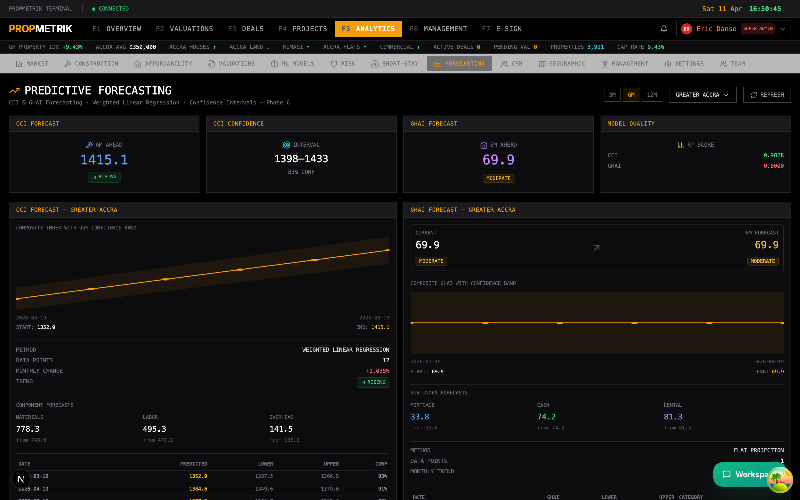

#### CCI Forecasting

The Construction Cost Index forecaster projects future cost indices:

- **Forecast Horizon** -- 3, 6, or 12 months ahead.
- **Predicted Index** -- the projected CCI value.
- **Confidence Interval** -- upper and lower bounds.
- **Model Info** -- method used, data points, R-squared, trend direction, monthly change rate.
- **Component Forecasts** -- separate projections for materials, labour, and overhead.

#### GHAI Forecasting

The affordability forecaster projects how affordability will change:

- Current GHAI and category
- Predicted GHAI at each future period
- Whether the category is expected to change (e.g. Moderate to Stretched)
- Contributing factors driving the forecast

#### Price Forecasting

Property price predictions by region:

- Current median price
- 3/6/12-month price projections
- Confidence intervals
- Key drivers (supply changes, economic indicators, construction costs)

---

### 11.5 Geographic Analytics

Navigate to **Dashboard > Analytics > Geographic**.

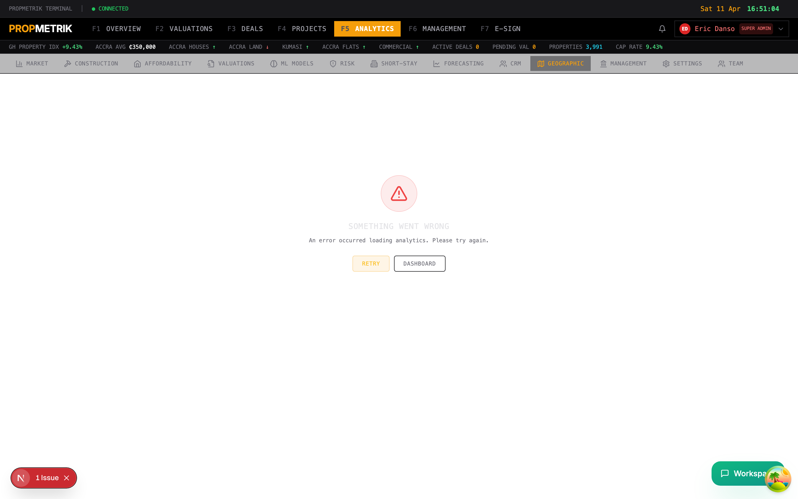

- Interactive regional comparison charts
- Neighbourhood-level metrics (average price, transaction volume, days on market)
- Urban vs. peri-urban analysis
- Infrastructure proximity scoring
- School and amenity accessibility indices

---

### 11.6 Risk Analytics

Navigate to **Dashboard > Analytics > Risk**.

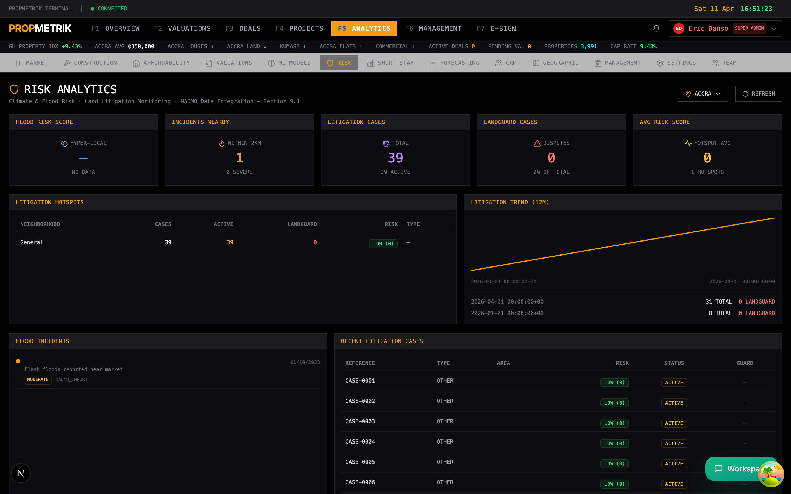

#### Flood Risk

- Flood risk scores by neighbourhood (0--100 scale)
- Risk level classification (Low, Moderate, High, Very High)
- Nearby flood incidents with distance
- Risk factors list
- Zone type and severity
- Recommendations

#### Recent Flood Incidents

A timeline of flood events with:

- Source and date
- Description and severity
- Neighbourhood and city
- Latitude/longitude coordinates

#### Land Litigation Risk

- Active cases by region
- Case reference and dispute type
- Status (pending, resolved, appealed)
- Risk score
- Filing date

#### Environmental Hazards

- Proximity to industrial zones
- Soil contamination risk
- Noise pollution zones
- Air quality indices

> **Tip:** Always check the Risk Analytics for a property's neighbourhood before finalising a valuation or deal -- flood risk alone can impact value by 10--25%.

---

### 11.7 Short-Stay Analytics

Navigate to **Dashboard > Analytics > Short-Stay**.

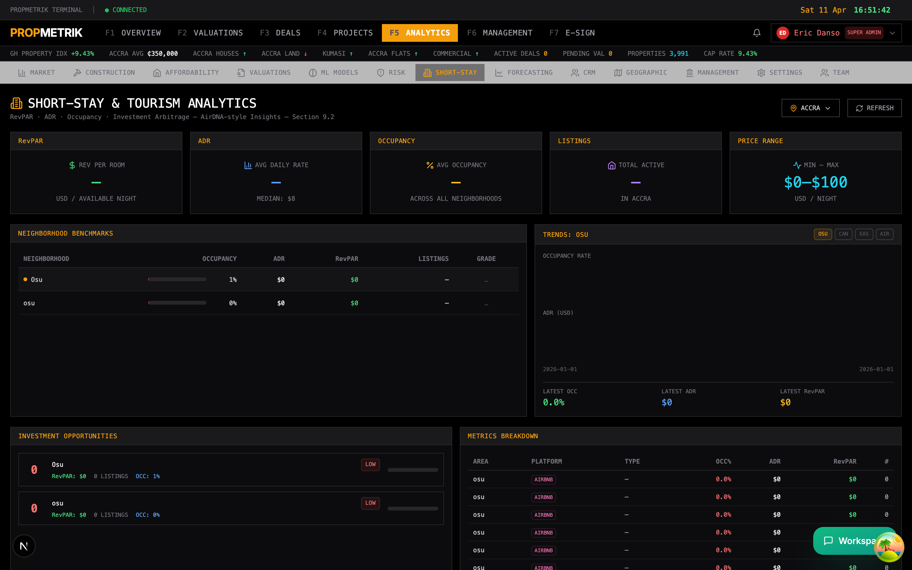

- Average daily rates by neighbourhood
- Occupancy rates
- Revenue per available night
- Seasonal demand patterns
- Competition analysis (number of listings by area)
- Guest review score averages

---

### 11.8 Investment Analysis

Navigate to **Dashboard > Analytics > Market > Investments**.

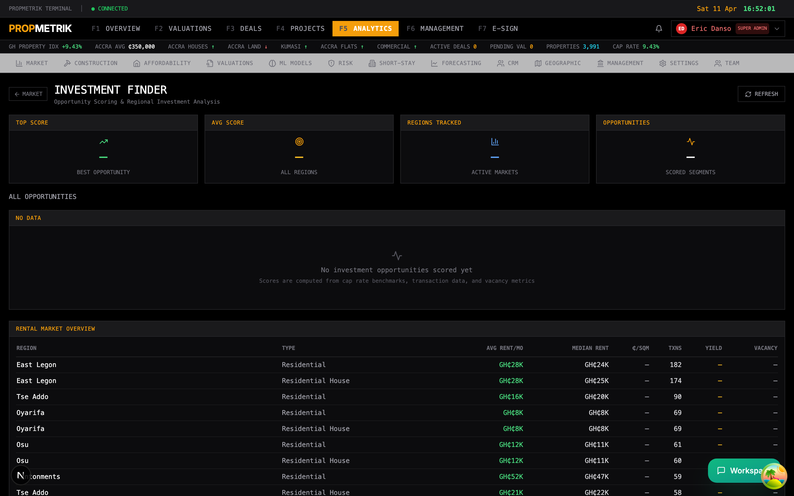

- Gross and net yield calculations by region
- Capitalisation rates
- Cash-on-cash return projections
- Break-even analysis
- Comparative investment scoring
- Buy vs. rent decision framework

---

### 11.9 Rental Market Analysis

Navigate to **Dashboard > Analytics > Market > Rentals**.

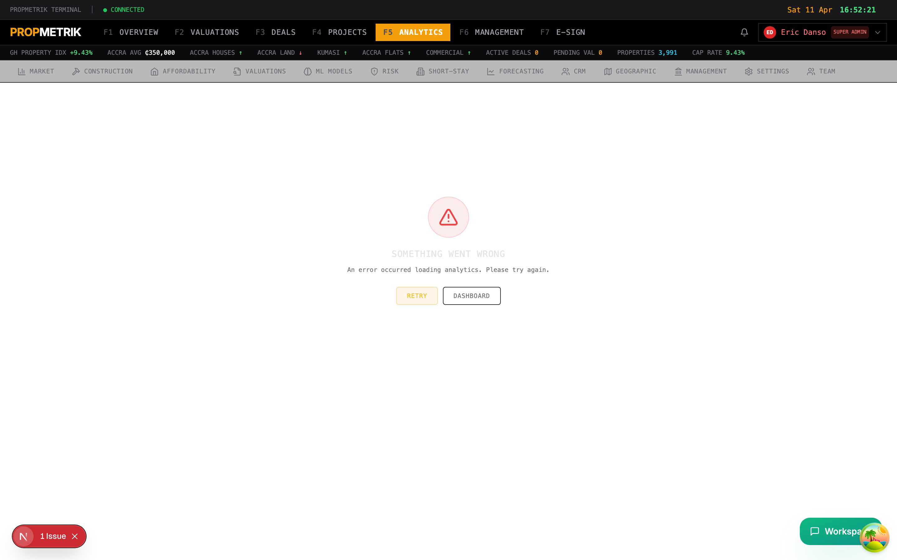

- Median rent by region and property type
- Rental yield trends
- Vacancy rates
- Rent growth year-over-year
- Landlord return analysis
- Rental demand indicators

---

### 11.10 ML Insights Dashboard

Navigate to **Dashboard > Analytics > ML**.

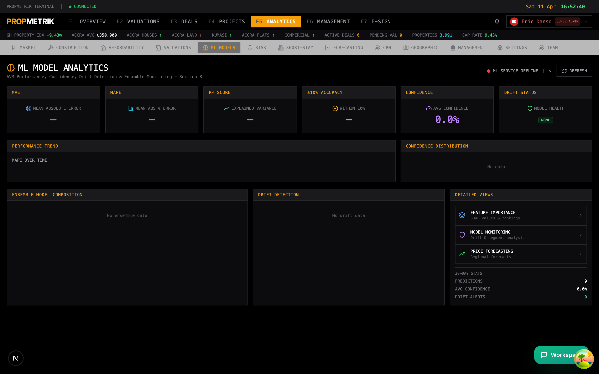

The ML (Machine Learning) dashboard provides transparency into the predictive models powering PropMetrik's analytics.

#### Service Status

- ML service status (online/offline)
- Model version in production
- Total predictions in the last 30 days
- Average confidence score
- Active drift alerts

#### Model Performance Metrics

| Metric | Description |
|--------|-------------|
| MAE | Mean Absolute Error -- average prediction error in GH₵ |
| RMSE | Root Mean Squared Error -- penalises large errors more |
| MAPE | Mean Absolute Percentage Error |
| R-squared | Proportion of variance explained (closer to 1.0 is better) |
| Median Error | Middle error value |
| P90 Error | 90th percentile error (worst 10% of predictions) |
| Within 10% | Percentage of predictions within 10% of actual values |
| Within 20% | Percentage of predictions within 20% of actual values |

#### Ensemble Analytics

PropMetrik uses an ensemble of multiple models. The dashboard shows:

- Individual model weights
- Model agreement scores
- Ensemble vs. individual model performance

---

### 11.11 ML Feature Importance

Navigate to **Dashboard > Analytics > ML > Features**.

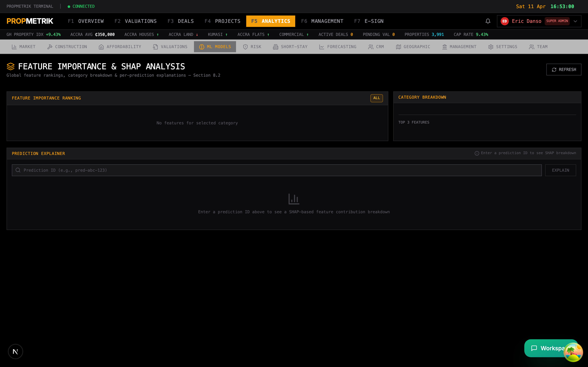

- Ranked list of features (inputs) used by the valuation model
- Feature importance scores
- SHAP (Shapley) values showing how each feature pushes predictions up or down
- Feature distribution histograms
- Correlation matrix between key features

---

### 11.12 ML Forecasting

Navigate to **Dashboard > Analytics > ML > Forecasting**.

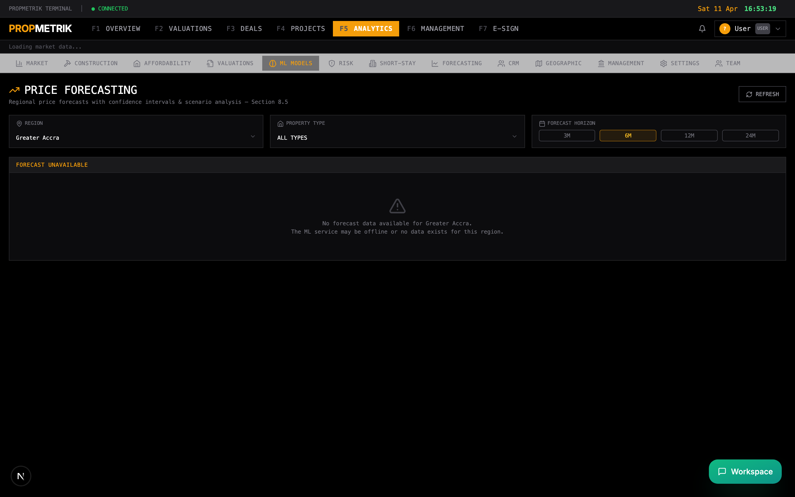

- Property value time-series forecasts
- Confidence bands (narrow = high confidence, wide = uncertain)
- Historical accuracy tracking
- Model comparison (which model performed best by region/property type)

---

### 11.13 ML Model Monitoring

Navigate to **Dashboard > Analytics > ML > Monitoring**.

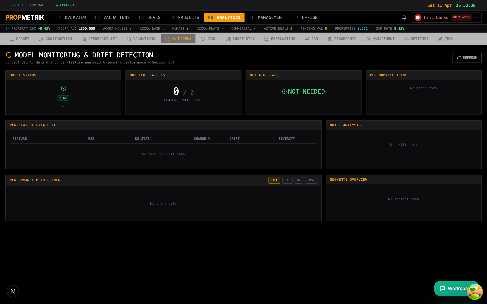

#### Drift Detection

Monitors whether the model's input data distribution has shifted:

- **Concept Drift** -- the relationship between inputs and outputs has changed.
- **Data Drift** -- the distribution of incoming data has shifted.
- **Prediction Drift** -- model outputs are systematically different from expectations.

Each drift alert includes:

- Detection date
- Drift type and severity
- Affected metrics
- Recommendation (retrain, monitor, or no action)
- Whether retraining is required

#### Performance Trends

Track how model accuracy changes over time:

- Trend direction (improving, degrading, stable)
- Change rate
- Historical performance charts

#### Confidence Distribution

- Histogram of prediction confidence scores
- High/medium/low confidence breakdown
- Mean and median confidence over time

---

## Part B: Data Hub Administration

### 11.14 Data Hub Overview

Navigate to **Dashboard > Admin > Data Hub** for the administration dashboard.

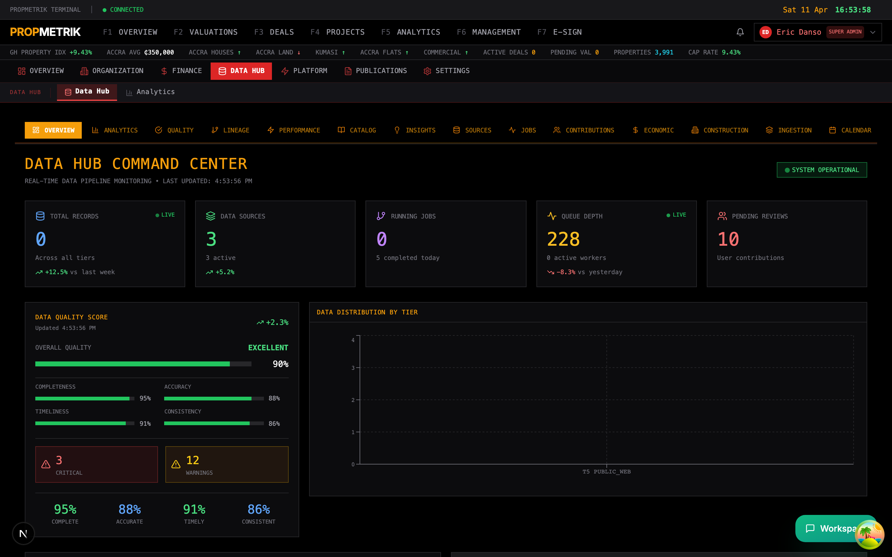

The Data Hub overview displays:

- **Source Statistics** -- total data sources by tier, active vs. paused.
- **ETL Job Status** -- running, queued, completed, and failed jobs.
- **Pending Contributions** -- community-submitted data awaiting review.
- **Economic Snapshot** -- latest macro-economic indicators.
- **Data Quality Widget** -- overall quality scores and alerts.
- **Real-Time Data Feed** -- live stream of incoming data events.
- **System Health** -- server status, queue depths, processing rates.

#### Data Source Tiers

PropMetrik organises data sources into five tiers based on reliability:

| Tier | Name | Examples | Colour |
|------|------|----------|--------|
| Tier 1 | Government | Lands Commission, Ghana Statistical Service | Blue |
| Tier 2 | Financial | Banks, mortgage providers, insurance companies | Green |
| Tier 3 | Partners | Estate agents, developers, professional bodies | Purple |
| Tier 4 | Contributions | User-submitted transactions and market data | Amber |
| Tier 5 | Public Web | Property listing websites, classifieds | Orange |

---

### 11.15 Data Sources

Navigate to **Admin > Data Hub > Sources**.

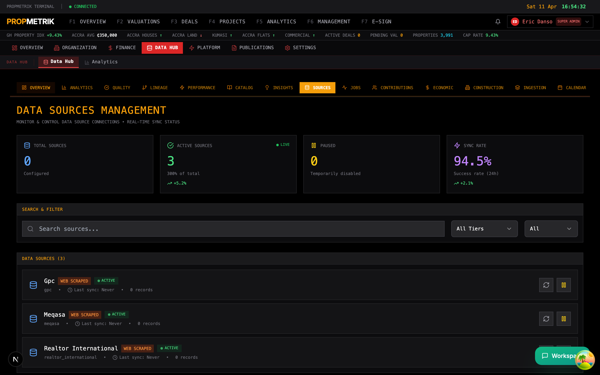

#### Viewing Sources

The source list shows:

- Source name and description
- Tier badge (colour-coded)
- Status (Active, Paused, Inactive)
- Last sync timestamp
- Record count
- Health indicator (green checkmark, yellow warning, red error)

#### Filtering

- **Search** -- find sources by name or description.
- **Tier filter** -- show only sources of a specific tier.
- **Status filter** -- filter by Active, Paused, or Inactive.

#### Source Actions

- **Play/Pause** -- toggle a source between active and paused states.
- **Refresh** -- trigger an immediate data pull from the source.
- **View Details** -- inspect source configuration, API endpoints, and error logs.

---

### 11.16 Ingestion

Navigate to **Admin > Data Hub > Ingestion**.

The ingestion pipeline processes raw data through multiple stages:

1. **Extract** -- pull data from the source (API call, file download, web scrape).
2. **Transform** -- normalise, deduplicate, geocode, and enrich records.
3. **Validate** -- run quality checks (completeness, consistency, accuracy).
4. **Load** -- write validated records to the data warehouse.

The ingestion page shows:

- Pipeline stages with processing counts
- Current throughput (records per minute)
- Error rates per stage
- Queue depth
- Processing latency

---

### 11.17 Data Catalog

Navigate to **Admin > Data Hub > Catalog**.

The data catalog is a searchable registry of all datasets in the platform:

- Dataset name and description
- Schema (columns, data types, constraints)
- Source tier and origin
- Freshness (when last updated)
- Record count
- Usage statistics (which analytics modules reference this dataset)
- Data lineage links

#### Searching the Catalog

Use the search bar to find datasets by name, column name, or description. Filter by tier or data domain (property, economic, demographic, geographic).

---

### 11.18 Data Quality

Navigate to **Admin > Data Hub > Quality**.

#### Quality Scores

Each dataset receives a composite quality score based on:

| Dimension | Description |
|-----------|-------------|
| Completeness | Percentage of non-null values in required fields |
| Consistency | Cross-field validation (e.g. price > 0 when status = "sold") |
| Accuracy | Spot-check accuracy against verified sources |
| Timeliness | How recent the data is relative to expected refresh cadence |
| Uniqueness | Percentage of non-duplicate records |

#### Validation Rules

Define custom validation rules for each dataset:

1. Click **+ Add Rule**.
2. Select the dataset and field.
3. Choose the rule type (not null, range, regex, cross-field, custom SQL).
4. Set the severity (Error, Warning, Info).
5. Click **Save**.

#### Issue Tracking

Failed validation rules generate issues that appear in the issues table with:

- Dataset and field affected
- Rule that failed
- Severity
- Record count affected
- First and last occurrence
- Resolution status

---

### 11.19 Data Lineage

Navigate to **Admin > Data Hub > Lineage**.

The lineage view provides a visual graph showing how data flows through the system:

- Source nodes (Tier 1--5)
- ETL transformation steps
- Intermediate datasets
- Final analytical outputs

Click any node to see:

- Input sources
- Transformation logic applied
- Output destinations
- Data freshness at each stage

> **Tip:** Use lineage to debug data issues -- trace a suspicious metric back to its source to identify where the problem originated.

---

### 11.20 Data Analytics

Navigate to **Admin > Data Hub > Analytics**.

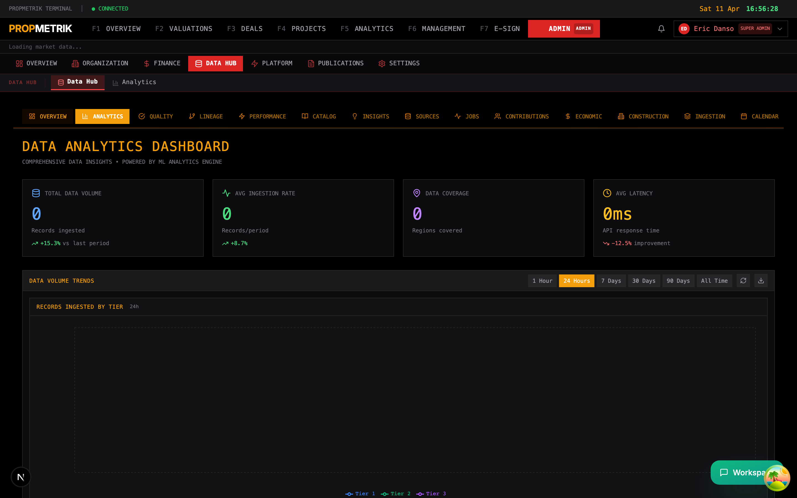

Internal analytics about the data platform itself:

- Ingestion volume over time (records per day/week/month)
- Source reliability rankings
- Data growth rates by tier
- Processing time distributions
- Error rate trends

---

### 11.21 Construction Data

Navigate to **Admin > Data Hub > Construction**.

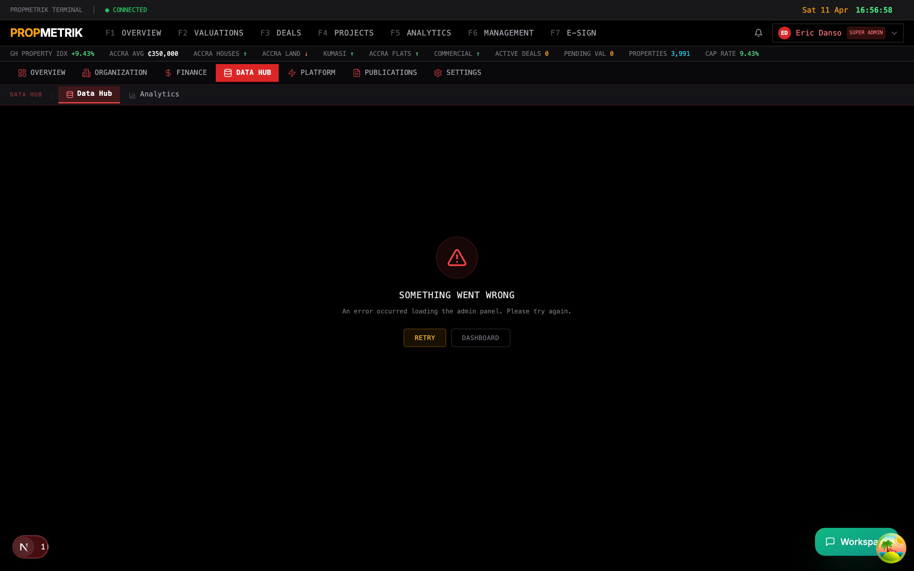

Manage the underlying construction cost data that feeds the CCI:

- Material price records with supplier, region, and date
- Labour rate entries by skill level and region
- Bulk upload interface for periodic price surveys
- Historical price charts per material
- Supplier directory

---

### 11.22 Economic Data

Navigate to **Admin > Data Hub > Economic**.

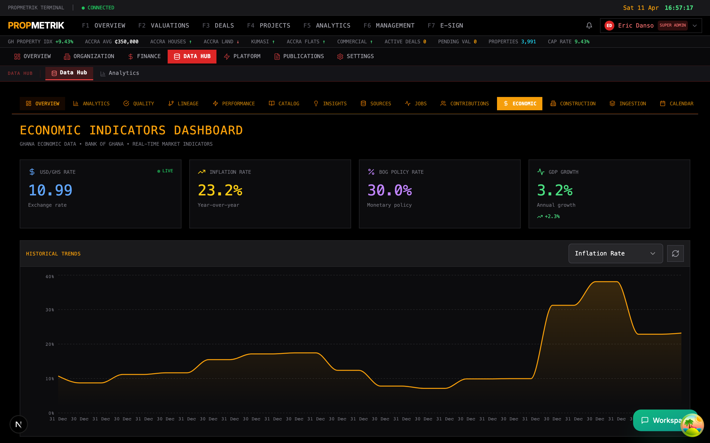

Manage macro-economic indicators used in analytics:

- GDP growth rates
- Inflation (CPI, PPI)
- Bank of Ghana policy rate
- Commercial mortgage rates
- Exchange rates (GH₵/USD, GH₵/EUR, GH₵/GBP)
- Unemployment statistics
- Building permits issued

Data is sourced from:

- Ghana Statistical Service
- Bank of Ghana
- Ministry of Finance
- World Bank
- IMF

---

### 11.23 Insights

Navigate to **Admin > Data Hub > Insights**.

Auto-generated intelligence reports:

- Market trend summaries
- Anomaly detection alerts (unusual price movements, transaction spikes)
- Regional comparison reports
- Seasonal pattern analysis
- Investment opportunity signals

---

### 11.24 Performance

Navigate to **Admin > Data Hub > Performance**.

System performance metrics:

- API response times (p50, p95, p99)
- Database query latency
- Cache hit rates
- Concurrent users
- System throughput (requests per second)
- Resource utilisation (CPU, memory, disk)

---

### 11.25 ETL Jobs

Navigate to **Admin > Data Hub > Jobs**.

#### Job List

All ETL jobs with:

- Job name and type (Extract, Transform, Load, Full Pipeline)
- Status badge (Running, Queued, Completed, Failed, Cancelled)
- Progress bar (for running jobs)
- Start time and duration
- Records processed
- Error count

#### Filtering

- **Status filter** -- show only running, completed, or failed jobs.
- **Type filter** -- filter by job type.

#### Job Actions

- **Cancel** -- stop a running job with an optional reason.
- **View Logs** -- inspect the terminal-style log output.
- **Retry** -- re-run a failed job.

#### Job Statistics

Summary cards show:

- Total jobs run
- Currently running
- Success rate
- Average duration
- Jobs in queue

---

### 11.26 Queues

Navigate to **Admin > Data Hub > Queues**.

Monitor and manage background processing queues:

- Queue name and purpose
- Current depth (messages waiting)
- Processing rate (messages per minute)
- Worker count and status
- Dead letter queue size (messages that failed all retry attempts)
- Oldest message age

Queue actions:

- **Pause/Resume** -- temporarily halt processing.
- **Purge** -- clear all messages from the queue (confirmation required).
- **Retry Dead Letters** -- re-queue failed messages for another attempt.

---

### 11.27 Pull Integrations

Navigate to **Admin > Data Hub > Pull Integrations**.

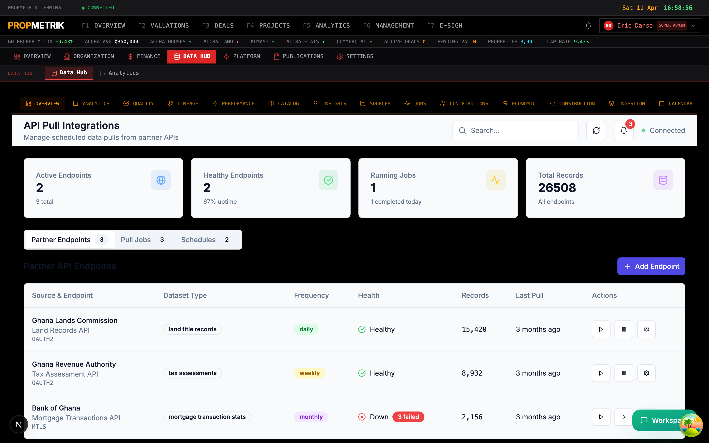

Manage scheduled data pulls from external APIs:

- Integration name and target API
- Sync schedule (cron expression)
- Last sync time and status
- Records fetched
- Authentication status
- Configuration (API keys, endpoints, pagination settings)

To add a new integration:

1. Click **+ New Integration**.
2. Enter the API endpoint URL and authentication credentials.
3. Configure the data mapping (source fields to PropMetrik fields).
4. Set the sync schedule.
5. Test the connection.
6. Click **Save & Activate**.

---

### 11.28 Web Spiders

Navigate to **Admin > Data Hub > Spiders**.

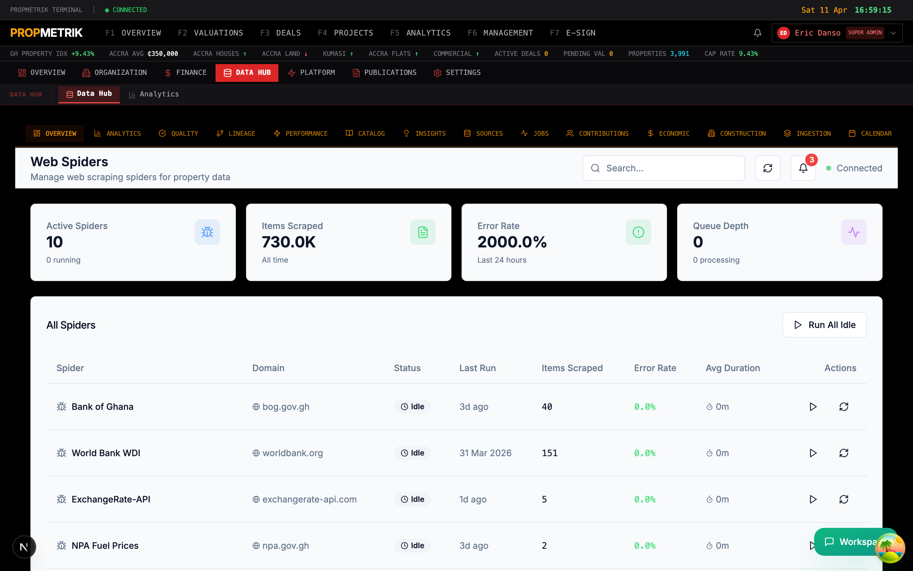

Web spiders crawl property listing websites to collect market data. Each spider targets a specific website or data source.

#### Spider List

Each spider shows:

- Spider name and target website
- Status badge (Idle, Running, Failed, Paused)
- Pages crawled and records extracted
- Last run time and duration
- Success rate
- Schedule

#### Spider Actions

- **Play** -- start a spider crawl immediately.
- **Pause** -- suspend a running crawl.
- **Stop** -- terminate a running crawl.
- **Refresh** -- update the status display.

#### Spider Statistics

- Total pages crawled
- Records extracted
- Error rates
- Average pages per minute
- Data freshness

> **Tip:** Schedule spiders to run during off-peak hours (midnight to 6 AM WAT) to minimise impact on target websites and reduce blocking risk.

---

### 11.29 Contributions

Navigate to **Admin > Data Hub > Contributions**.

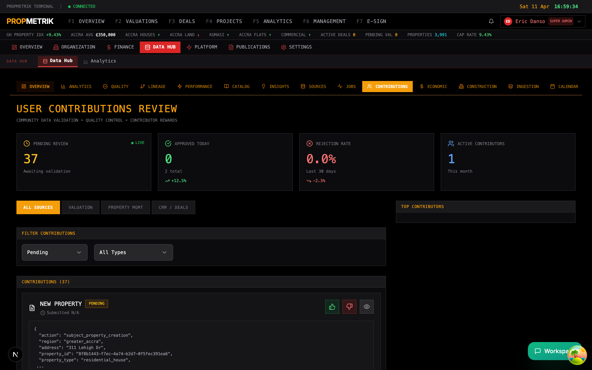

Community members and partner agents can submit property transaction data. The contributions page manages the review workflow:

#### Review Queue

Pending contributions with:

- Submitter name and organisation
- Property details (location, type, price)
- Transaction date
- Supporting evidence (photos, documents)
- Confidence score (auto-assessed)

#### Review Actions

1. Click a contribution to view full details.
2. Cross-reference against existing records.
3. Choose an action:
   - **Approve** -- accept the data into the platform.
   - **Reject** -- decline with a reason.
   - **Request More Info** -- ask the submitter for additional details.
   - **Flag for Review** -- escalate to a senior data analyst.

#### Contributor Leaderboard

Track top contributors:

- Number of submissions
- Approval rate
- Data quality score
- Contributor tier (Bronze, Silver, Gold, Platinum)

---

### 11.30 Valuation Configuration

Navigate to **Admin > Data Hub > Valuation Config**.

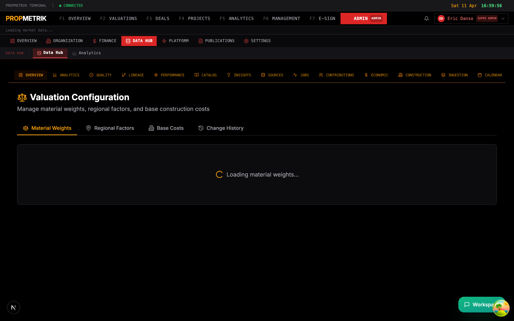

Configure the parameters that drive automated valuation models:

- **Comparable Selection Rules** -- radius, property type matching, age limits, size variance.
- **Adjustment Factors** -- per-feature adjustments (e.g. +5% for corner plot, -3% per year of age difference).
- **Model Weights** -- relative importance of comparable sales, cost approach, and income approach.
- **Confidence Thresholds** -- minimum confidence score to auto-approve a valuation.
- **Regional Overrides** -- custom parameters for specific regions.

---

### 11.31 Data Hub Settings

Navigate to **Admin > Data Hub > Settings**.

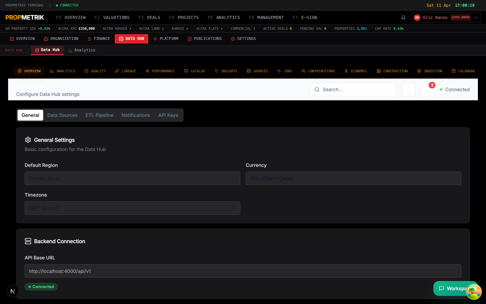

System-wide Data Hub configuration:

- **API Rate Limits** -- maximum requests per minute for each tier.
- **Retention Policies** -- how long to keep raw data, processed data, and logs.
- **Notification Settings** -- email/Slack alerts for job failures, quality issues, and drift detection.
- **Access Control** -- which roles can view, edit, or administer data hub features.
- **Backup Configuration** -- automated backup schedules and retention.
- **Environment Variables** -- API keys and secrets for external integrations (masked in the UI).

---

## Summary

The Data Hub & Analytics module is the backbone of PropMetrik's market intelligence capabilities. The analytics dashboards transform raw real estate data into actionable insights -- from affordability indices and construction cost trends to ML-powered valuations and risk assessments. The administration tools give data teams full control over the ingestion pipeline, quality management, and system health. Together, they provide a comprehensive data platform purpose-built for the Ghanaian real estate market.
