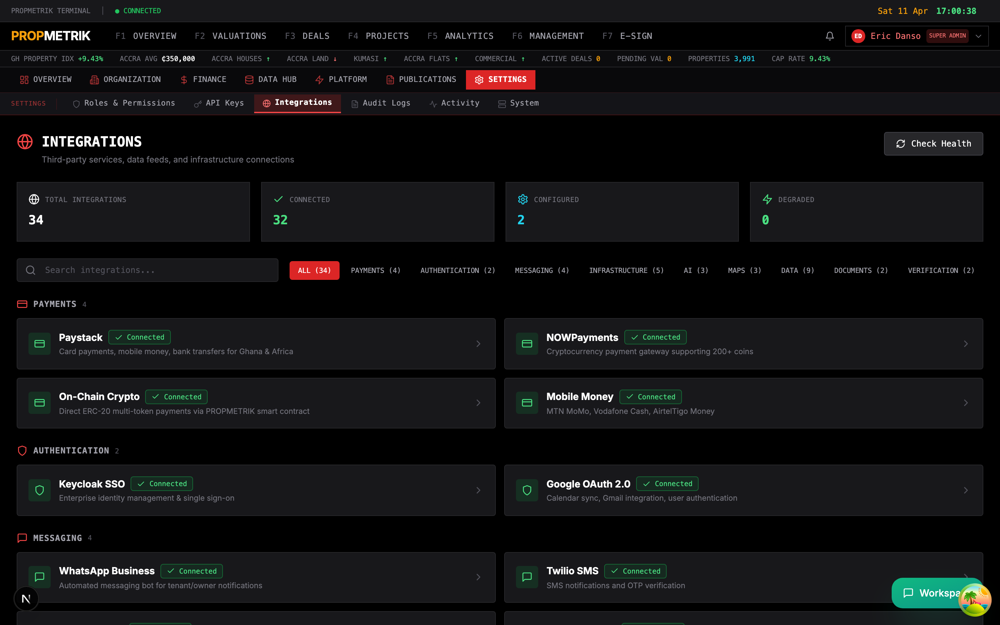
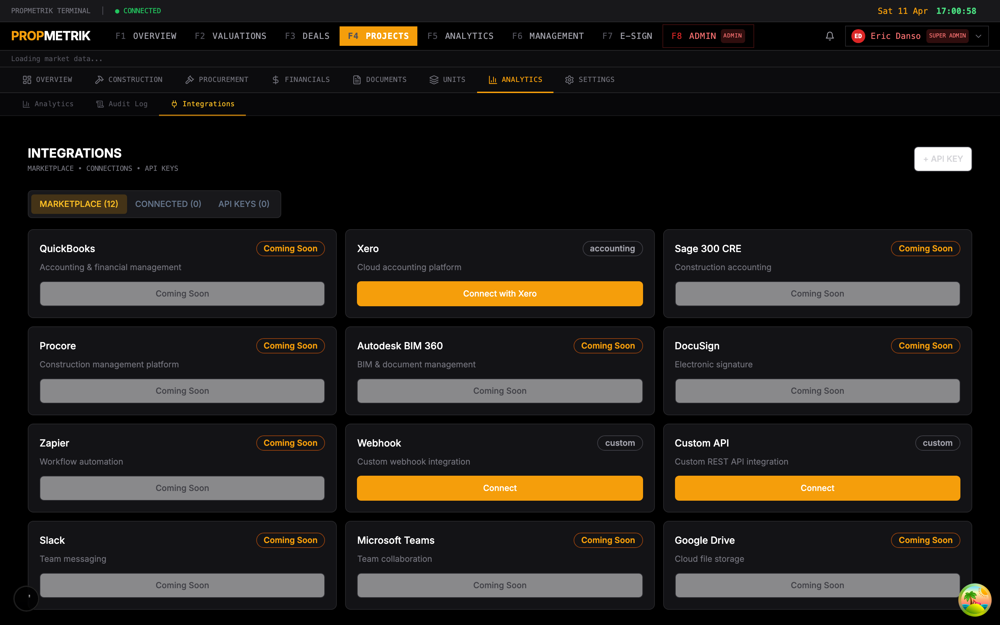
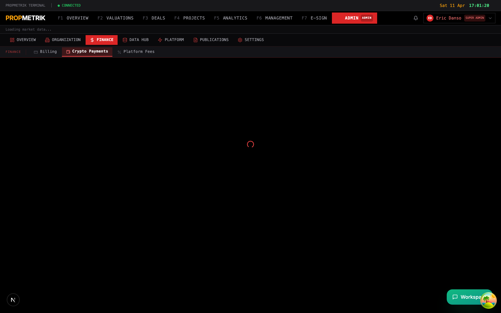

# Chapter 12: Integrations

PropMetrik connects to a wide ecosystem of third-party services covering payments, messaging, accounting, AI, mapping, data feeds, and more. This chapter walks you through viewing integration status, connecting new services from the marketplace, and configuring payment gateways including cryptocurrency.

---

## 12.1 Integration Dashboard

Navigate to **Admin > Integrations** from the sidebar to reach the integration hub.

The integration dashboard displays every service PropMetrik connects to, organized by category:

| Category | Services |
|----------|----------|
| **Payments** | Paystack, NOWPayments, On-Chain Crypto (ERC-20), Mobile Money (MTN MoMo, Vodafone Cash, AirtelTigo) |
| **Authentication** | Keycloak SSO, Google OAuth 2.0 |
| **Messaging** | WhatsApp Business, Twilio SMS, Google SMTP, Realtime SSE |
| **Infrastructure** | PostgreSQL + PostGIS, Redis, MinIO (S3), OpenSearch, ClickHouse |
| **AI & ML** | DeepSeek LLM, Anthropic Claude, ML Serving (PyTorch) |
| **Maps & Geocoding** | Mapbox, Google Maps, GhanaPost GPS |
| **Data Feeds** | Bank of Ghana, World Bank WDI, Ghana Statistical Service, NPA Fuel Prices, FX Feed, Booking.com, NADMO Flood Risk, Partner API Pulls, Scrapy Pipelines |
| **Documents** | E-Sign Service, Google Calendar |
| **Verification** | TIN Verification (GRA), SSNIT Verification |

### Understanding Status Indicators

Each integration card shows one of four statuses:

- **Connected** (green) -- The service is live and actively communicating with PropMetrik.
- **Configured** (cyan) -- Environment variables are set but the service is not yet in active use.
- **Degraded** (amber) -- The service is partially available or experiencing issues.
- **Not Configured** (grey) -- No credentials or configuration have been provided.

### Viewing Integration Details

1. Click any integration card to expand it.
2. Review the **Provider**, **Configured Via** field (shows whether it uses environment variables, OAuth, or a Docker service), and the **Details** line describing specific capabilities.
3. If a **Docs** link is available, click it to jump to the relevant admin page for deeper configuration.

### Searching and Filtering

- Use the **search bar** at the top of the page to filter integrations by name or description.
- Click a **category tab** to view only integrations in that group (e.g., show only Payments or only Data Feeds).
- The summary bar shows total connected, configured, and disconnected counts at a glance.

> **Tip:** The integration dashboard is read-only for most services. Connections managed via environment variables (such as Paystack or Mapbox) are configured at the infrastructure level by your DevOps team. OAuth-based integrations like Xero can be connected directly from the UI.

---

## 12.2 Marketplace

The **Integrations Marketplace** provides a catalog of available connectors, including both active and upcoming integrations. Access it from **Projects > Integrations Marketplace** or by clicking the Marketplace tab within the integration hub.

### Available Connectors

The marketplace lists connectors across several categories:

| Category | Connectors |
|----------|------------|
| **Accounting** | Xero (available), QuickBooks (coming soon), Sage 300 CRE (coming soon) |
| **Project Management** | Procore (coming soon) |
| **Document Management** | Autodesk BIM 360 (coming soon), DocuSign (coming soon) |
| **Automation** | Zapier (coming soon) |
| **Communication** | Slack (coming soon), Microsoft Teams (coming soon) |
| **Storage** | Google Drive (coming soon) |
| **Custom** | Webhook (available), Custom API (available) |

### Connecting Xero (Accounting)

Xero is PropMetrik's primary accounting integration, enabling two-way sync of project costs, invoices, and contacts.

1. In the Marketplace tab, locate the **Xero** card and click **Connect**.
2. You will be redirected to Xero's OAuth consent screen. Sign in with your Xero credentials and authorize PropMetrik.
3. After authorization, you are redirected back to PropMetrik with a success notification: "Xero connected successfully."
4. The Xero card now shows a **Connected** status with your organization name and tenant ID.

**Once connected, you can:**

- **Sync Costs** -- Click the **Sync** button on the Xero card to push project costs to your Xero ledger. Each cost record gets a `xero_contact_id` and `xero_synced_at` timestamp.
- **Disconnect** -- Click the **Disconnect** button if you need to unlink your Xero account. This revokes the OAuth tokens but does not delete previously synced data in Xero.

### Setting Up a Webhook Integration

1. In the Marketplace, click **Connect** on the **Webhook** card.
2. Fill in the configuration form:
   - **Name** -- A descriptive label (e.g., "Slack Webhook for Cost Alerts").
   - **Endpoint URL** -- The HTTPS URL that will receive POST requests.
   - **Events** -- Select which PropMetrik events trigger the webhook (e.g., cost created, invoice paid, project status changed).
   - **Secret** -- An optional shared secret for HMAC signature verification.
3. Click **Save**. PropMetrik will send a test ping to verify the endpoint responds with a 200 status.

### Setting Up a Custom API Integration

1. Click **Connect** on the **Custom API** card.
2. Provide:
   - **Base URL** -- The API endpoint root.
   - **Authentication Type** -- Choose between API Key, Bearer Token, or Basic Auth.
   - **Credentials** -- Enter the relevant key or token.
3. Configure the **sync direction** (push, pull, or bidirectional) and the **data mapping** for each entity type.
4. Click **Save & Test** to validate the connection.

### Managing API Keys for Integrations

Each marketplace integration that requires an API key can be managed from the **API Keys** tab:

1. Click **Generate API Key** after connecting an integration.
2. Copy the key immediately -- it is shown only once.
3. Use the **Revoke** button to deactivate a compromised key.

> **Tip:** Webhook integrations support retry logic. If your endpoint returns a non-2xx status, PropMetrik will retry up to 3 times with exponential backoff. Check the integration logs at **Admin > Integrations** for delivery status.

---

## 12.3 Cryptocurrency Payment Settings

PropMetrik supports cryptocurrency payments through two channels: **NOWPayments** (managed gateway) and **On-Chain Crypto** (direct smart contract payments on Polygon/Ethereum). Configure these from **Admin > Crypto Settings**.

### NOWPayments Configuration

NOWPayments provides a managed payment gateway supporting 200+ cryptocurrencies with automatic conversion:

1. Navigate to **Admin > Crypto Settings**.
2. In the **NOWPayments** section, verify your API key status (configured via environment variable `NOWPAYMENTS_API_KEY`).
3. Review settings:
   - **IPN Callback URL** -- The endpoint PropMetrik uses to receive Instant Payment Notifications.
   - **Auto-Conversion** -- Enable to automatically convert received crypto to a settlement currency.
   - **Settlement Currency** -- Choose your preferred payout currency.

### On-Chain Crypto (Smart Contract)

PropMetrik deploys the `PROPMETRIKPayments.sol` smart contract for direct ERC-20 token payments:

**Supported tokens:**

| Token | Description | Color Code |
|-------|-------------|------------|
| USDT | Tether USD | Green |
| USDC | USD Coin | Blue |
| WETH | Wrapped Ether | Purple |
| WBTC | Wrapped Bitcoin | Orange |

**Supported networks:**
- Polygon (Chain ID 137) -- recommended for lower gas fees
- Ethereum (Chain ID 1)

### Configuring On-Chain Payments

1. In the **On-Chain Settings** tab, set your **receiving wallet address**.
2. Select the **default network** (Polygon is recommended for cost-effective transactions).
3. Choose which **tokens to accept** by toggling each token on or off.
4. Set **platform fee percentage** if applicable.
5. Click **Save Configuration**.

### Viewing Crypto Transaction History

The bottom section of the Crypto Settings page displays a transaction ledger:

- **Transaction Hash** -- Click to open the transaction on the relevant block explorer (Polygonscan or Etherscan).
- **Status** -- Confirmed, Pending, or Failed.
- **Amount** -- Token amount and USD equivalent at time of transaction.
- **Gas Cost** -- Network fee paid in MATIC or ETH.
- **Type** -- Payment type (e.g., invoice payment, deposit, rent payment).

Use the search bar to filter transactions by hash, payer address, or payment type. Export the transaction log as CSV for reconciliation with your accounting system.

### Crypto Analytics Dashboard

The analytics section within Crypto Settings provides:

- **Total transaction volume** (in USDT equivalent and GHS equivalent)
- **Transaction count** by status (successful, pending, failed)
- **Volume by payment type** (invoice, deposit, rent, etc.)
- **Unique payers and recipients**
- **Average payment size**
- **Total fees collected** and **total gas costs**

> **Tip:** For production deployments, always use Polygon for lower gas costs. Ethereum mainnet is supported for high-value transactions where users prefer Layer 1 security. Monitor gas costs in the analytics section to ensure transaction fees remain reasonable relative to payment amounts.

---

## 12.4 WhatsApp Business Integration

PropMetrik includes a WhatsApp Business bot powered by the Meta Cloud API. The bot handles automated notifications for property management workflows:

- **Expense alerts** -- Notifies property owners when maintenance expenses are logged.
- **Rent reminders** -- Sends automated rent due notifications to tenants.
- **Status updates** -- Pushes project milestone updates to stakeholders.
- **Command handling** -- Tenants and owners can reply with structured commands to check balances, request maintenance, or acknowledge notifications.

WhatsApp is configured at the infrastructure level via the `WHATSAPP_TOKEN` environment variable. Once configured, the bot is active for all organizations on the platform.

> **Tip:** WhatsApp message templates must be pre-approved by Meta before they can be sent. Work with your administrator to ensure all notification templates are submitted and approved in the Meta Business Suite.

---

## 12.5 Other Key Integrations

### Keycloak SSO

PropMetrik uses Keycloak for enterprise identity management. Keycloak handles:
- User registration and authentication
- Single Sign-On (SSO) across all PropMetrik modules
- Role-based access via JWT tokens
- Password policies and multi-factor authentication

Configuration is managed via environment variables (`KEYCLOAK_URL`, `REALM`). See Chapter 01 (Authentication) for user-facing SSO login instructions.

### Mapbox and Google Maps

Both mapping services work together:
- **Mapbox** provides map tile rendering throughout the platform (property locations, heatmaps, geographic analytics).
- **Google Maps** handles address autocomplete, geocoding, and distance calculations.
- **GhanaPost GPS** adds support for Ghana's Digital Address System, enabling GPS code lookups.

### Data Feed Integrations

PropMetrik automatically ingests data from multiple sources to power its analytics engine:

- **Bank of Ghana** -- Exchange rates, Treasury bill rates, and inflation data refreshed on the BOG publication schedule.
- **Ghana Statistical Service** -- Labor market data and construction wage indices.
- **NPA** -- Fuel prices that feed into the Construction Cost Index (CCI) model.
- **World Bank** -- GDP, population, and development indicators for the Housing Affordability Index (HAI).
- **NADMO** -- Flood incident data for property risk scoring.

These feeds are managed through the **Data Hub** module (see Chapter 11). Scraping schedules and ETL pipelines run automatically but can be monitored and adjusted from **Admin > Data Hub > Spiders** and **Admin > Data Hub > Pull Integrations**.

---

## Summary

| Task | Where to Go |
|------|-------------|
| View all integration statuses | Admin > Integrations |
| Connect Xero accounting | Projects > Integrations Marketplace > Xero |
| Set up a webhook | Projects > Integrations Marketplace > Webhook |
| Configure crypto payments | Admin > Crypto Settings |
| View crypto transactions | Admin > Crypto Settings > Transactions tab |
| Monitor data feed health | Admin > Data Hub > Pull Integrations |
