# Chapter 13: Admin & Compliance

The Admin module gives organization administrators control over platform configuration, user access, API management, publications, customer health tracking, and platform monetization. This chapter covers every admin sub-module in detail.

---

## 13.1 Admin Dashboard

Navigate to **Admin** from the sidebar to reach the administration hub.

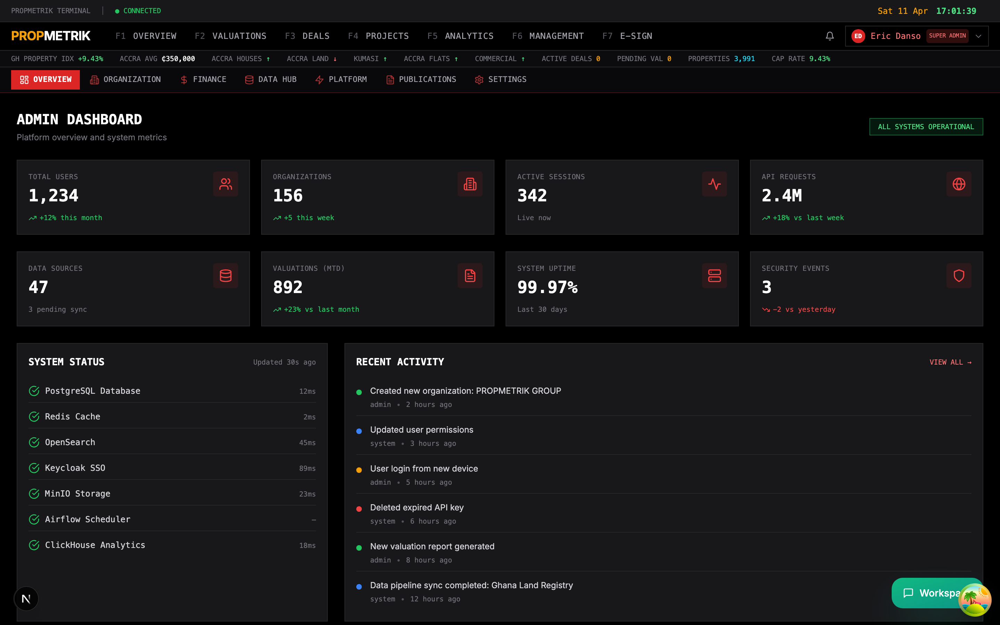

The admin dashboard provides a high-level overview of your platform instance:

### Key Metrics

- **Total Users** -- Active user count across all organizations, with trend indicators showing growth or decline.
- **Total Properties** -- Number of properties under management across all modules (property management, valuations, deals).
- **API Calls** -- Request volume over the past 30 days with trend comparison to the previous period.
- **System Health** -- Real-time status of core services (database, cache, storage, search).

### System Status Panel

The system status panel on the right side shows the health of each infrastructure component:

| Service | What It Shows |
|---------|--------------|
| PostgreSQL | Database connectivity and query latency |
| Redis | Cache hit rates and memory usage |
| MinIO | Object storage availability |
| OpenSearch | Search index health |
| Keycloak | Authentication service status |

Each service displays a status indicator (healthy, warning, or error) with response latency in milliseconds.

### Recent Activity Feed

The activity feed at the bottom of the dashboard shows the latest administrative actions:
- User account creations and logins
- Permission changes and role assignments
- System configuration updates
- Data import/export operations

Each entry shows the action performed, the user who performed it, and the timestamp.

> **Tip:** Bookmark the admin dashboard as your first stop each morning. The system status panel will immediately surface any infrastructure issues that need attention.

---

## 13.2 Role-Based Access Control (RBAC)

PropMetrik uses a policy-based RBAC system that governs access to every resource and action across the platform. Navigate to **Admin > RBAC** to manage policies and review audit logs.

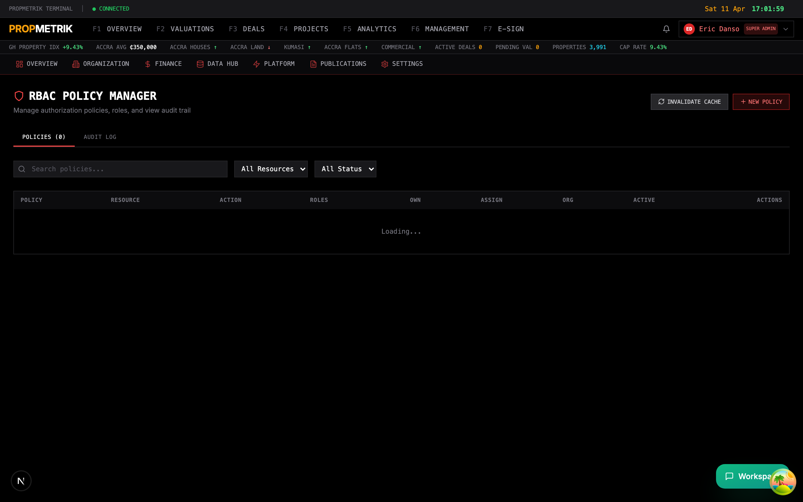

### Understanding Roles

PropMetrik defines the following roles, ordered from most to least privileged:

| Role | Description |
|------|-------------|
| `super_admin` | Full platform access, can manage all organizations |
| `firm_principal` | Organization owner, full access within their org |
| `admin` | Organization administrator, manages users and settings |
| `senior_valuer` | Lead valuer with approval authority |
| `manager` | Department or team manager |
| `project_manager` | Manages construction projects and teams |
| `valuer` | Conducts property valuations |
| `finance_manager` | Manages invoices, payments, and financial reports |
| `compliance_officer` | Reviews compliance reports and audit trails |
| `agent` | Real estate agent handling deals and listings |
| `probationer` | Trainee or junior staff with limited access |
| `inspector` | Site inspector for quality and safety checks |
| `analyst` | Data analyst with read access to analytics modules |
| `viewer` | Read-only access across permitted modules |

### Managing Access Policies

Each policy defines a rule that grants or restricts access:

1. Click the **Policies** tab to view all active policies.
2. Use the **search bar** to find policies by name, or filter by **resource type** and **active status**.
3. Each policy row shows:
   - **Policy Name** -- Descriptive label (e.g., "Valuations - Create Report").
   - **Resource Type** -- The entity being protected (e.g., `valuation`, `project`, `invoice`).
   - **Action** -- The operation being controlled (e.g., `create`, `read`, `update`, `delete`).
   - **Allowed Roles** -- Which roles can perform this action.
   - **Ownership/Assignment Flags** -- Whether the user must own or be assigned to the resource.
   - **Same Org Required** -- Whether access is restricted to the user's own organization.

### Creating a New Policy

1. Click the **+ New Policy** button.
2. Fill in the policy form:
   - **Policy Name** -- Use a clear, descriptive name following the pattern "Module - Action" (e.g., "Projects - Delete Project").
   - **Resource Type** -- Select the entity type from the dropdown.
   - **Action** -- Choose the operation (create, read, update, delete, list, approve, export).
   - **Allowed Roles** -- Check one or more roles that should have this permission.
   - **Require Ownership** -- Toggle on if only the resource creator should have access.
   - **Require Assignment** -- Toggle on if only users assigned to the resource should have access.
   - **Require Same Org** -- Toggle on to restrict access to users within the same organization.
3. Click **Save**. The policy takes effect immediately.

### Editing and Deactivating Policies

- Click the **Edit** icon on any policy row to modify its configuration.
- Toggle the **Active** switch to deactivate a policy without deleting it. Deactivated policies are greyed out and have no effect on access control.
- Click **Delete** to permanently remove a policy. This action cannot be undone.

### Reviewing the Audit Log

1. Switch to the **Audit** tab.
2. The audit log records every significant action taken on the platform:
   - **Action** -- What was done (e.g., "created", "updated", "deleted", "logged in").
   - **Entity Type** -- What was affected (e.g., "user", "project", "valuation").
   - **Entity ID** -- The specific record identifier.
   - **User** -- Who performed the action, shown by email address.
   - **IP Address** -- The client IP for security tracking.
   - **Metadata** -- Additional context as JSON (e.g., which fields were changed).
   - **Timestamp** -- When the action occurred.
3. Use pagination controls to navigate through historical entries.

> **Tip:** Set up a weekly review of the audit log to catch unauthorized access attempts or unusual activity patterns. Pay special attention to `delete` actions and permission changes.

---

## 13.3 API Key Management

Manage API keys for external integrations and third-party access at **Admin > API Keys**.

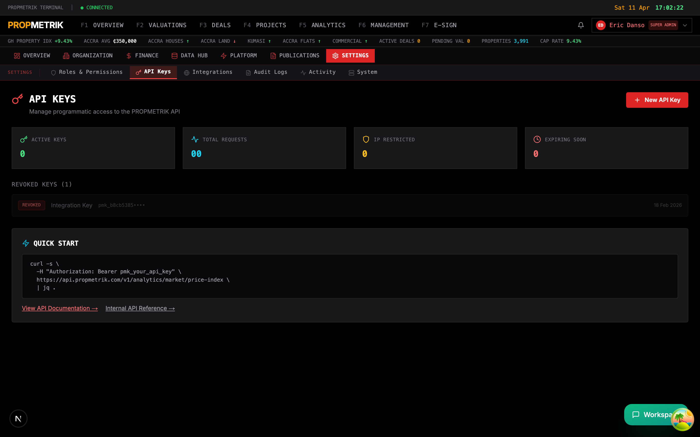

### Generating a New API Key

1. Click **Generate New Key**.
2. Provide a **name** for the key (e.g., "Mobile App - Production" or "Partner - ABC Corp").
3. Select the **scope** -- which API endpoints the key can access.
4. Set an **expiration date** (optional but recommended).
5. Click **Create**. The API key is displayed once. Copy it immediately and store it securely.

### Managing Existing Keys

The key list shows all active and revoked keys with:
- **Name** -- The label you assigned.
- **Created** -- When the key was generated.
- **Last Used** -- Most recent API call using this key.
- **Status** -- Active or Revoked.

To revoke a key, click the **Revoke** button on its row. Revoked keys cannot be reactivated -- you must generate a new one.

> **Tip:** Follow the principle of least privilege. Create separate API keys for each integration with the minimum scope required. This limits the blast radius if a key is compromised.

---

## 13.4 API Documentation

PropMetrik provides built-in interactive API documentation at **Admin > API Docs**.

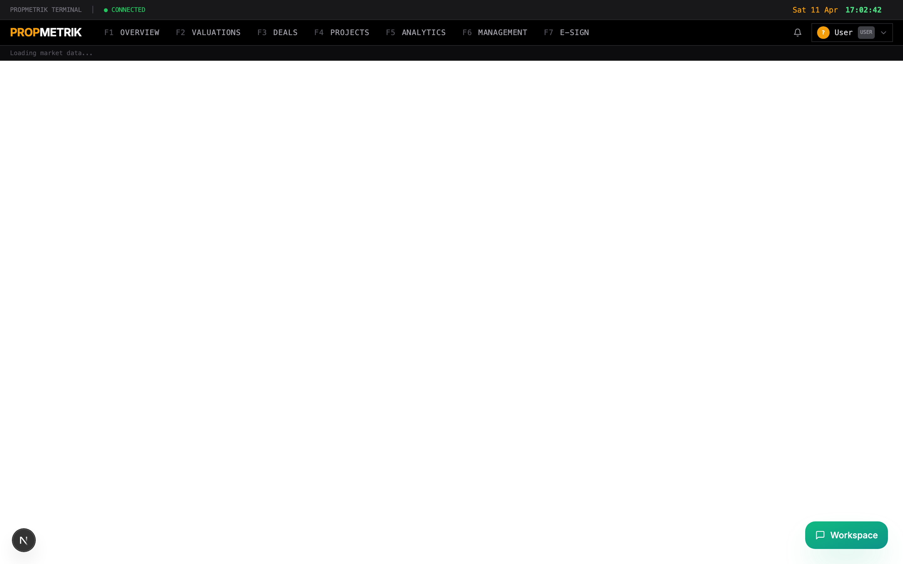

The API docs page provides:

- **Endpoint reference** -- Every REST API endpoint grouped by module (valuations, projects, properties, deals, etc.).
- **Request/response schemas** -- JSON schema definitions for all request bodies and response payloads.
- **Authentication guide** -- How to use API keys and JWT tokens for authentication.
- **Code examples** -- Sample requests in cURL, JavaScript, and Python.
- **Try it out** -- An interactive console where you can execute API calls directly from the browser using your current session.

### Using the Interactive Console

1. Select an endpoint from the sidebar navigation.
2. Fill in the required parameters (path params, query params, request body).
3. Click **Execute** to send the request.
4. Review the response status code, headers, and body in the output panel.

---

## 13.5 Usage Analytics

Monitor platform usage and resource consumption at **Admin > Usage**.

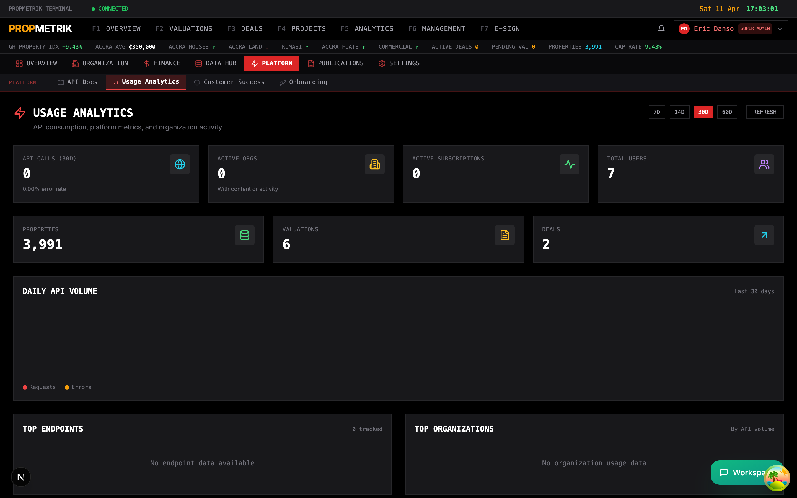

The usage page breaks down consumption across several dimensions:

- **API Calls** -- Total requests over time with breakdowns by endpoint, user, and response status.
- **Storage** -- Document and media storage consumption across MinIO buckets (documents, floor plans, signatures, media).
- **Active Users** -- Daily and monthly active user counts with engagement metrics.
- **Feature Utilization** -- Which modules are most used (valuations, projects, property management, deals).
- **Rate Limiting** -- Current rate limit thresholds and any requests that were throttled.

Use the date range selector to view usage for specific periods. Export usage reports as CSV for billing reconciliation or capacity planning.

---

## 13.6 Platform Fees

Configure platform-wide fee structures at **Admin > Platform Fees**.

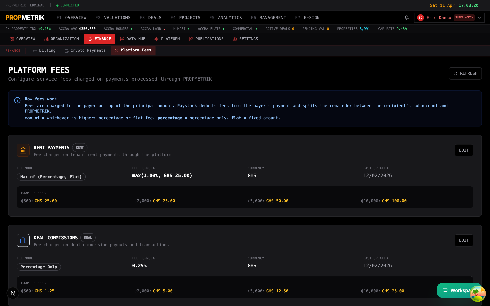

### Fee Types

| Fee Type | Description |
|----------|-------------|
| **Transaction Fee** | Percentage charged on each payment processed through PropMetrik |
| **Subscription Fee** | Monthly or annual platform access fee per organization |
| **Per-Seat Fee** | Additional charge per user beyond the base plan allocation |
| **API Overage Fee** | Charge for API calls exceeding the plan's monthly limit |
| **Storage Overage Fee** | Charge for storage exceeding the plan's allocation |

### Configuring Fees

1. Select the fee type you want to configure.
2. Set the **rate** (percentage for transaction fees, flat amount for others).
3. Choose the **billing currency** (GHS or USD).
4. Define **tier thresholds** if using volume-based pricing (e.g., 2% for the first 100 transactions, 1.5% thereafter).
5. Set the **effective date** for the fee change.
6. Click **Save**. Changes apply to new transactions from the effective date forward.

### Payment Splits (Paystack)

For marketplace transactions, configure payment splits to automatically distribute funds:
- **Platform share** -- The percentage retained by PropMetrik.
- **Vendor share** -- The percentage forwarded to the service provider.
- Split configurations are managed through Paystack's sub-account system.

---

## 13.7 Customer Success

Track customer health and engagement at **Admin > Customer Success**.

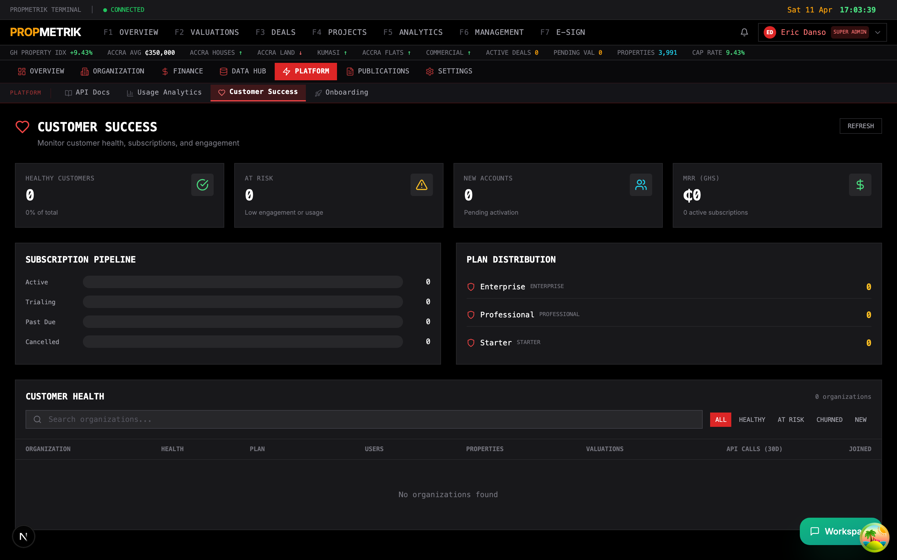

### Health Score System

Every customer account is assigned a health score:

| Health Status | Indicator | Meaning |
|---------------|-----------|---------|
| **Healthy** | Green | Active usage, current on payments, growing engagement |
| **At Risk** | Amber | Declining usage, overdue invoices, or support escalations |
| **Churned** | Red | Account inactive or subscription cancelled |
| **New** | Blue | Recently onboarded, in ramp-up phase |

### Customer Details View

Each customer row shows:
- **Organization name** and **plan tier** (free, starter, professional, enterprise)
- **Properties** under management
- **Valuations** completed
- **Users** -- Active user count
- **API Calls (30d)** -- API request volume for the past 30 days
- **Renewal Date** -- Next subscription renewal
- **Joined** -- Account creation date

### Subscription Metrics

The top of the page shows aggregate subscription health:
- **Active subscriptions** -- Currently paying customers
- **MRR (GHS)** -- Monthly recurring revenue in Ghana Cedis
- **Past Due** -- Subscriptions with overdue payments
- **Trialing** -- Accounts in free trial period
- **Cancelled** -- Recently churned subscriptions

### Filtering and Search

Use the search bar to find specific customers by name. Filter by health status to focus on at-risk accounts that need intervention.

> **Tip:** Set up a weekly review of "At Risk" accounts. Proactive outreach to customers showing declining engagement significantly reduces churn.

---

## 13.8 Onboarding Management

Manage organization onboarding workflows at **Admin > Onboarding**.

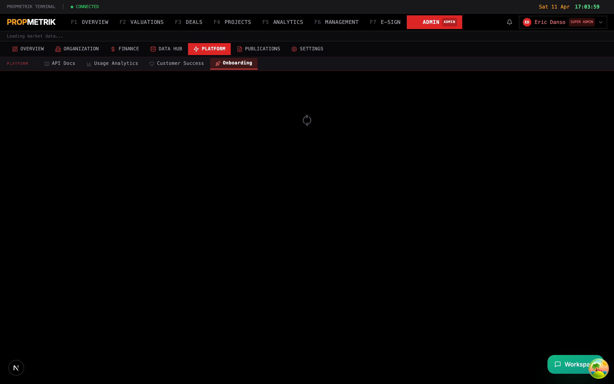

The onboarding module lets administrators:

- **Review pending signups** -- See organizations that have started but not completed onboarding.
- **Configure onboarding steps** -- Define the checklist items new organizations must complete (profile setup, first property, team invitation, etc.).
- **Payment bypass** -- Enable or disable payment requirements during the onboarding flow for promotional or trial purposes.
- **Track completion rates** -- See what percentage of new signups complete each onboarding step.
- **Send reminders** -- Trigger automated reminder emails or WhatsApp messages to stalled signups.

---

## 13.9 Publications

PropMetrik includes a full publications engine for producing market research reports, indices, and newsletters. Navigate to **Admin > Publications**.

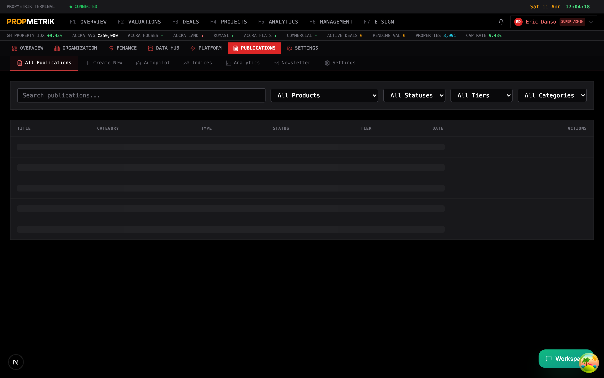

### Publications List

View all published and draft reports at **Admin > Publications > List**.

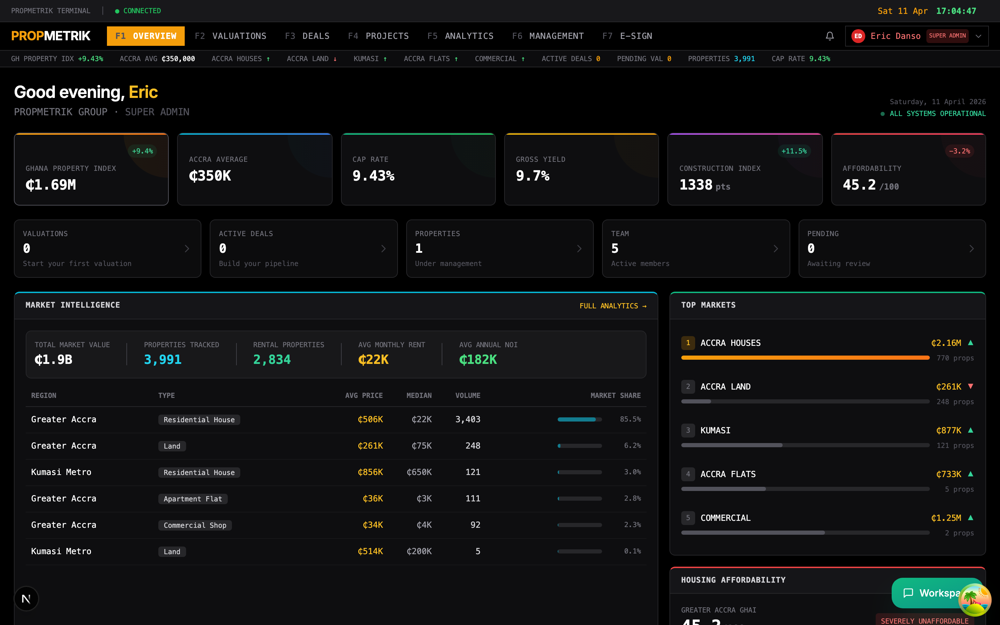

The list view shows:
- **Title** and **subtitle** of each publication
- **Status** -- Draft, Published, or Archived
- **Publication date** -- When it was or will be published
- **Category** -- Market Report, Research Brief, Index Update, etc.
- **Author** -- Who created the publication
- **Views** -- How many times the publication has been viewed

### Creating a New Publication

Navigate to **Admin > Publications > New**.

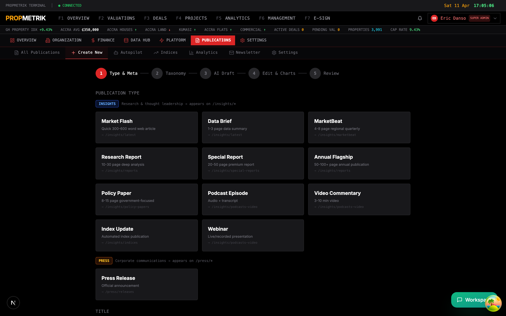

1. Enter the **title** and **subtitle**.
2. Select the **category** from the dropdown.
3. Set the **publication date** (future dates schedule the publication for auto-publishing).
4. Write or paste content in the **rich text editor**. The editor supports:
   - Headings, bold, italic, and lists
   - Data tables with formatted numbers
   - Embedded charts from PropMetrik analytics
   - Image uploads and captions
   - Block quotes and callout boxes
5. Add **tags** for discoverability.
6. Set the **visibility** (public, subscribers only, or internal).
7. Click **Save Draft** to save without publishing, or **Publish** to make it live immediately.

### Publication Settings

Configure global publication settings at **Admin > Publications > Settings**.

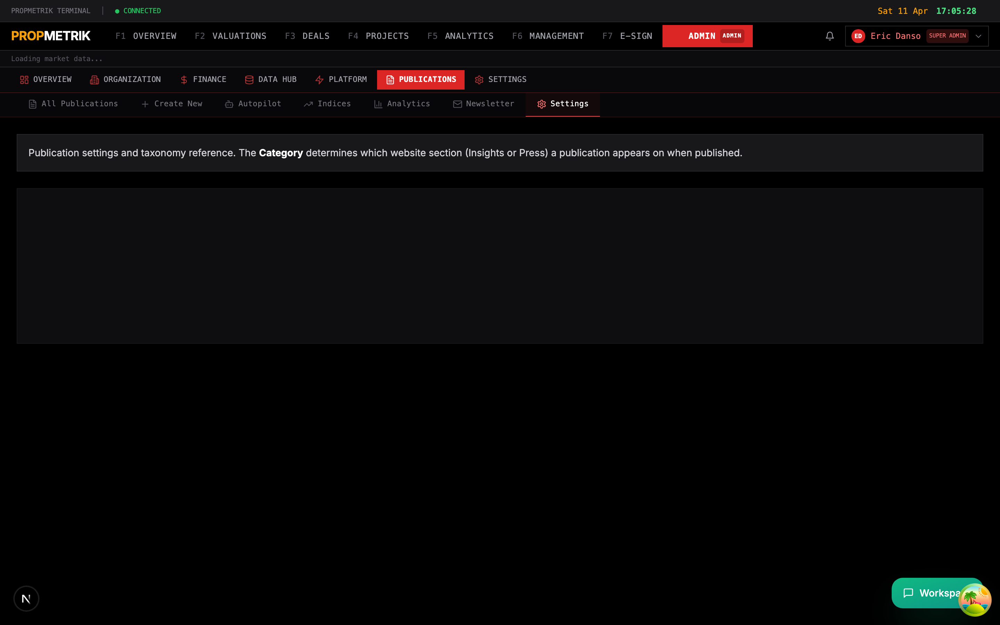

- **Branding** -- Upload your organization's logo, set primary colors, and configure the publication header/footer template.
- **Distribution** -- Set default email distribution lists for new publications.
- **Format** -- Choose default output formats (web, PDF, or both).
- **Disclaimer** -- Configure the legal disclaimer text appended to all publications.
- **Social sharing** -- Enable or disable social media sharing buttons on published reports.

### Publication Analytics

Track readership and engagement at **Admin > Publications > Analytics**.

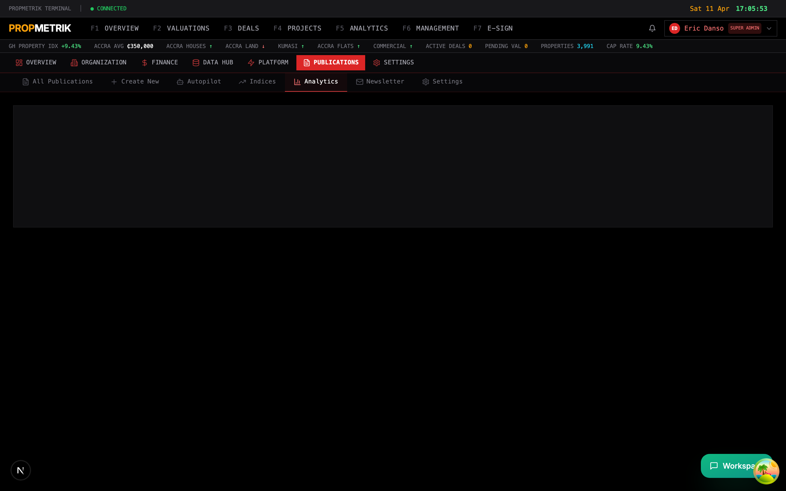

The analytics dashboard shows:
- **Total views** across all publications with trend lines
- **Top publications** ranked by view count
- **Reader demographics** -- Geographic distribution and organization types
- **Engagement metrics** -- Average time on page, scroll depth, and share counts
- **Email delivery stats** -- Open rates, click-through rates, and bounce rates for distributed publications

### Autopilot

PropMetrik's Autopilot feature uses AI to assist with publication creation.

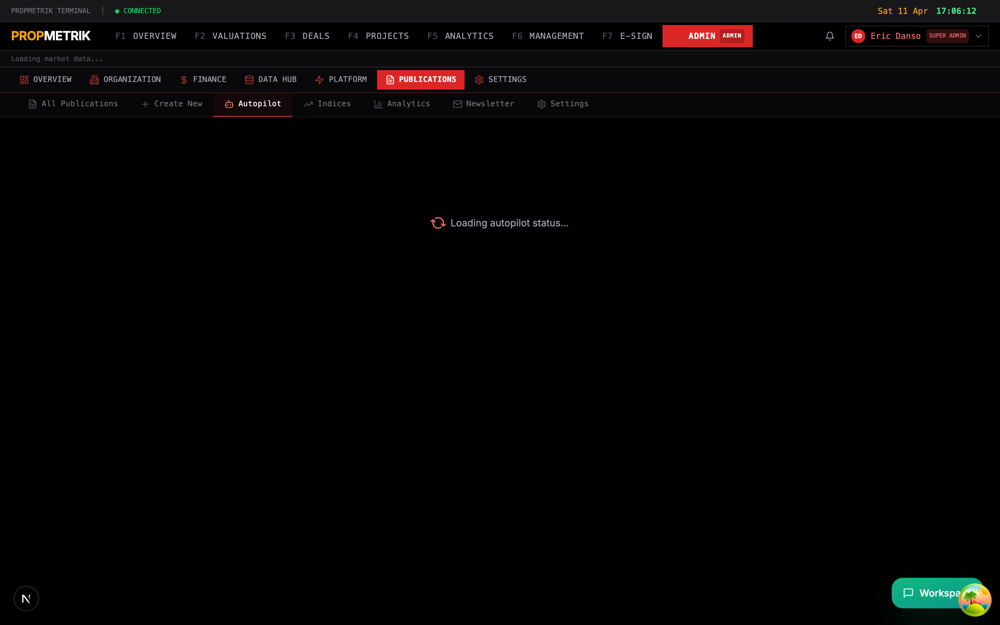

Autopilot can:
- **Generate draft reports** from PropMetrik data (market indices, construction costs, economic indicators).
- **Summarize data trends** into natural language narrative sections.
- **Suggest publication topics** based on recent data changes or market movements.
- **Schedule automated publications** that refresh with the latest data on a recurring cadence.

To configure Autopilot:
1. Enable the **Autopilot toggle** at the top of the page.
2. Select the **data sources** to feed into generated content.
3. Set the **publication frequency** (weekly, monthly, quarterly).
4. Choose a **review workflow** -- fully automated (publishes without review) or semi-automated (generates a draft for human review).
5. Click **Save**.

> **Tip:** Start with semi-automated mode. Review the first few AI-generated drafts to calibrate quality, then switch to fully automated once you are confident in the output.

---

## 13.10 Newsletter

Manage email newsletter campaigns at **Admin > Publications > Newsletter**.

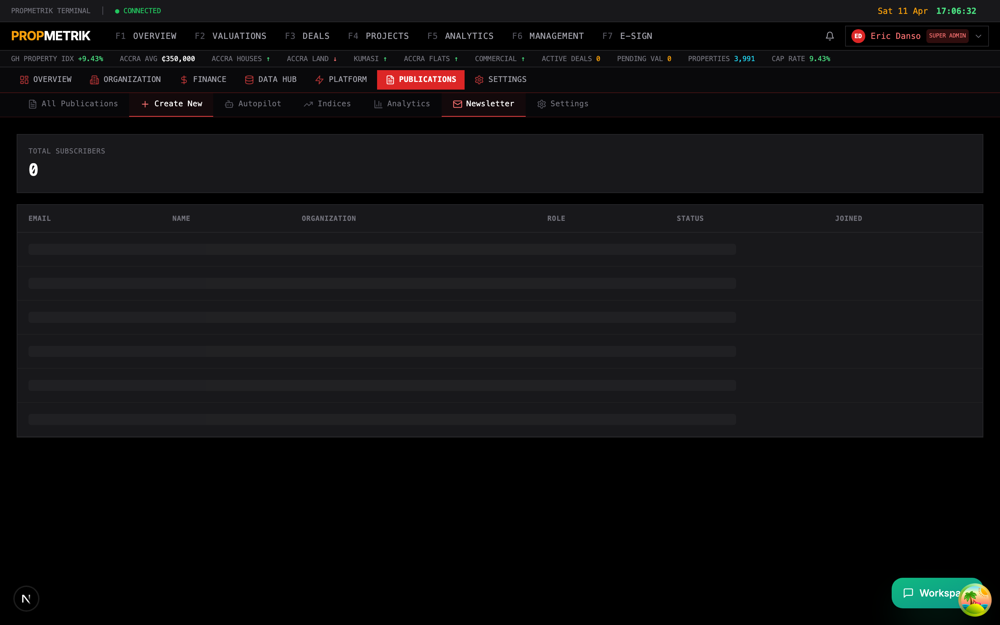

### Creating a Newsletter Campaign

1. Click **New Campaign**.
2. Enter the **subject line** and **preview text**.
3. Compose the newsletter body using the visual editor. You can:
   - Insert publication summaries with links to full reports
   - Add market data snapshots (indices, rates, price trends)
   - Include calls-to-action with buttons
   - Embed images and logos
4. Select the **recipient list** -- choose from subscriber segments (all subscribers, by plan tier, by module usage, custom list).
5. **Preview** the newsletter in desktop and mobile formats.
6. Choose to **Send Now** or **Schedule** for a future date and time.

### Managing Subscribers

- View your subscriber list with email addresses, subscription dates, and engagement scores.
- **Import subscribers** from CSV.
- **Export subscribers** for use in external marketing tools.
- Track **unsubscribe rates** and honor opt-out requests automatically.

---

## 13.11 Market Indices

Manage published market indices at **Admin > Publications > Indices**.

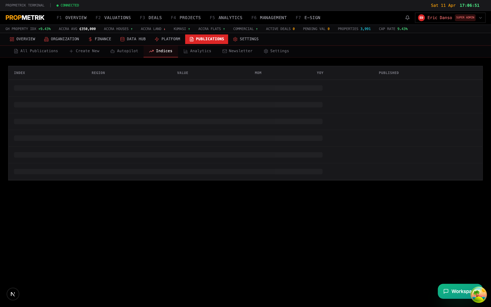

PropMetrik publishes several proprietary indices for the Ghanaian real estate market:

| Index | Description |
|-------|-------------|
| **Housing Affordability Index (HAI)** | Measures whether a typical family earns enough to qualify for a mortgage on a median-priced home |
| **Construction Cost Index (CCI)** | Tracks changes in construction input costs (materials, labor, fuel) |
| **Property Price Index** | Monitors residential and commercial property price movements by region |
| **Rental Yield Index** | Calculates gross rental yields across property types and locations |

### Publishing an Index Update

1. Navigate to **Admin > Publications > Indices**.
2. Select the index you want to update.
3. Review the **calculated values** -- these are derived from PropMetrik's data pipelines (Bank of Ghana rates, GSS labor data, NPA fuel prices, etc.).
4. Add **commentary** to explain significant changes or market context.
5. Set the **effective date** for the index period.
6. Click **Publish**. The updated index values become available across the platform (in valuation reports, analytics dashboards, and publications).

> **Tip:** Schedule index publications to coincide with upstream data releases. For example, publish the CCI update within a week of the NPA fuel price announcement and GSS labor data release.

---

## Summary

| Task | Where to Go |
|------|-------------|
| View system health and stats | Admin > Dashboard |
| Manage access policies | Admin > RBAC > Policies tab |
| Review audit trail | Admin > RBAC > Audit tab |
| Generate or revoke API keys | Admin > API Keys |
| Explore API endpoints | Admin > API Docs |
| Monitor platform usage | Admin > Usage |
| Configure transaction fees | Admin > Platform Fees |
| Track customer health | Admin > Customer Success |
| Manage onboarding | Admin > Onboarding |
| Create publications | Admin > Publications > New |
| Configure publication settings | Admin > Publications > Settings |
| View readership analytics | Admin > Publications > Analytics |
| Set up AI-assisted publishing | Admin > Publications > Autopilot |
| Send newsletters | Admin > Publications > Newsletter |
| Publish market indices | Admin > Publications > Indices |
