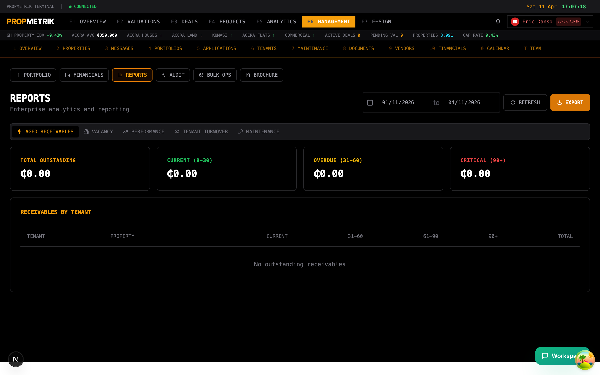
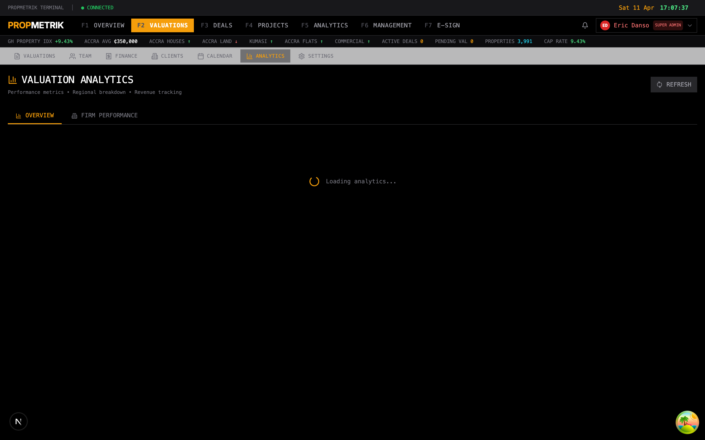
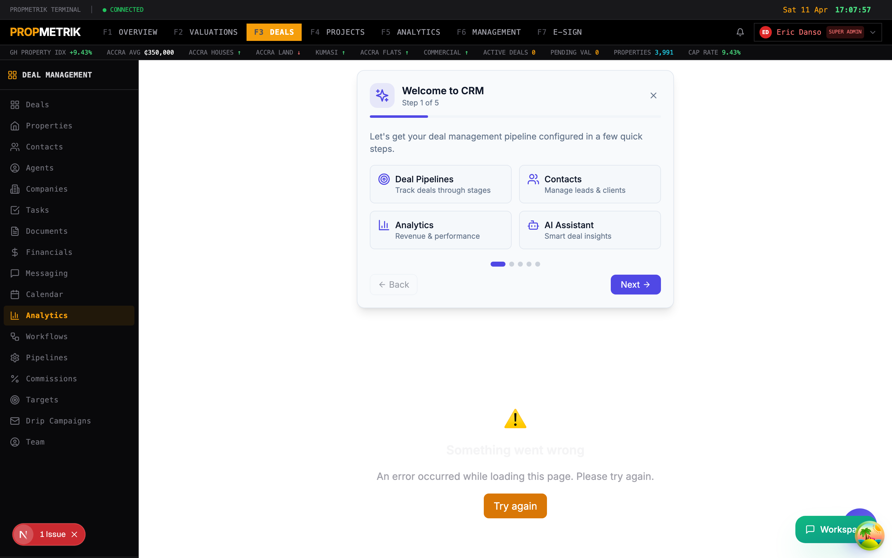
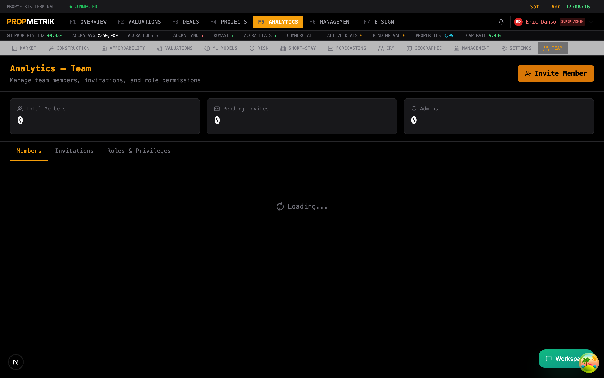
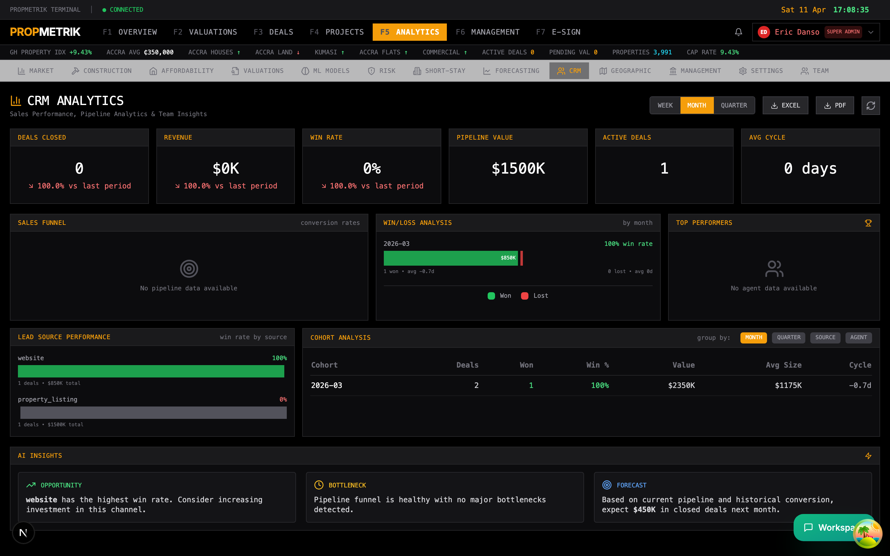
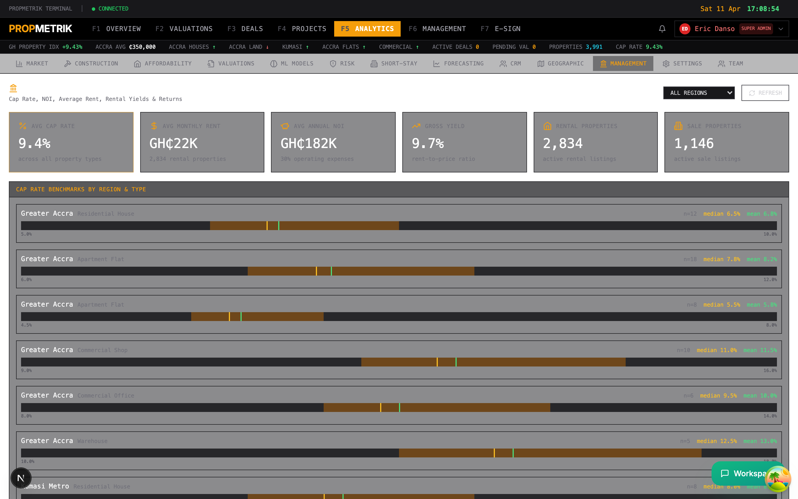
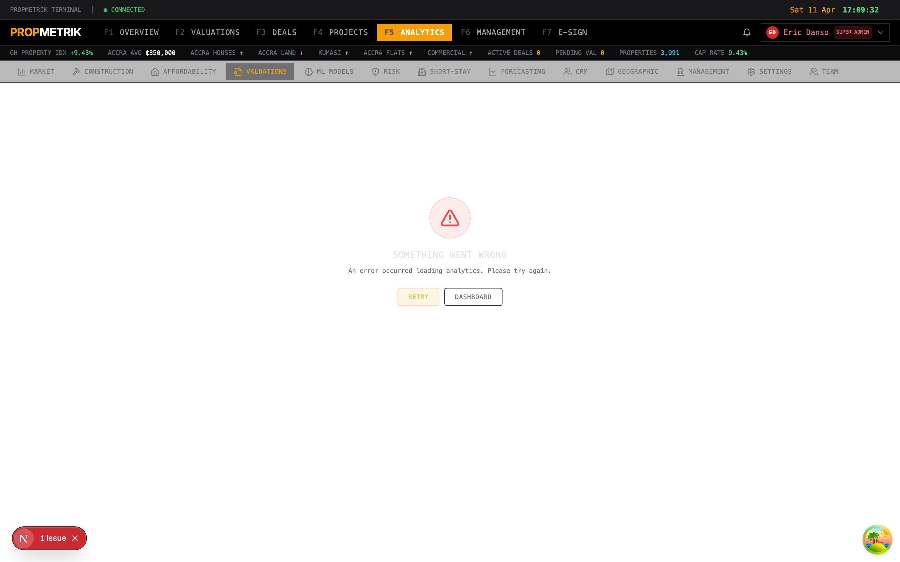

# Chapter 14: Reporting & Analytics

PropMetrik provides a comprehensive reporting suite that spans every module on the platform. From project-level compliance reports to cross-portfolio valuation analytics and sensitivity modeling, this chapter covers how to generate, interpret, and export reports across the platform.

---

## 14.1 Project Reports

Generate and manage construction project reports at **Dashboard > Projects > [Project] > Reports**, or view aggregated reports at **Dashboard > Analytics**.

### Available Project Report Types

| Report | Description |
|--------|-------------|
| **Progress Report** | Summarizes construction progress by phase, including percentage complete, milestones hit, and schedule variance |
| **Cost Report** | Breaks down actual vs. budgeted costs by cost code, with variance analysis and forecasting |
| **Safety Report** | Compiles safety inspection results, incident counts, and compliance scores |
| **Quality Report** | Aggregates checklist inspection scores, punch list status, and deficiency trends |
| **Meeting Minutes** | Formatted record of project meetings with action items and attendee lists |
| **Change Order Summary** | Lists all approved, pending, and rejected change orders with cost impact |
| **Closeout Report** | Final project summary covering schedule performance, budget adherence, and lessons learned |

### Generating a Project Report

1. Navigate to the project and click the **Reports** tab.
2. Select the **report type** from the template gallery.
3. Configure report parameters:
   - **Date range** -- The reporting period (e.g., this month, this quarter, project-to-date).
   - **Sections** -- Toggle which sections to include or exclude.
   - **Format** -- Choose PDF, Excel, or on-screen preview.
4. Click **Generate Report**.
5. The report appears in the report list with a download link. Click to view or download.

### Scheduling Automated Reports

1. On the Reports tab, click **Schedule**.
2. Choose the **report type** and **frequency** (daily, weekly, biweekly, monthly).
3. Set the **delivery method**:
   - **Email** -- Enter recipient email addresses.
   - **In-app** -- Report appears in the notifications center.
   - **WhatsApp** -- Summary sent via the WhatsApp bot to specified numbers.
4. Click **Save Schedule**. Reports generate automatically at the configured interval.

### E-Signing Reports

Project reports that require stakeholder approval can be routed through the e-sign workflow:

1. After generating a report, click **Send for Signature**.
2. Select recipients (project owner, client, compliance officer).
3. The report is wrapped in an e-sign envelope and sent via email with a magic link.
4. Track signing status directly from the Reports tab.

> **Tip:** Schedule weekly progress reports to auto-generate every Friday. This creates a consistent paper trail for stakeholders and reduces manual reporting effort.

---

## 14.2 PM Reports (Project Management Reports)

Access project management analytics and compliance reports at **Dashboard > Analytics > PM Reports**.

### Compliance Report Dashboard

The PM reports page provides a compliance-focused view across all active projects:

- **Overall Compliance Score** -- A weighted average of safety, quality, documentation, and schedule adherence scores across all projects.
- **Project Health Matrix** -- A grid showing each project's status across multiple compliance dimensions (red/amber/green).
- **Overdue Items** -- Count of overdue RFIs, submittals, inspections, and action items.
- **Non-Conformance Tracker** -- Lists open non-conformance reports (NCRs) with severity ratings.

### Generating Compliance Reports

1. Select the **report scope** (single project, portfolio, or organization-wide).
2. Choose the **compliance framework** (internal standards, building code requirements, or client-specific requirements).
3. Set the **reporting period**.
4. Click **Generate**. The report includes:
   - Executive summary with overall compliance score
   - Section-by-section breakdown (safety, quality, documentation, schedule)
   - Charts showing compliance trends over time
   - Detailed findings with photos and inspector notes
   - Recommended corrective actions

### Exporting PM Reports

- **PDF** -- Formatted report suitable for client distribution and regulatory submission.
- **Excel** -- Raw data export with all metrics and underlying data points.
- **API** -- Programmatic access to report data via the PropMetrik REST API.

---

## 14.3 Valuation Analytics

Access valuation performance analytics at **Dashboard > Analytics > Valuations**.

### Key Metrics

The valuation analytics dashboard tracks:

- **Total Valuations** -- Count of completed valuations with period-over-period comparison.
- **Average Turnaround** -- Mean time from instruction to report delivery.
- **Revenue** -- Total valuation fee revenue by period.
- **Pipeline Value** -- Aggregate market value of properties currently under valuation.

### Production Charts

- **Valuations by Month** -- Bar chart showing monthly production volume.
- **Value Distribution** -- Histogram of property values across completed valuations.
- **By Property Type** -- Breakdown by residential, commercial, industrial, and mixed-use.
- **By Location** -- Geographic distribution of valuations across regions and districts.
- **By Method** -- Split between income approach, market comparison, and cost approach valuations.

### Valuer Performance

Individual valuer metrics are displayed in a ranked table:
- **Valuations completed** in the selected period
- **Average turnaround time** per valuer
- **Revenue generated** per valuer
- **Client satisfaction scores** (if feedback is collected)

Use the date range selector and filters to drill into specific time periods, property types, or geographic areas.

---

## 14.4 Deal Analytics

Track deal pipeline and CRM performance at **Dashboard > Analytics > Deals**.

### Pipeline Overview

- **Total Pipeline Value** -- Sum of all active deals by stage.
- **Deal Count** -- Number of deals at each pipeline stage (lead, prospect, negotiation, under contract, closed).
- **Conversion Rates** -- Percentage of deals that move from one stage to the next.
- **Average Deal Size** -- Mean transaction value across closed deals.
- **Average Days to Close** -- Mean time from lead creation to deal closure.

### Revenue Analytics

- **Closed Revenue** -- Total value of deals closed in the selected period.
- **Commission Revenue** -- Agent commissions earned.
- **Revenue by Agent** -- Individual agent performance ranking.
- **Revenue by Property Type** -- Which property categories generate the most deal volume.

### Funnel Visualization

The deal funnel chart shows how many leads convert through each stage. Hover over any stage to see:
- Number of deals at that stage
- Total value
- Average time spent in stage
- Drop-off rate to the next stage

> **Tip:** Monitor the drop-off rate between "Negotiation" and "Under Contract" stages closely. A high drop-off here often indicates pricing misalignment or documentation bottlenecks.

---

## 14.5 Team Analytics

Review team productivity and workload distribution at **Dashboard > Analytics > Team**.

### Team Performance Metrics

- **Active Members** -- Number of team members currently working on projects, valuations, or deals.
- **Tasks Completed** -- Total tasks completed across all modules in the selected period.
- **Average Task Duration** -- Mean time to complete assigned tasks.
- **Overdue Task Rate** -- Percentage of tasks completed after their due date.

### Individual Performance Cards

Each team member's card shows:
- **Module distribution** -- What percentage of their time is spent on projects, valuations, deals, or property management.
- **Task completion rate** -- Percentage of assigned tasks completed on time.
- **Active assignments** -- Current open items across all modules.
- **Utilization rate** -- Percentage of available capacity currently allocated.

### Workload Heatmap

The heatmap visualization shows team capacity over time:
- **Green cells** indicate available capacity.
- **Amber cells** indicate near-full allocation.
- **Red cells** indicate over-allocation.

Use this view to identify team members who need workload redistribution and plan resource allocation for upcoming projects.

---

## 14.6 CRM Analytics

Deep-dive into customer relationship metrics at **Dashboard > Analytics > CRM**.

### Contact Engagement

- **Total Contacts** -- Active contacts in the CRM database.
- **Engagement Score Distribution** -- How contacts are distributed across engagement tiers (hot, warm, cold).
- **Contact Growth** -- New contacts added over time.
- **Source Attribution** -- Where contacts come from (referral, web inquiry, walk-in, drip campaign, import).

### Campaign Performance

If you are running drip campaigns (see Chapter 08 -- Deals & CRM):
- **Campaign Open Rates** -- Percentage of campaign emails opened.
- **Click-Through Rates** -- Percentage of recipients who clicked a link.
- **Conversion Rates** -- Percentage of campaign recipients who became active leads.
- **Revenue Attribution** -- Revenue from deals that originated from campaigns.

### Lead Scoring

The CRM analytics page shows how the automated lead scoring model is performing:
- **Score Distribution** -- Histogram of lead scores across all active leads.
- **Conversion by Score Band** -- What percentage of leads in each score range convert to deals.
- **Top Scoring Factors** -- Which attributes most strongly predict conversion (property type interest, engagement frequency, budget range).

---

## 14.7 Management Analytics

Access executive-level dashboards at **Dashboard > Analytics > Management**.

### Executive Dashboard

The management analytics page consolidates metrics from all modules into a single executive view:

- **Revenue Summary** -- Total revenue across valuations, property management fees, deal commissions, and project invoices.
- **Portfolio Performance** -- Occupancy rates, rental income, and NOI (Net Operating Income) across managed properties.
- **Project Health** -- Aggregate project status (on-track, delayed, at-risk) with budget variance summary.
- **User Growth** -- Platform adoption metrics including new users, active users, and user retention.

### KPI Tracking

Define and track organization-level KPIs:
- Set **targets** for key metrics (e.g., "Complete 50 valuations per month" or "Maintain 95% occupancy").
- View **actual vs. target** performance with trend indicators.
- Configure **alerts** when KPIs fall below threshold.

### Cross-Module Trends

The trend charts at the bottom show how key metrics evolve over time:
- Monthly revenue by module
- Valuation pipeline growth
- Property occupancy trends
- Deal conversion rate trends
- Team utilization patterns

> **Tip:** Share the management analytics URL with your leadership team. The page updates in real-time and provides a comprehensive snapshot without requiring recipients to navigate multiple modules.

---

## 14.8 Valuation Leaderboard

Compare valuer performance at **Dashboard > Analytics > Valuations > Leaderboard**.

### Leaderboard Rankings

The leaderboard ranks valuers by a composite performance score calculated from:

| Factor | Weight | Description |
|--------|--------|-------------|
| **Volume** | 30% | Number of valuations completed |
| **Turnaround** | 25% | Average time from instruction to report delivery |
| **Accuracy** | 20% | Deviation between estimated and actual sale prices (where data is available) |
| **Revenue** | 15% | Total fee revenue generated |
| **Client Feedback** | 10% | Average satisfaction rating from clients |

### Leaderboard Features

- **Time Period Selector** -- View rankings for the current month, quarter, year, or a custom date range.
- **Filter by Property Type** -- See rankings for specific property categories (residential, commercial, land).
- **Filter by Region** -- Compare performance within specific geographic areas.
- **Trend Indicators** -- Arrows show whether each valuer's rank is improving or declining compared to the previous period.

### Individual Valuer Drill-Down

Click any valuer's name to see their detailed performance profile:
- Valuation history with property types and values
- Turnaround time trend chart
- Revenue contribution over time
- Active assignments and pipeline

---

## 14.9 Sensitivity Analysis

Model the impact of variable changes on property valuations at **Dashboard > Analytics > Valuations > Sensitivity**.

### What Is Sensitivity Analysis?

Sensitivity analysis lets you test how changes to key assumptions affect a property's estimated value. This is essential for:
- Understanding which variables have the greatest impact on valuation
- Presenting best-case and worst-case scenarios to clients
- Stress-testing valuations against market shifts
- Validating model robustness

### Running a Sensitivity Analysis

1. Navigate to **Analytics > Valuations > Sensitivity**.
2. Select the **valuation** to analyze (or enter property parameters manually).
3. Choose the **variables** to test:

| Variable | Example Range |
|----------|---------------|
| **Capitalization Rate** | +/- 1-3 percentage points |
| **Discount Rate** | +/- 1-3 percentage points |
| **Rental Growth Rate** | +/- 2-5 percentage points |
| **Vacancy Rate** | +/- 5-15 percentage points |
| **Operating Expense Ratio** | +/- 5-10 percentage points |
| **Terminal Cap Rate** | +/- 1-2 percentage points |
| **Construction Cost Escalation** | +/- 5-15% |

4. Set the **step size** (how much each variable changes per increment) and the **range** (minimum and maximum values to test).
5. Click **Run Analysis**.

### Interpreting Results

The output includes:

- **Tornado Chart** -- Horizontal bar chart showing which variables have the greatest impact on value. The widest bars indicate the most sensitive variables.
- **Data Table** -- Tabular output showing the estimated value at each variable level.
- **Spider Chart** -- Multi-axis chart showing how value changes as each variable moves from its base case.
- **Scenario Matrix** -- Two-variable grid showing values at intersections of two selected variables (e.g., cap rate vs. vacancy rate).

### Exporting Sensitivity Analysis

- **PDF Report** -- Formatted report with charts, tables, and methodology notes suitable for client presentation.
- **Excel** -- Full data export with all calculated scenarios for further analysis.
- **Embed in Valuation Report** -- Insert the sensitivity analysis as an appendix to the main valuation report.

> **Tip:** Always include a sensitivity analysis when presenting valuations to institutional clients or lenders. Focus on the 2-3 variables that show the greatest impact, and explain what market conditions could cause those variables to shift.

---

## 14.10 Additional Analytics Modules

PropMetrik includes several specialized analytics modules accessible from the main Analytics sidebar:

### Affordability Analysis (Analytics > Affordability)

- Calculates the Housing Affordability Index (HAI) for different income brackets and locations.
- Shows monthly mortgage payment as a percentage of median household income.
- Compares affordability across regions, property types, and time periods.
- Powered by Bank of Ghana interest rate data and PropMetrik's property price database.

### Construction Analytics (Analytics > Construction)

- Tracks the Construction Cost Index (CCI) over time.
- Breaks down cost drivers: materials, labor, fuel, equipment, and overheads.
- Compares construction costs across building types and regions.
- Provides cost forecasting based on historical trends and leading indicators.

### Risk Assessment (Analytics > Risk)

- Property-level risk scoring incorporating:
  - **Flood risk** -- Based on NADMO incident data and geographic elevation.
  - **Market risk** -- Price volatility and liquidity measures.
  - **Credit risk** -- Tenant payment history and financial stability.
  - **Regulatory risk** -- Zoning compliance and permitting status.
- Portfolio-level risk aggregation and diversification analysis.
- Risk-adjusted return calculations for investment properties.

### Geographic Analytics (Analytics > Geographic)

- Interactive map-based visualizations of property data.
- Heatmaps for property values, rental rates, transaction volumes, and risk scores.
- Neighborhood-level market statistics and comparables.
- Distance-based analysis for amenities, transport links, and infrastructure.

---

## Summary

| Task | Where to Go |
|------|-------------|
| Generate a project report | Projects > [Project] > Reports |
| Schedule automated reports | Projects > [Project] > Reports > Schedule |
| View PM compliance reports | Analytics > PM Reports |
| Analyze valuation production | Analytics > Valuations |
| Track deal pipeline | Analytics > Deals |
| Review team workload | Analytics > Team |
| Monitor CRM engagement | Analytics > CRM |
| Access executive dashboards | Analytics > Management |
| Compare valuer performance | Analytics > Valuations > Leaderboard |
| Run sensitivity analysis | Analytics > Valuations > Sensitivity |
| Check housing affordability | Analytics > Affordability |
| Track construction costs | Analytics > Construction |
| Assess property risk | Analytics > Risk |
| View geographic analytics | Analytics > Geographic |
